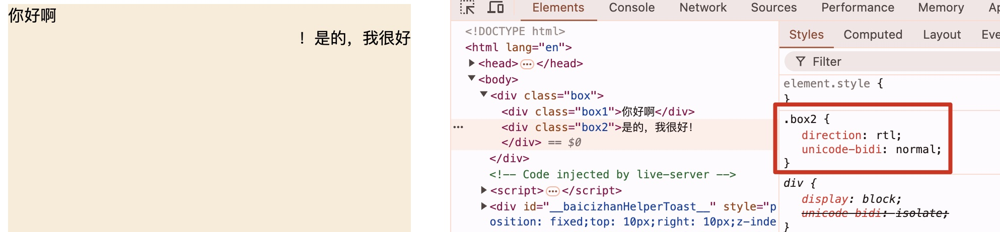
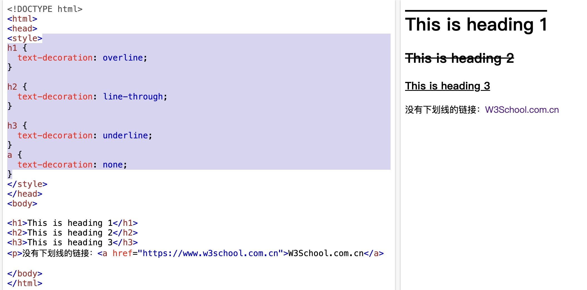
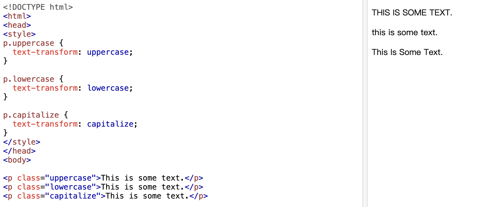

### 文本

> 除了最常用的 color、line-height 外，还有以下不是很常用的属性

- `text-align` 文本水平对齐方式，取值为`left`、`right`、`center`、`justify（拉伸每一行）`
- `vertical-align` 文本垂直对齐方式，取值为`top`、`middle`、`bottom`
- `direction` 文本方向，取值为`ltr`（从左到右）、`rtl`（从右到左），一般与`unicode-bidi`配合使用
  - 一般用于多语言环境中文本展示，对于中文有点鸡肋，可以看到最后的标点符号被放在了前面



- `text-decoration` 文本装饰，取值为`none`、`underline`、`overline`、`line-through`



- `text-transform` 文本转换，取值为`none`、`capitalize`、`uppercase`、`lowercase`，分别为无转换、首字母大写、全大写、全小写



- `text-indent` 文本缩进，取值为`length`、`percentage`，分别为长度、百分比
- `letter-spacing` 字符间距，取值为`length`、`normal`，可以为负数
- `word-spacing` 单词间距，取值为`length`、`normal`，可以为负数
- `white-space` 空白符处理，取值为`normal`、`nowrap`、`pre`
- `text-overflow` 文本溢出，取值为`clip`、`ellipsis`，分别为裁剪、省略号
```css
/* 定义容器 width 后，使用下面三属性可以实现文本超长省略 */
.ellipsis {
  overflow: hidden;
  text-overflow: ellipsis;
  white-space: nowrap;
}
```
- `text-shadow` 文本阴影，取值为`none`、 `length length length color`，对应水平阴影、垂直阴影、模糊效果、颜色
  - 可以添加多个阴影，用逗号隔开

