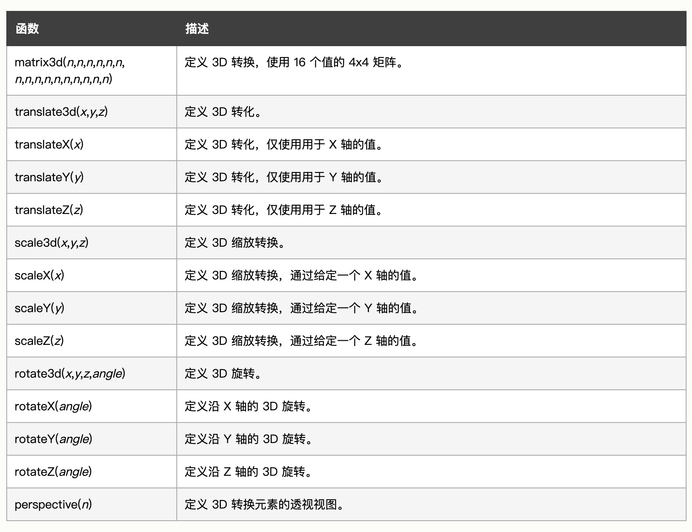

### 1、转换

- css 转换分为 2D 转换和 3D 转换

### 2、2D 转换

- `transform` 转换属性，默认取值为 `none`，其他取值如下
- `translate()` 用于移动当前元素，接收两个参数，分别为 x 轴和 y 轴的偏移量，取值为 `length`、`percentage`
  - `translateX()` 接收一个参数，为 x 轴的偏移量
  - `translateY()` 接收一个参数，为 y 轴的偏移量
- `rotate()` 用于旋转当前元素，接收一个参数，为旋转角度
- `scale()` 用于缩放当前元素，接收两个参数，分别为 x 轴和 y 轴的缩放比例
  - `scaleX()` 接收一个参数，为 x 轴的缩放比例
  - `scaleY()` 接收一个参数，为 y 轴的缩放比例
- `skew()` 用于倾斜当前元素，接收两个参数，分别为 x 轴和 y 轴的倾斜角度
  - `skewX()` 接收一个参数，为 x 轴的倾斜角度
  - `skewY()` 接收一个参数，为 y 轴的倾斜角度
- `matrix()` 用于矩阵转换，接收六个参数，分别为 x 轴的缩放比例、y 轴的倾斜角度、x 轴的倾斜角度、y 轴的缩放比例、x 轴的偏移量、y 轴的偏移量

### 3、3D 转换

- 3D 转换的属性与 2D 转换的属性类似，只是多了一个 `z` 轴的偏移量，也是使用 `transform` 实现
- 但是业务中使用还是比较少的，2D 转换已经足够了

