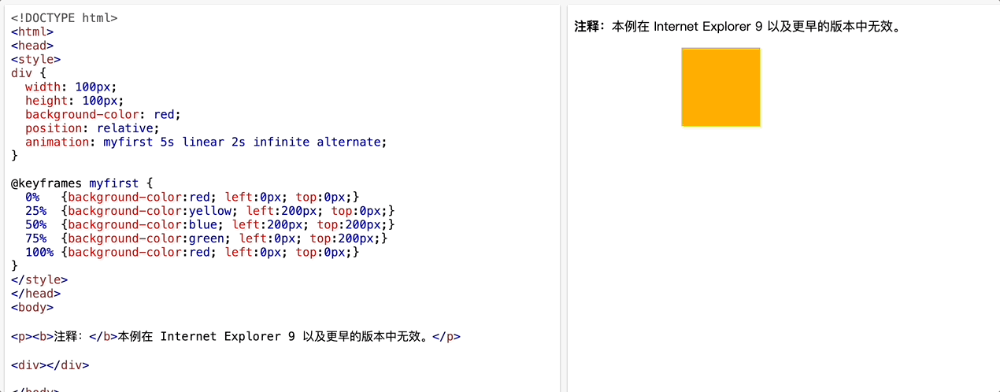

### 动画

- css 可实现 HTML 元素的动画效果，而不使用 JS 或 Flash

| 属性 | 描述 |
| --- | --- |
| `animation-play-state` | 指定动画是否正在运行或已暂停，默认值为 running，即正在运行 |
| `animation`|简写属性，用于设置六个动画属性，分别为动画名称、持续时间、动画速度曲线、延迟时间、播放次数、是否反向播放|
|`animation-name`|指定要绑定到选择器的 keyframe 名称|
|`animation-duration`|指定动画完成一个周期所花费的秒或毫秒，默认值为 0，即不执行动画|
|`animation-timing-function`|指定动画的速度曲线，默认值为 ease，即动画以低速开始和结束|
|`animation-delay`|指定动画何时开始，默认值为 0，即立即开始|
|`animation-iteration-count`|指定动画播放的次数，默认值为 1，即播放一次|
|`animation-direction`|指定动画是向前播放、向后播放还是交替播放，默认值为 normal，即正常播放|

- 以上是动画属性，但是需要配合 `@keyframes` 来使用

