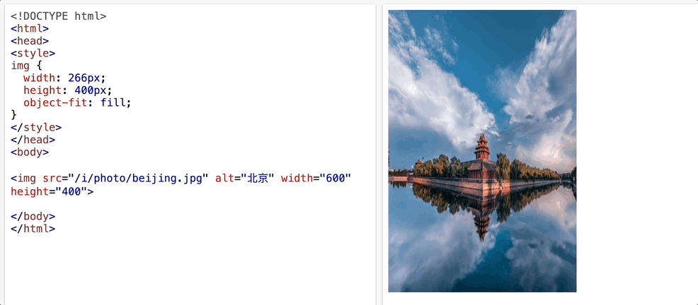
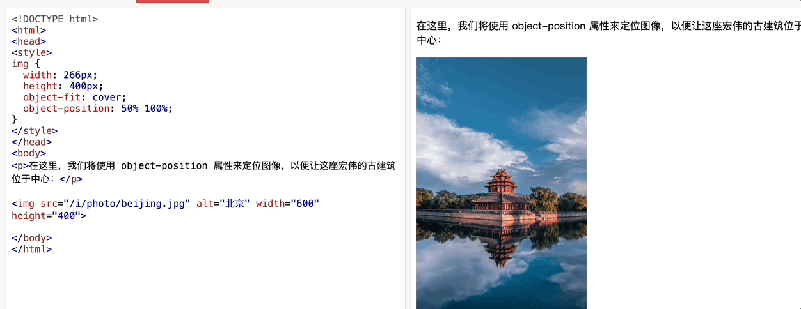

### object-fit 属性

- 属性用于规定如何调整 ` <video>` 的大小来适应其容器
- 取值为
  - `fill`：默认值，不保持宽高比，拉伸图片
  - `contain`：保持宽高比，缩放图片，直到图片的长边能完全显示出来
  - `cover`：保持宽高比，缩放图片，直到图片的短边能完全显示出来
  - `none`：保持宽高比，不缩放图片

### object-position 属性

- 用于指定 `<video>` 在其容器中的位置，取值为
  - `x-offset y-offset`：x 轴偏移量和 y 轴偏移量，默认值为 `50% 50%`

