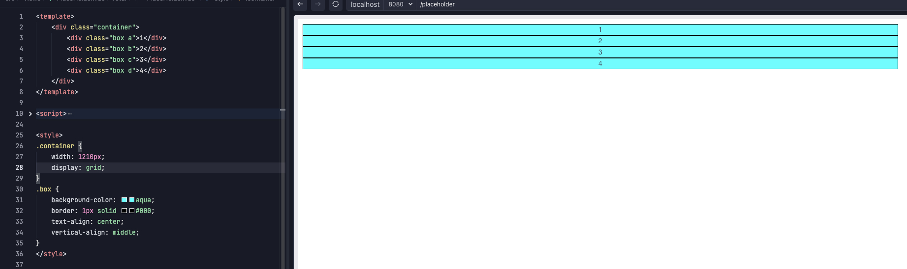
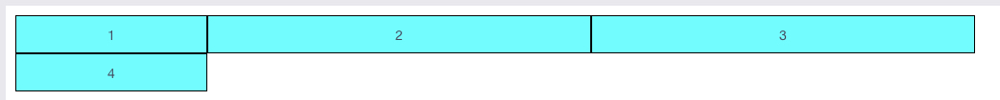
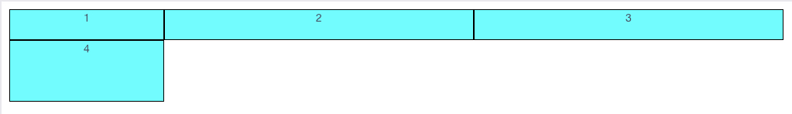
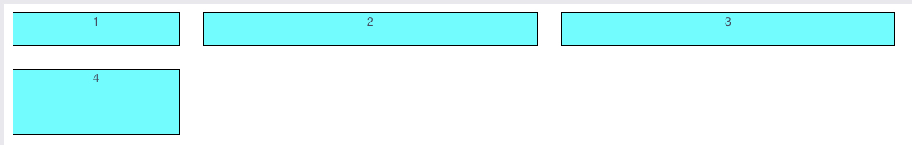
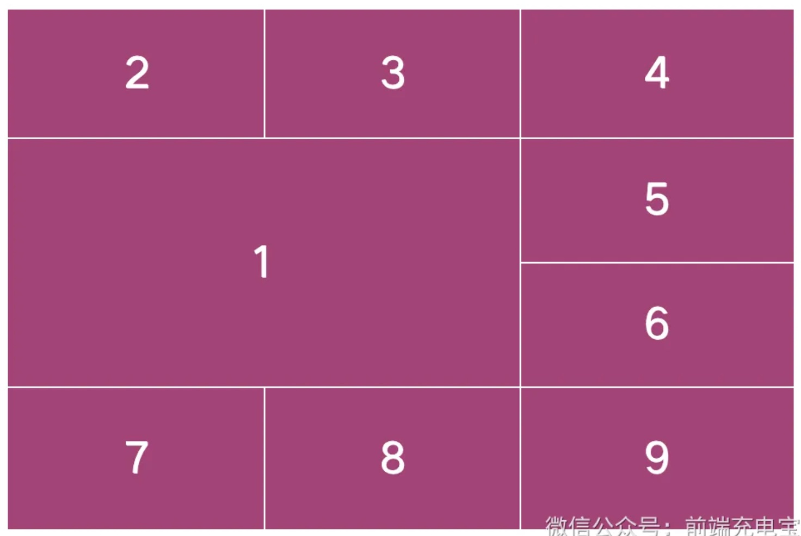

### 1、grid 布局概述

- 网格容器，定义 `display: grid;` 的元素
- 网格项，网格容器的所有子元素
- 网格线，划分网格的线，水平网格线和垂直网格线
- 网格轨道，两个相邻网格线之间的空间
- 网格单元，两条相邻的列网格线和两条相邻的行网格线组成的矩形区域
- 网格区域，由任意数量的网格单元组成的矩形区域



### 2、设置基本网格

- 当元素设置了网格布局，`float` `clear` `vertical-align` 失效
- 实际上，只设置了父元素为网格容器，子元素并没有什么变化

### 3、设置行和列的宽度

#### 3.1、 `grid-template-columns` 属性

- 该属性指定网格容器中所需的列数以及每列的宽度

```css
.container {
    width: 1210px;
    display: grid;
    grid-template-columns: 200px 400px 400px;
}
```



#### 3.2、`grid-template-rows` 属性

- 该属性指定网格容器中每行的高度，没指定行数，是因为网格容器都会隐式创建一个新行

```css
.container {
    width: 1210px;
    display: grid;
    grid-template-columns: 200px 400px 400px;
    grid-template-rows: 100px 200px;
}
```



- 如果隐式创建了多行，但是没有指定高度，那么这些行的高度是由内容大小决定的

#### 3.3、`grid-template-areas` 属性

- 该属性来定义网格区域，有三个属性值，分别是：
  - 网格区域的名称
  - 用 `.` 表示的空白区域
  - 用 `none` 表示没有定义网格区域
- 了解即可

```css
.container{
    grid-template-areas: "header header header header"
                         "main main . sidebar"
                         "footer footer footer footer";
}
```

#### 3.4、网格线名称

- `grid-template-columns` 和 `grid-template-rows` 属性还可以使用方括号来指定每一条网格线的名字

```css
.container{
  grid-template-columns: [one] 40px [two] 50px [three] auto [four];
  grid-template-rows: [five] 25% [six] 100px [seven] auto [eight];
}
```

### 4、行和列之间添加间隙

#### 4.1、`column-gap` 属性

- 该属性用来设置每一列之间的间隙

```css
.container { 
   display: grid; 
   column-gap: 28px;
}
```

#### 4.2、`row-gap` 属性

- 该属性用来设置每一行之间的间隙

```css
.container {
   display: grid;
   row-gap: 28px;
}
```



### 5、水平对齐内容

- `justify-content` 属性，设置网格在网格容器内沿着水平方向的对齐方式，取值为 `start` `end` `center` `space-around` `space-between` `space-evenly` `stretch`
- `justify-items` 属性，控制所有网格项沿水平方向的对齐方式，取值为 `start` `end` `center` `stretch`
- `justify-self` 属性，控制单个网格项沿水平方向的对齐方式，取值为 `start` `end` `center` `stretch`

### 6、垂直对齐内容

- 同上，但参数名有差异，为 `align-content` `align-items` `align-self`

### 7、新的测量单位

#### 7.1、`fr` 单位

- 类似 flex 布局中 `flex: 1;` 自动瓜分剩余空间，但是有区别

```css
/* 1fr 2fr 3fr 表示每列的宽度为 1/6 2/6 3/6 */
grid-template-columns: 1fr 2fr 3fr;
/* 200px 2fr 3fr 表示每列的宽度为 200px (剩余部分2/5 3/5) */
grid-template-columns: 200px 2fr 3fr;
```

#### 7.2、 `min-content`

- 它是一个关键字，是一个值，通常是网格项中最小内容大小

```css
grid-template-columns: 1fr min-content 1fr;
```

#### 7.3、 `max-content`

- 它是一个关键字，是一个值，通常是网格项中最大内容大小

### 8、css 函数

- `repeat()` 函数

```css
/* repeat(3, 100px) 表示每列的宽度为 100px 3 次 */
grid-template-columns: repeat(3, 100px);
```

- `minmax()` 函数
- `fit-content()` 函数

### 9、网格项属性

- `grid-column-start` 属性
- `grid-column-end` 属性
- `grid-row-start` 属性
- `grid-row-end` 属性
- 以上都是设置网格项在网格中的列、行的起始位置

```css
.container div:nth-of-type(1) {
  grid-column-start: 1;
  grid-column-end: 3;
  grid-row-start: 2;
  grid-row-end: 4;
}
```



- 取值可以是网格线号，也可以是 `span <number>`

### 10、属性简写

- `gap` 属性, 同时设置行和列的间隙，是 `row-gap` 和 `column-gap` 的简写
- `place-items` 属性，同时设置 `align-items` 和 `justify-items` 的简写
- `place-content` 属性，同时设置 `align-content` 和 `justify-content` 的简写
- `place-self` 属性，同时设置 `align-self` 和 `justify-self` 的简写
- `grid-column` 属性，同时设置 `grid-column-start` 和 `grid-column-end` 的简写
- `grid-row` 属性，同时设置 `grid-row-start` 和 `grid-row-end` 的简写
- `grid-area` 属性，同时设置 `grid-row-start`、`grid-column-start`、`grid-row-end` 和 `grid-column-end` 的简写
- `grid-template` 属性，同时设置 `grid-template-rows`、`grid-template-columns` 和 `grid-template-areas` 的简写
- `grid` 属性，同时设置 `grid-template-rows`、`grid-template-columns`、`grid-template-areas`、`grid-auto-rows`、`grid-auto-columns`、`grid-auto-flow` 的简写