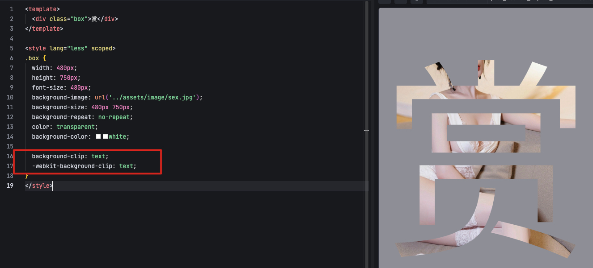
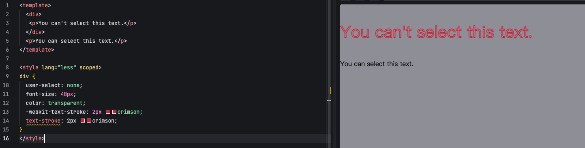

### 1、图像填充文字效果

- 可以设置 `background-clip: text` 来实现

### 2、文字瞄边效果

- 除了可以设置 `text-shadow` 来实现文字模糊，还可使使用 `text-stroke` 来实现

### 3、`user-select` 属性

- 可以设置 `user-select` 来控制是否允许用户选择文本
  - `auto`：默认值，根据浏览器决定是否允许用户选择文本
  - `none`：不允许用户选择文本
  - `text`：允许用户选择文本
  - `all`：允许用户选择文本和元素

### 4、`scroll-behavior` 属性

- 可以设置 `scroll-behavior` 来控制滚动行为
  - `auto`：默认值，滚动行为由浏览器决定
  - `smooth`：平滑滚动
- 一般页面通过锚点点位页面位置，可以实现不同的滚动效果，实现平滑滚动，可以使用 `scroll-behavior` 属性而不用 JS 实现