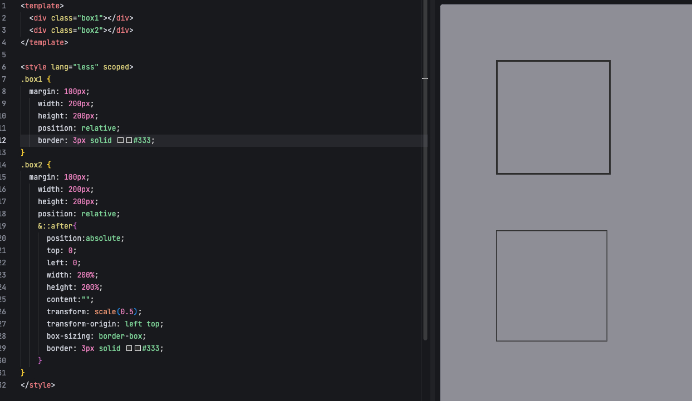

### 如何解决 1px 问题


---
---

- 在移动端设备上，css 的 `1px` 会被渲染成 `2px`，甚至更粗，这是因为移动端设备的屏幕分辨率比较高，解决方法有多种
- 方法一：直接写 0.5px，但缺点是兼容性不好

```xml
<div id="container" data-device={{window.devicePixelRatio}}></div>

#container[data-device="2"] {
  border:0.5px solid #333
}
```
- 方法二: `box-shadow` 可以模拟更细的边框

```css
.element {
  box-shadow: 0 0 0 0.5px black;
}
```
- 方法三： 伪元素先放大后缩小
  - 这里使用 3px 效果更明显



- 方法四：`viewport` 缩小，缺点是会影响全体布局

### 怎么设置小于 12px 的字体
- 方法一：使用 `transform: scale` 缩小
- 方法二：使用图片