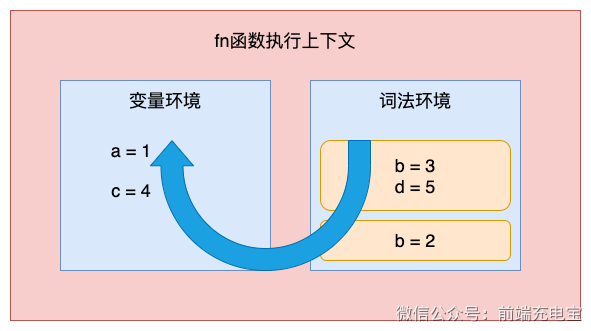

### 一、什么是变量提升

- ES6之前，JS 引擎会把变量的声明部分和函数的声明部分提升到作用域的顶端
- 变量提升会提升变量的声明，不会提升变量的赋值
- 函数提升会提升函数的声明，不会提升函数的调用（仅针对函数式声明，变量形式声明和变量提升逻辑一样）

### 二、为什么有变量提升

> 作用域就是变量与函数的可访问范围，即作用域控制着变量和函数的可见性和生命周期

- ES6之前，作用域只有全局作用域和函数作用域，没有块级作用域，因此将变量的声明提升到作用域的顶端，方便开发者使用

### 三、块级作用域

- ES6 引入了块级作用域，使用一对花括号 `{}` 包裹的代码块，在这个代码块中使用 `let 、 const` 声明的变量，只能在这个代码块中访问，不会影响到全局作用域

### 四、如何支持块级作用域



- 通过 var 声明的变量，在编译阶段会被存放到变量环境中
- 通过 let 声明的变量，在编译阶段会被存放到词法环境中
- 词法环境是 ES6 中新增的概念，它是一种存储变量的机制，它有两种类型：全局环境和函数环境
- 词法环境的作用是在编译阶段就确定

### 五、暂时性死区

- ES6 规定：如果区块中存在 let 和 const，这个区块对这两个关键字声明的变量，从一开始就形成了封闭作用域。假如尝试在声明前去使用这类变量，就会报错。这一段会报错的区域就是暂时性死区。

```js
var name = 'JavaScript';
{
	name = 'CSS';
	let name;
}

// 输出结果：Uncaught ReferenceError: Cannot access 'name' before initialization
```

> let 和 const 在同一块作用域中不能重复声明