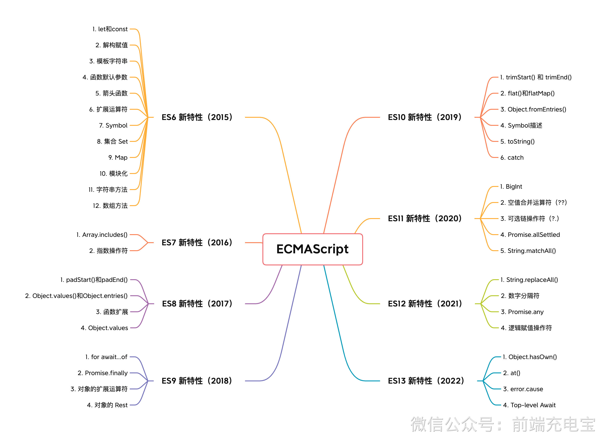

> ECMAScript 是 JavaScript 的标准与规范，JavaScript 是 ECMAScript 标准的实现和扩展



### 一、ES6 新特性 （2015）

#### 1.1 let 和 const

#### 1.2 解构赋值

#### 1.3 模板字符串

#### 1.4 函数默认参数

#### 1.5 箭头函数

- 特点
  - 没有自己的 this
  - 没有 arguments
  - 不能作为构造函数，不能使用 new
  - 没有原型
  - 不能使用 call、apply、bind

#### 1.6 扩展运算符

#### 1.7 Symbol 

#### 1.8 集合 Set WeakSet

- 类似于数组，但是成员的值都是唯一的，可以用于数组去重
- 集合实现了iterator接口，所以可以使用扩展运算符和 for…of 进行遍历
- 属性与方法
  - size： 集合的长度
  - add(value)：添加元素
  - delete(value)：删除元素
  - has(value)：判断元素是否存在
  - clear()：清空集合

```js
//创建一个空集合
let s = new Set();
//创建一个非空集合
let s1 = new Set([1,2,3,1,2,3]);

console.log(s1.size);       // 3
console.log(s1.add(4));     // {1,2,3,4}
```

- WeakSet 用于存储唯一的对象引用
- 特点
   - 成员只能是对象
   - 成员都是弱引用，即垃圾回收机制不考虑 WeakSet 对该对象的引用，不会阻止垃圾回收
   - 不能遍历，没有 size 属性

#### 1.9 映射 Map WeakMap

- 类似于对象，但是键可以是任意类型
- 属性与方法
  - size： 集合的长度
  - set(key,value)：添加元素
  - get(key)：获取元素
  - delete(key)：删除元素
  - has(key)：判断元素是否存在
  - clear()：清空集合

```js
let m2 = new Map([
 ['name', 'hello'],
]);
//获取映射元素的个数
console.log(m2.size);          // 1
//添加映射值
console.log(m2.set('age', 6)); // {"name" => "hello", "age" => 6}
```

- WeakMap 特点
  - 键只能是对象
  - 键都是弱引用，即垃圾回收机制不考虑 WeakMap 对该对象的引用，不会组阻止垃圾回收（比如深拷贝时借用这个）
  - 不可遍历

#### 1.10 模块化

- `export` 导出

```js
export let a = 1;
export function func() {
    return true;
}
// 默认导出，只能有一个
export default function () {
  console.log('foo');
}
```

- `import` 导入

```js
import { a, func } from './module.js';
import foo from './module.js';

import 'lodash'; //仅仅是加载而已，无法使用
```

#### 1.11 字符串方法

- includes()
- startsWith()
- endsWith()
- repeat()

#### 1.12 数组方法

- Array.from()
- reduce()
- find()
- fill()

#### 1.13 class 类

- 类的本质是函数，类的所有方法都定义在类的 prototype 属性上

#### 1.14 迭代器

#### 1.15 生成器

#### 1.16 Promise

#### 1.17 async/await

#### 1.18 Reflect

#### 1.19 Proxy

### 二、ES7 新特性 （2016）

#### 2.1 Array.includes()

#### 2.2 指数运算符

- 指数运算符（**），与 `Math.pow()` 方法一致

```js
Math.pow(2, 10));  // 1024
2**10;           // 1024
```

### 三、ES8 新特性 （2017）

#### 3.1 padStart() 和 padEnd()

- 用于补齐字符串的长度
- 接受两参数，第一个参数是补齐后字符串的长度；第二个参数是要补齐的字符串，不传时默认是空格

#### 3.2 Object.values() 和 Object.entries()

- Object.values()：返回对象的值
- Object.entries()：返回对象的键值对
- 都用来遍历对象，它会返回一个由给定对象的自身可枚举属性（不含继承的和Symbol属性）组成的数组

> 在ES5中就引入了 `Object.keys` 方法

#### 3.3 函数扩展

- 规定函数的参数列表的结尾可以为逗号

```js
function foo(a, b,) {
    return a + b;
}
```


### 四、ES9 新特性 （2018）

#### 4.1 for await…of

- 用于遍历异步的可迭代对象

#### 4.2 Promise.finally()

- 表示无论 Promise 实例最终成功或失败都会执行的方法

```js
promise
  .then(() => console.log('success'))
  .catch(() => console.log('fail'))
  .finally(() => console.log('finally'))
```

#### 4.3 对象的扩展运算符

- 在ES6中就引入了扩展运算符，但是它只能作用于数组，ES2018中的扩展运算符可以作用于对象

### 五、ES10 新特性 （2019）

#### 5.1 trimeStart() 和 trimEnd()

#### 5.2 flat() 和 flatMap()

- flatMap 是 flat 和 map 的结合

#### 5.3 catch

在 ES2019 以前，catch 会带有参数，但是很多时候 catch 块是多余的。而现在可以不带参数

#### 5.4 Symbol描述

- 之前只能用 String 或 toString 方法获取
```js
let s = Symbol('foo');
console.log(s.description); // foo
```

### 六、ES11 新特性 （2020）

#### 6.1 BigInt

#### 6.2 空值合并运算符 (??)

- 比 || 更严格，只有当左侧操作数为 null 或者 undefined 时，才会返回右侧操作数

```js
const dogName = false; 
const name =  dogName ?? 'default';  // name = false;
```
#### 6.3 可选链运算符 (?.)

#### 6.4 Promise.allSettled

- 返回一个 Promise，该 Promise 在所有给定的 Promise 都已经 fulfilled 或 rejected 后 resolve，并且每个对象都描述每个 Promise 的结果

#### 6.5 String.matchAll

- 返回一个迭代器，该迭代器包含所有匹配正则表达式的结果

### 七、ES12 新特性 （2021）

#### 7.1 String.replaceAll

- 感觉和 replace 差不多，但是 replace 只能替换第一个匹配的字符串（正则不使用 g 的情况下），replaceAll 可以替换所有匹配的字符串

#### 7.2 数字分隔符

- 数字分隔符是用来分隔数字的，方便阅读

```js
const num = 1000000000;
const num2 = 1_000_000_000;
num === num2 // true
```

#### 7.3 Promise.any

- 返回一个 Promise，该 Promise 在任何给定的 Promise 被 resolve 或 reject 后 resolve，并且返回第一个被 resolve 的值

#### 7.4 逻辑赋值运算符

```js
// 等同于 a = a || b
a ||= b;
// 等同于 c = c && d
c &&= d;
// 等同于 e = e ?? f
e ??= f;
```

### 八、ES13 新特性 （2022）

#### 8.1 Object.hasOwn

- 判断一个对象是否包含某个属性
- 返回一个布尔值，true 表示对象具有该属性，false 表示对象不具有该属性或属性来自原型链

```JS
const obj = {
  name: 'hello',
  age: 18
}
Object.hasOwn(obj, 'name'); // true
```
> 可以代替 `hasOwnProperty` 使用

#### 8.2 数组方法 at()

- 返回数组中指定位置的元素，可以使用负数索引，从数组末尾开始计数

#### 8.3 error.cause

- 返回一个错误的原因

```js
try {
 ...
}
catch (e) {
  console.log(e.cause); // Error: bar
}
```