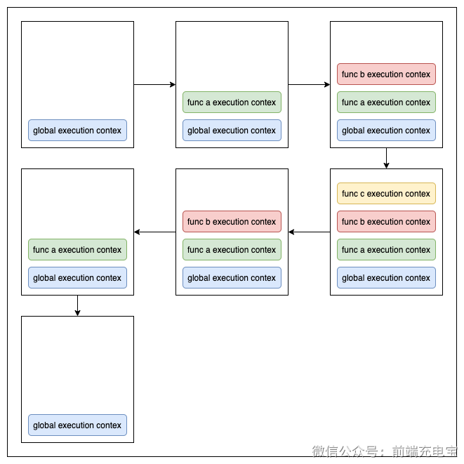

### 一、执行上下文

- 执行上下文中，包含了变量环境、词法环境、外部环境、this
- this 是和执行上下文绑定的，也就是说每个执行上下都有一个 this

#### 1.1 执行上下文概念
- 执行上下文是 JavaScript 中的一个抽象概念，用于描述代码在运行时所处的环境
- 全局执行上下文
  - 任何不在函数内部的都是全局执行上下文
  - 全局执行上下文只有一个
  - 浏览器中，全局执行上下文是 window 对象
- 函数执行上下文
  - 每个函数在调用时都会创建一个新的执行上下文
  - 函数执行上下文可以有多个
- eval 执行上下文

#### 1.2 执行上下文栈
- 入栈出栈
```js
function c(){
console.log('ok');
}
function a(){
  function b(){
    c();
  }
  b();
}
a();
```



### 二、函数的 this 指向

- `this` 是一个关键字，多数情况下 `this` 指向调用它的对象
    - 如果调用它的不是对象或对象不存在，则指向全局对象（严格模式下是 undefuned）
    - this 是在函数调用时确定的，指向取决于函数调用的地方，不是函数声明的地方（箭头函数除外）
- ```this``` 在函数的指向绑定形式有四种：默认绑定、隐式绑定、显式绑定、new绑定

#### 2.1 默认绑定（全局环境）

- 函数在全局环境中直接调用时，this 指向全局对象（浏览器中是 window），严格模式下是 undefined

#### 2.2 隐式绑定

- 函数作为对象的方法调用时，this 指向该对象

#### 2.3 显式绑定（apply、call、bind）

- `apply`、`call`、`bind` 可以改变函数的 this 指向
- `apply`、`call` 立即执行函数
- `bind` 返回一个新函数，不会立即执行

```js
const target = {}
fn.call(target, 'arg1', 'arg2')
fn.apply(target, ['arg1', 'arg2'])
fn.bind(target, 'arg1', 'arg2')()
```

- 如果把 null 或 undefined 作为参数，这些值在调用时会被忽略，实际应用的是默认绑定规则

#### 2.4 new 绑定
- 使用 new 关键字调用函数时，会创建一个新对象，this 指向这个新对象
- new 原理
  - 创建一个新对象
  - 将构造函数的 ```prototype``` 赋值给这个新对象的 ```__proto__```
  - 将构造函数的 `this` 指向新对象
  - 返回新对象

### 三、this 的优先级

- new 绑定 > 显式绑定 > 隐式绑定 > 默认绑定

### 四、特殊的 this 指向

#### 4.1 箭头函数

- 箭头函数会根据其声明的地方来决定 this 的指向
- 箭头函数没有自己的 this，它的 this 指向是在定义时就确定的，而不是在调用时确定的

#### 4.2 setTimeout 和 setInterval

- 无论是 setTimeout 还是 setInterval 里传入的函数，都会首先被交到全局对象手上。因此，函数中 this 的值，会被自动指向 window

```js
var name = 'hello'
var obj = {
  name: 'world',
  hello: function() {
    setTimeout(function() {
      console.log(this.name)
    })
  }
}
obj.hello() // hello
```
- 改为箭头函数就指向了 obj

```js
var name = 'hello'
var obj = {
  name: 'world',
  hello: function() {
    setTimeout(() => {
      console.log(this.name)
    })
  }
}
obj.hello() // world
```