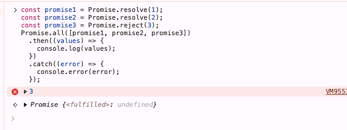
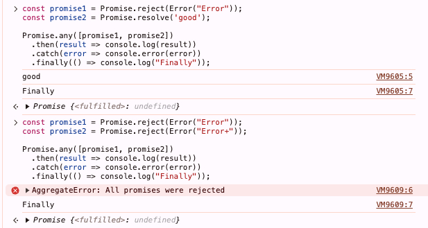
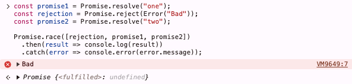
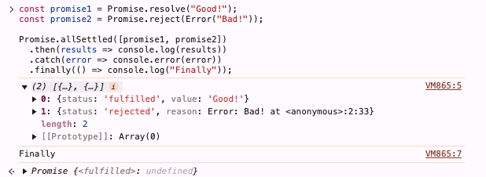

### 一、错误概述

- js 中错误是一个对象，有以下属性：
  - `name`：错误名称
  - `message`：错误信息
  - `stack`：错误堆栈

### 二、错误类型

- `SyntaxError、ReferenceError、TypeError、RangeError、URIError、EvalError、InternalError`
- 自定义错误类型

```js
class ValidationError extends Error {
    constructor(message) {
        super(message);
        this.name = "ValidationError";
    }
}
throw new ValidationError("Invalid input");
// 或
throw  ValidationError("Invalid input");
```

### 三、抛出错误

- 错误和异常不是一回事。Error 对象只有在被抛出时才会成为异常
- `throw` 语句抛出一个错误

```js
throw new TypeError("Expected number");
// 或
throw TypeError("Expected number");
```

### 四、同步错误处理

- 同步错误处理：`try...catch`

```js
try {
    // 可能会抛出错误的代码
    throw new Error("Something went wrong");
} catch (e) {
    // 错误处理代码
    console.log(e.message);
} finally {
    // 无论是否有错误都会执行的代码
}
```

- `catch` 中可以捕获手动抛出的错误，也可以捕获代码运行时的异常

### 五、异步错误处理

- 与同步错误处理不同。`try/catch` 是同步的，无法处理异步错误
- 比如下面代码就是无效的

```js
function failAfterOneSecond() {
  setTimeout(() => {
    throw Error("Wrong!");
  }, 1000);
}
try {
  failAfterOneSecond();
} catch (error) {
  console.error(error.message);
}
```

- 包括 DOM 监听事件抛出的错误也不能这样处理

#### 5.1 Promise 错误处理

```js
function toUppercase(string) {
  if (typeof string !== "string") {
    return Promise.reject(TypeError("Expected string"));
  }

  const result = string.toUpperCase();

  return Promise.resolve(result);
}
```
- 现在就可以在 then 中使用结果，并使用 catch 来处理被拒绝的 Promise

```js
toUppercase("hello")
  .then((result) => {
    console.log(result);
  })
  .catch((error) => {
    console.error(error.message);
  });
  .finally(() => {
    console.log("finally");
  })
```

- 常见 fetch 中

```js
fetch("URL_ADDRESSfetch("https://example.com/data")
  .then((response) => {
    if (!response.ok) {
      throw new Error("Network response was not ok");
    }
    return response.json();
  })
  .then((data) => {
    // 处理数据
  })
  .catch((error) => {
    // 处理错误
  });
```

#### 5.2 使用 Promise 处理定时器错误

- 仍然是最开始的定时器，可以改为

```js
function failAfterOneSecond() {
  return new Promise((resolve, reject) => {
    setTimeout(() => {
      reject(Error("Wrong!"));
    }, 1000);
  });
}
```
- 使用时

```js
failAfterOneSecond().catch(error => console.error(error.message));
```

#### 5.3 Promise.all 错误处理

- 接收一个 Promise 数组，返回一个 Promise
  - 如果所有 Promise 都成功，则返回一个成功的 Promise
  - 如果有一个 Promise 失败，则返回一个失败的 Promise，返回第一个被拒绝的 Promise 的值



#### 5.4 Promise.any 错误处理

- 接收一个 Promise 数组，返回一个 Promise
  - 总是返回第一个成功的 Promise
  - 如果所有 Promise 都失败，则产生错误 AggregateError



#### 5.5 Promise.race 错误处理

- 接收一个 Promise 数组，返回一个 Promise
  - 总是返回第一个 Promise，无论成功或失败
  - 实际应用，比如当需要执行一个任务，超过多长时间就不做了

```js
Promise.race([promise1, timeOutPromise(5000)]).then(res => console.log(res))
```



#### 5.6 promise.allSettled 错误处理

- 接收一个 Promise 数组，返回一个 Promise
  - 与 Promise.all 相反，无论成功或失败，都会返回一个 Promise



#### 5.7 async/await 错误处理

- 通过将 `async` 放在函数前面，可以将函数转换为异步函数，返回一个 Promise

```js
async function toUppercase(string) {
  if (typeof string !== "string") {
    throw TypeError("Expected string");
  }

  return string.toUpperCase();
}
```
- 现在有两种方式处理错误

```js
toUppercase('hello')
  .then(result => {
    console.log(result);
  })
  .catch(error => {
    console.error(error.message);
  })
```
- 第二种方式，必须是从另一个函数中调用它，才能使用 `try/catch`，相当于是使用 `await` 后，将 `async` 函数转换为同步函数

```js
async function consumer() {
  try {
    await toUppercase(98);
  } catch (error) {
    console.error(error.message);
  } finally {
    console.log("Finally");
  }
}
```

### 六、Node.js 错误处理

- 同步错误处理：`try...catch`
- 异步错误处理：事件发射器、回调模式
