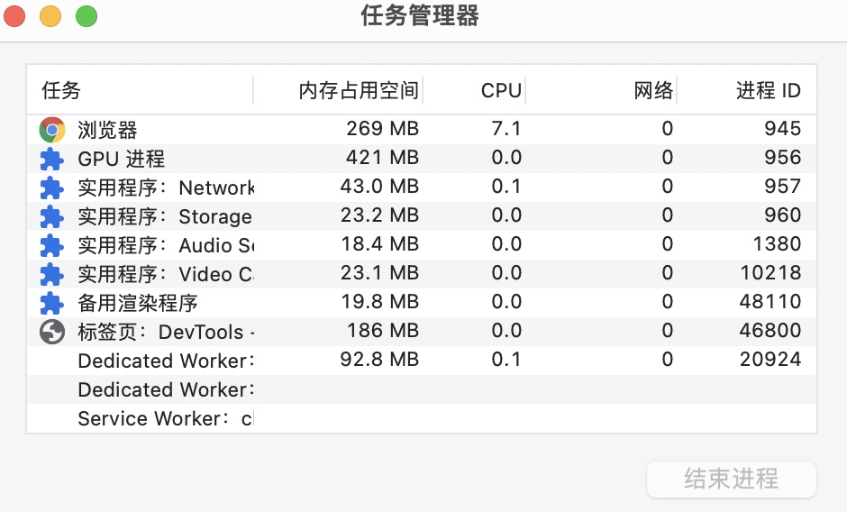

> 内存泄漏，即是申请的内存空间使用完后未释放，结果导致一直占用该内存单元，直到程序结束。

### 一、常见的内存泄漏

- 未清理的全局对象
- 未清理的定时器
- 未清理的事件监听
- 未清理的 DOM 引用
- 未清理的缓存

### 二、内存泄漏的检测

- 任务管理器，以 chrome 为例，更多工具 》 任务管理器

- 控制台 `Performance` 面板

- 控制台 `Memory` 面板

> 网上有很多教程，可以参考学习

### 三、实际项目解决

- 不用学习检测方法，因为检测就是简单看有没有内存泄漏，和定位内存泄漏的地方，但是实际项目中，这样一点点的看很耗时间，实际效率也不高
- 按照下面步骤做就行了
  - 全局检索 `addEventListener`，在组建销毁前，使用 `removeEventListener` 移除事件监听
  - 全局检索 `$on`，主要是针对 eventbus 监听，在组建销毁前，使用 `$off` 移除事件监听
  - 全局检索 `setTimeout`、`setInterval`，在组建销毁前，使用 `clearTimeout`、`clearInterval` 移除定时器
  - （次要）全局检索 `document.querySelector`、`document.querySelectorAll`，在组建销毁前，使用 `null` 或者 `undefined` 替换 DOM 引用
  - （次要）全局检索 `localStorage`、`sessionStorage`，在组建销毁前，使用 `localStorage.clear()`、`sessionStorage.clear()` 移除缓存

- 除上面常规操作外，还有一些其他的操作，比如第三方库使用后的销毁（对于此类，可以全局检索 new 关键字，包括 Vue 实例）
  - 图标 Chart，使用 `chart.destroy()` 销毁
  - 富文本 editor、Quill，使用 `editor.destroy()` 销毁
  - 地图 map，使用 `map.destroy()` 销毁
 
- 有一种情况比较坑，就是使用的第三方UI组件库里的监听事件没有正确移除，所以选择第三方UI组件库时要慎重

> 为什么这么简单粗暴呢，很简单，因为上面大部份就是闭包的实际应用
