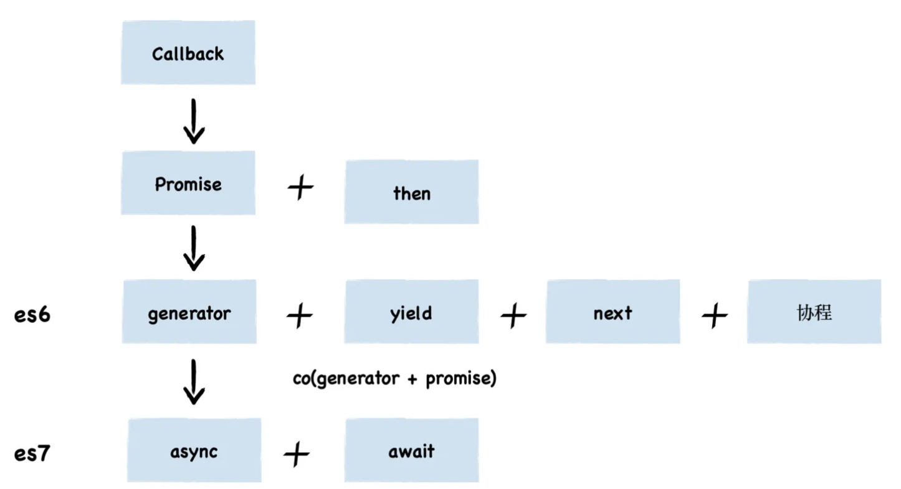
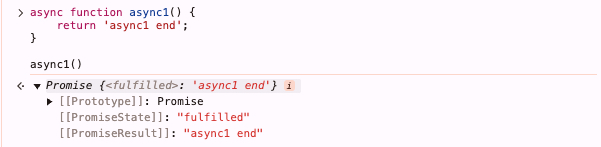

> 前言： JavaScript 是单线程的，只是把一些操作交给了其他线程处理，然后采用事件循环的机制处理返回结果，从而实现异步

> 从异步编程的出现时间进行整理



### 一、回调函数

- 定时器
- 事件监听
- Ajax 请求

> 缺点：回调多层嵌套（回调地狱），难以理解；无法捕获错误

### 二、Promise

#### 2.1 Promise 基本概念

- Promise 就是一个容器，里面保存着某个未来才会结束的事件的结果（通常是一个异步操作）
- Promise 有三种状态：`pending（进行中）、fulfilled（已成功）、rejected（已失败）`，且只能从 `pending` 到 `fulfilled` 或 `rejected`，一旦状态改变就不会再变
- 当 Promise 实例化时，会立即执行回调函数

```js
const https = require('https');

function httpPromise(url){
  return new Promise((resolve,reject) => {
    https.get(url, (res) => {
      resolve(data);
    }).on("error", (err) => {
      reject(error);
    });
  })
}

httpPromise().then((data) => {
  console.log(data)
}).catch((error) => {
  console.log(error)
})

// 调用链书写
httpPromise(url1)
    .then(res => {
        console.log(res);
        return httpPromise(url2);
    })
    .then(res => {
        console.log(res);
        return httpPromise(url3);
    })
    .then(res => {
      console.log(res);
      return httpPromise(url4);
    })
    .then(res => console.log(res));
```

#### 2.2 Promise 创建

- 构建函数创建，接收一个函数作为参数，函数接收两个参数，分别是 `resolve` 和 `reject`
- 除此外，也可以使用 `Promise.resolve()` 和 `Promise.reject()` 方法创建，返回值都是一个 Promise 对象

```js
Promise.resolve(11).then(function(value){
  console.log(value); // 打印出11
});

Promise.reject(11).catch(function(value){
  console.log(value); // 打印出11
})
```
- 相当于
```js
new Promise((resolve,reject) => {
  // resolve(11)
  resolve(11)
})
```

#### 2.3 Promise 作用

- 链式调用，解决多层嵌套问题
- 错误冒泡后一站式处理

```js
let readFilePromise = (filename) => {
  fs.readFile(filename, (err, data) => {
    if(err) {
      reject(err);
    }else {
      resolve(data);
    }
  })
}

readFilePromise('1.json').then(data => {
    return readFilePromise('2.json');
}).then(data => {
    return readFilePromise('3.json');
}).then(data => {
    return readFilePromise('4.json');
}).catch(err => {
  // xxx
})
```

#### 2.4 Promise 方法

- 常用方法：`then`、`catch`、`finally`、`all`、`race`、`any`、`allSettled`
- `then` 方法
  - 接收两个回调函数作为参数，一个是成功回调，一个是失败回调，一般第二个参数可以省略，用 `catch` 方法代替
- `catch` 方法
  - 除了实现类似 then 第二个参数的功能外，还可以捕获抛出的错误，比如上面的链式调用最后一步

#### 2.5 Promise 异常处理

- 正如上面所说，使用 `catch` 方法可以捕获

```js
const exe = (flag) => () => new Promise((resolve, reject) => {
    console.log(flag);
    setTimeout(() => {
        flag ? resolve("yes") : reject("no");
    }, 1000);
});

exe(false)()
       .catch((info) => { console.log(info); })
       .then(exe(true)); 
// 依次输出 false no true
```

#### 2.6 Promise 实现

```js
const PENDING = "pending";
const RESOLVED = "resolved";
const REJECTED = "rejected";

function MyPromise(fn) {
  // 保存初始化状态
  var self = this;

  // 初始化状态
  this.state = PENDING;

  // 用于保存 resolve 或者 rejected 传入的值
  this.value = null;

  // 用于保存 resolve 的回调函数
  this.resolvedCallbacks = [];

  // 用于保存 reject 的回调函数
  this.rejectedCallbacks = [];

  // 状态转变为 resolved 方法
  function resolve(value) {
    // 判断传入元素是否为 Promise 值，如果是，则状态改变必须等待前一个状态改变后再进行改变
    if (value instanceof MyPromise) {
      return value.then(resolve, reject);
    }

    // 保证代码的执行顺序为本轮事件循环的末尾
    setTimeout(() => {
      // 只有状态为 pending 时才能转变，
      if (self.state === PENDING) {
        // 修改状态
        self.state = RESOLVED;

        // 设置传入的值
        self.value = value;

        // 执行回调函数
        self.resolvedCallbacks.forEach(callback => {
          callback(value);
        });
      }
    }, 0);
  }

  // 状态转变为 rejected 方法
  function reject(value) {
    // 保证代码的执行顺序为本轮事件循环的末尾
    setTimeout(() => {
      // 只有状态为 pending 时才能转变
      if (self.state === PENDING) {
        // 修改状态
        self.state = REJECTED;

        // 设置传入的值
        self.value = value;

        // 执行回调函数
        self.rejectedCallbacks.forEach(callback => {
          callback(value);
        });
      }
    }, 0);
  }

  // 将两个方法传入函数执行
  try {
    fn(resolve, reject);
  } catch (e) {
    // 遇到错误时，捕获错误，执行 reject 函数
    reject(e);
  }
}

MyPromise.prototype.then = function(onResolved, onRejected) {
  // 首先判断两个参数是否为函数类型，因为这两个参数是可选参数
  onResolved =
    typeof onResolved === "function"
      ? onResolved
      : function(value) {
          return value;
        };

  onRejected =
    typeof onRejected === "function"
      ? onRejected
      : function(error) {
          throw error;
        };

  // 如果是等待状态，则将函数加入对应列表中
  if (this.state === PENDING) {
    this.resolvedCallbacks.push(onResolved);
    this.rejectedCallbacks.push(onRejected);
  }

  // 如果状态已经凝固，则直接执行对应状态的函数

  if (this.state === RESOLVED) {
    onResolved(this.value);
  }

  if (this.state === REJECTED) {
    onRejected(this.value);
  }
};
```

### 三、Generator

- Generator（生成器） 函数是 ES6 提供的一种异步编程解决方案，是一个带星号的函数（function* 并不是真正的函数）

```js
function* gen1() {
    yield 1;
    yield* gen2();
    yield 4;
}
function* gen2() {
    yield 2;
    yield 3;
}
var g = gen1(); // 阻塞，不会执行任何语句
console.log(g.next()) // { value: 1, done: false }
console.log(g.next()) // { value: 2, done: false }
console.log(g.next()) // { value: 3, done: false }
console.log(g.next()) // { value: 4, done: false }
console.log(g.next()) // { value: undefined, done: true }
```
- 生成器函数执行后返回一个生成器对象，生成器对象有一个 `next` 方法，每次调用 `next` 后，程序继续执行，直到遇到 `yield` 关键词时执行暂停，然后返回一个对象，对象有两个属性：`value` 和 `done`，`value` 是 `yield` 关键字后面的值，`done` 是一个布尔值，表示生成器函数是否已经执行完毕

### 四、async/await

- `async/await` 是 ES7 中引入的一种异步编程解决方案，它是基于 Generator 的一种语法糖，它的本质是一个生成器函数
- `async` 函数返回的是一个 Promise 对象，如果函数使用return关键字返回了值，这个值则会被 Promise.resolve() 包装成 Promise 对象（可以没有 `return`，默认返回 `undefined`）

```js
async function async1() {
    return 'async1 end';
}

async1()
```


- `await` 关键字只能在 `async` 函数中使用，await 表达式的运算结果取决于它等的是什么
  - 如果它等到的不是一个 Promise 对象，那 await 表达式的运算结果就是它等到的内容
  - 如果它等到的是一个 Promise 对象，await 就就会阻塞后面的代码，等着 Promise 对象 resolve，然后将得到的值作为 await 表达式的运算结果

```js
function testAsy(x){
   return new Promise(resolve=>{setTimeout(() => {
       resolve(x);
     }, 3000)
    }
   )
}
async function testAwt(){    
  let result =  await testAsy('hello world');
  console.log(result);    // 3秒钟之后出现hello world
  console.log('cuger')   // 3秒钟之后出现cug
}
testAwt();
console.log('cug')  //立即输出cug
```

- 看一个简单的手写代码

```js
function delay(ms) {
  return new Promise((resolve) => {
    setTimeout(() => {
      resolve();
    }, ms);
  });
}
function* generator() {
  console.log("start");
  yield delay(1000);
  console.log("after 1 second");
  yield delay(2000);
  console.log("after 2 more seconds");
}
function async(generatorFunc) {
  const iterator = generatorFunc();
  function handle(iteratorResult) {
    if (iteratorResult.done) {
      return Promise.resolve(iteratorResult.value);
    }
    return Promise.resolve(iteratorResult.value).then((res) => {
      return handle(iterator.next(res));
    });
  }
  return handle(iterator.next());
}
async(function () {
  return generator();
}).then(() => {
  console.log("all done");
});
```


