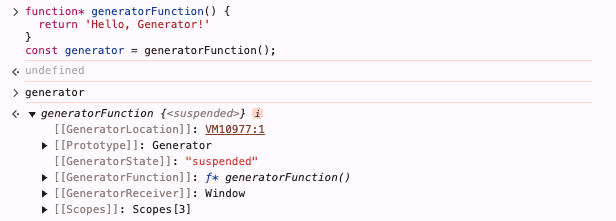

### 一、可迭代对象与普通对象的区别

#### 1.1 可迭代对象定义

- 指实现了迭代协议的对象
- 迭代协议要求对象实现一个名为 `Symbol.iterator` 的方法，该方法返回一个迭代器对象
- 迭代器对象是一个具有 `next()` 方法的对象，每次调用 `next()` 方法都会返回一个包含 `value` 和 `done` 属性的对象
  - `value` 表示当前迭代器返回的值
  - `done` 布尔值，表示迭代是否结束

#### 1.2 可迭代对象特点

- 可以使用 `for...of` 循环进行遍历
- 可以被扩展为更复杂的迭代器
- 可迭代对象通常用于集合类型（如数组、字符串、Map、Set 等）

#### 1.3 普通对象

- 普通对象没有实现迭代协议，不能使用 `for...of` 循环进行遍历
- 特点
  - 通过 `Object.keys()`、`Object.values()`、`Object.entries()` 等方法可以获取对象的键、值或键值对数组，通过 `for...in` 循环可以遍历对象的可枚举属性

### 二、迭代器

#### 2.1 同步迭代器

- 先看一个不可迭代的普通对象

```js
const favouriteMovies = {
  a: '哈利波特',
  b: '指环王',
  c: '尖峰时刻',
  d: '星际穿越',
  e: '速度与激情',
}
```
- 然后将其转换为可迭代对象以遍历它，这些成为自定义迭代器
```js
favouriteMovies[Symbol.iterator] = function() {
  const ordered = Object.values(this).sort((a, b) => a - b);
  let i = 0;
  return {
    next: () => ({
      done: i >= ordered.length,
      value: ordered[i++]
    })
  }
}

for (const v of favouriteMovies) {
  console.log(v);
}
```
- 可以在看创建一个 LeapYear 对象

```js
class LeapYear {
  constructor(start = 2020, end = 2040, interval = 4) {
    this.start = start;
    this.end = end;
    this.interval = interval;
  }
  [Symbol.iterator]() {
    let nextLeapYear = this.start;
    return {
      next: () => {
        if (nextLeapYear <= this.end) {
          let result = { value: nextLeapYear, done: false };
          nextLeapYear += this.interval;
          return result;
        }
        return { value: undefined, done: true };
      },
    };
  }
}
```
- 然后使用 for...of 循环遍历它
```js
for (const year of new LeapYear()) {
  console.log(year);
}
```
- 普通数组也可以在其上面再创建一个迭代器

```js
const favourtieMovies = [
  '哈利波特',
  '指环王',
  '尖峰时刻', 
  '星际穿越',
  '速度与激情',
];

const iterator = favourtieMovies[Symbol.iterator]();
 
iterator.next();  // { value: '哈利波特', done: false }
```

#### 2.2 异步迭代器

- 异步迭代器是实现 `Symbol.asyncIterator` 的对象

```js
const asyncIterable = {
  [Symbol.asyncIterator]: function() {
    let count = 0;

    return {
      next() {
        count++;
        if (count <= 3) {
          return Promise.resolve({ value: count, done: false });
        }

        return Promise.resolve({ value: count, done: true });
      }
    };
  }
};
```
- 可以使用 `next` 方法

```js
const go = asyncIterable[Symbol.asyncIterator]();

go.next().then(iterator => console.log(iterator.value)); // 1
go.next().then(iterator => console.log(iterator.value)); // 2
```

- 可以使用 `for await...of` 循环遍历它

```js
async function consumer() {
  for await (const asyncIterableElement of asyncIterable) {
    console.log(asyncIterableElement);
  }
}

consumer();
```

### 三、同步生成器

#### 3.1 基本概念

- 生成器是一个可以暂停和恢复并可以产生多个值的过程
- js 中的生成器由一个生成函数组成，它返回一个可迭代的 Generator 对象
- 生成器函数使用 `function*` 语法定义，其中 `*` 表示生成器函数

```js
function* generatorFunction() {}

const generatorFunction = function* () {}
```
- 也可以作为对象或类的方法

```js
// 生成器作为对象的方法
const generatorObj = {
  *generatorMethod() {},
}

// 生成器作为类的方法
class GeneratorClass {
  *generatorMethod() {}
}
```
- 生成器不能使用 `new` 关键字创建，也不能与箭头函数结合使用

#### 3.2 生成器对象

- 生成器函数不会立即返回值，而是返回一个可迭代的生成器对象

```js
function* generatorFunction() {
  return 'Hello, Generator!'
}
const generator = generatorFunction();
```

- 上面 generator 并不是一个返回的字符串，而是一个 `处于挂起状态的生成器对象`



#### 3.3 yield 关键字

- `yield` 可以暂停生成器函数并返回 `yield` 之后的值

```js
function* generatorFunction() {
  yield 'One'
  yield 'Two'
  yield 'Three'

  return 'Hello, Generator!'
}

const generator = generatorFunction()
```

- 调用 next 方法时，生成器函数会执行到下一个 `yield` 语句，然后暂停并返回 `yield` 之后的值

```js
generator.next() // { value: 'One', done: false }
generator.next() // { value: 'Two', done: false }
generator.next() // { value: 'Three', done: false }
generator.next() // { value: 'Hello, Generator!', done: true }
```
> 注意，生成器不需要 `return；` 如果省略，最后一次迭代将返回 `{value: undefined, done: true}`，生成器完成后对 `next()` 的任何后续调用也是如此

#### 3.4 遍历生成器

- 上面也说了，返回的是一个可迭代的生成器对象，所以可以使用 `for...of` 循环遍历它

```js
for (const value of generatorFunction()) {
  console.log(value);
}
// One
// Two
// Three
```
- 但是不会输出 `Hello, Generator!`，因为生成器函数已经执行完毕，所以不会输出 `Hello, Generator!`
- 扩展运算符也可用于将生成器的值分配给数组
```js
const values = [...generatorFunction()];
console.log(values); // ['One', 'Two', 'Three']
```

- 也可以解构赋值
```js
const [a, b, c] = generatorFunction();
console.log(a, b, c); // One Two Three
```

#### 3.5 关闭生成器

- 立即关闭生成器，可以使用 `return` 方法或 `throw` 方法

```js
generator.next() // { value: 'One', done: false }
generator.return('Return！') // { value: 'Return！', done: true }
generator.next() // { value: undefined, done: true }
```

```js
generator.next() // { value: 'One', done: false }
generator.throw(new Error('Error！')) //  Error: Error！ { value: undefined, done: true }
```

#### 3.6 生成器方法和状态

- 方法：`next()`、`return()`、`throw()`
- 状态：`suspended`、`closed`

#### 3.7 yield 委托

- 生成器可以使用 `yield*` 表达式将更多值委托给另一个生成器

```js
function* delegate() {
  yield 3
  yield 4
}
function* begin() {
  yield 1
  yield 2
  yield* delegate()
}
const generator = begin()

for (const value of generator) {
  console.log(value) // 1 2 3 4
}
```

### 四、异步生成器

- 只需要在生成器函数前加上 `async` 关键字即可

```js
async function* asyncGenerator() {
  yield 'One';
  yield 'Two';
}

const go = asyncGenerator();

go.next().then(iterator => console.log(iterator.value));
go.next().then(iterator => console.log(iterator.value));
```
```js
async function* asyncGenerator() {
  yield 'One';
  yield 'Two';
}

async function consumer() {
  for await (const value of asyncGenerator()) {
    console.log(value);
  }
}

consumer();
```

- `for await...of` 非常适合提取非有限数据流