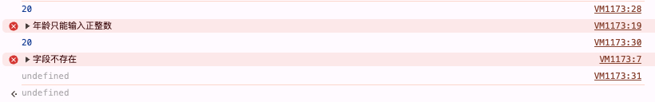

### 一、介绍

- `Proxy` 是一个构造函数，用于创建一个对象的代理对象，从而实现对目标对象基本操作的拦截和自定义

### 二、Reflect 介绍

- `Reflect` 是一个内置的对象，它提供了一些静态方法，用于操作对象的属性和方法
  - `Reflect.get(target, propKey, receiver)` 用于获取对象的属性值
  - `Reflect.set(target, propKey, value, receiver)` 用于设置对象的属性值
  - `Reflect.deleteProperty(target, propKey)` 用于删除对象的属性
- 在使用 `Proxy` 时，我们可以使用 `Reflect` 来实现对目标对象的基本操作

### 三、使用

- 使用 `new Proxy(target, handler)` 生成一个代理对象
  - `target` 目标对象
  - `handler` 一个以函数作为属性的对象，用于定义拦截操作的行为。拦截属性有很多，这里着重介绍三个
    - `get(target,propKey,receiver)` 用于拦截读取属性的操作
    - `set(target,propKey,value,receiver)` 用于拦截设置属性的操作
    - `deleteProperty(target,propKey)` 用于拦截删除属性的操作

#### 3.1、get 拦截属性

- 接收三个参数，`get(target,propKey,receiver)`
  - `target` 目标对象
  - `propKey` 属性名
  - `receiver` 代理对象，就是 `new Proxy()` 生成的实例本身

```js
let person = {
  name: "Guest"
};
let proxy = new Proxy(person, {
  get: function(target, propKey, receiver) {
    return Reflect.get(target, propKey, receiver)
  }
});

proxy.name // "Guest"
```

#### 3.2、set 拦截属性
- 接收四个参数，`set(target,propKey,value,receiver)`
  - `target` 目标对象
  - `propKey` 属性名
  - `value` 属性值
  - `receiver` 代理对象，就是 `new Proxy()` 生成的实例本身

```js
const obj = { name: "张三", age: 18 };
const proxy = new Proxy(obj, {
    get(target, prop) {
      if (prop in target) {
        return Reflect.get(target, prop);
      } else {
        console.error("字段不存在")
        return undefined;
      }
    },
    set(target, propKey, value, receiver) {
      if (propKey === "age") {
        if (typeof value === "number") {
          return Reflect.set(target, propKey, value, receiver);
          // or
          // target[propKey] = value 
          // return true
        } else {
          console.error("年龄只能输入正整数");
          return false;
        }
      } else {
        return false;
      }
    }
});
proxy.age = 20;  
console.log(proxy.age);  // 20
proxy.age = "22";
console.log(proxy.age);  // 20
console.log(proxy.test); // undefined
```


*严格模式下，`set` 代理如果没有返回true，就会报错*

#### 3.3、deleteProperty 拦截属性
- 接收两个参数，`deleteProperty(target,propKey)`
  - `target` 目标对象
  - `propKey` 属性名

```js
var handler = {
  deleteProperty (target, key) {
    invariant(key, 'delete');
    Reflect.deleteProperty(target,key)
    return true;
  }
};
function invariant (key, action) {
  if (key[0] === '_') {
    throw new Error(`无法删除私有属性`);
  }
}

var target = { _prop: 'foo' };
var proxy = new Proxy(target, handler);
delete proxy._prop
// Error: 无法删除私有属性
```
#### 3.4、取消代理

```js
Proxy.revocable(target, handler);
```

### 使用场景

- 其功能类似设计模式中的代理模式，为一个对象提供一个代用品或占位符，以便控制对它的访问
- 也可以实现观察者模式
  - 观察者模式：当一个对象的状态发生改变时，所有依赖于它的对象都将得到通知并自动更新

```js
const queuedObservers = new Set();
// 观察者函数都放入 set 集合中
const observe = fn => queuedObservers.add(fn);
// 当修改 obj 时，在 set 函数中拦截，自动执行 Set 集合中所有观察者
const observable = obj => new Proxy(obj, {set});

function set(target, key, value, receiver) {
  const result = Reflect.set(target, key, value, receiver);
  queuedObservers.forEach(observer => observer());
  return result;
}
```