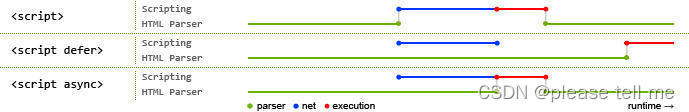

### JavaScript 脚本延迟加载的方式有哪些

> 延迟加载就是等页面加载完成之后再加载 JavaScript 文件，js 延迟加载有助于提高页面的加载速度

---
---

- `defer` 属性：脚本的加载与文档的解析同步，然后在文档解析完成后再执行这个脚本文件。多个 `defer` 属性的脚本文件会按照它们在文档中的顺序执行。
- `async` 属性：脚本的加载与文档的解析同步，但是一旦加载完成就会立即执行。多个 `async` 属性的脚本文件的执行顺序是不确定的。
- 动态创建 `script` 标签来引入 js 脚本
- 使用 `setTimeout` 延迟加载 js 脚本
- 让 js 最后加载