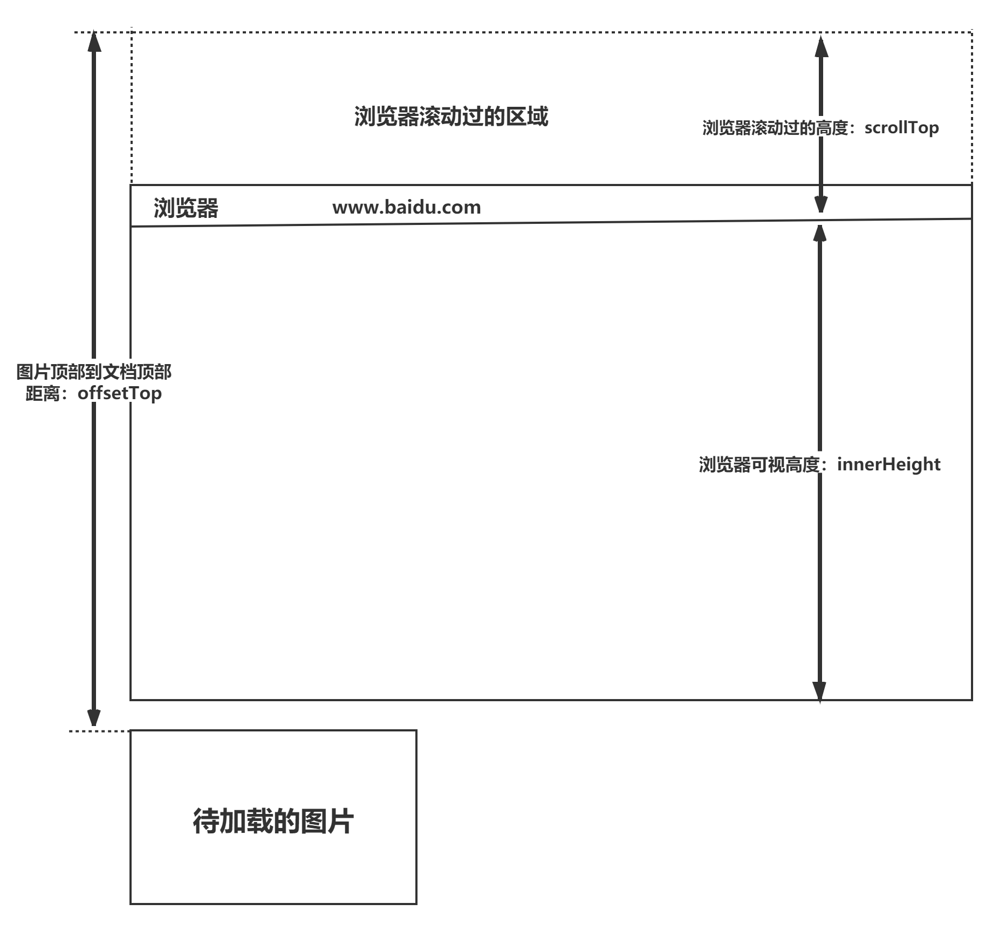
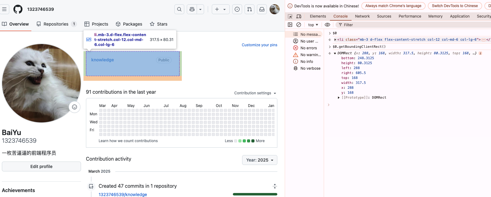

### 如何判断元素是否到达可视区域

---
---

#### 1、高度判断

- `window.innerHeight` 是浏览器可是高度
- `document.body.scrollTop || document.documentElement.scrollTop` 是浏览器滚动的过的距离
- `offsetTop` 是元素距离文档顶部的距离
- 内容达到可视区域的条件是 `document.body.scrollTop + window.innerHeight >= div.offsetTop`



#### 2、使用 `IntersectionObserver`

- 是一个更现代的 API，用于检测元素是否进入或离开视口，最高效的方法

```js
const element = document.getElementById('myElement');

const observer = new IntersectionObserver((entries) => {
    entries.forEach((entry) => {
        if (entry.isIntersecting) {
            console.log('Element is in viewport');
        } else {
            console.log('Element is not in viewport');
        }
    });
}, {
    root: null, // 使用浏览器视口作为参考
    threshold: 0.1, // 元素至少有 10% 可见时触发回调
});

observer.observe(element);

// 如果需要停止观察
// observer.unobserve(element);
```
- `IntersectionObserver` 构造函数接受两个参数
  - 回调函数：当元素进入或离开视口时，会触发回调函数
  - 选项对象：用于配置观察器的行为
    - `root`：指定一个元素作为观察器的视口，默认为浏览器视口
    - `threshold`：指定一个阈值数组或单个值，用于确定何时触发回调函数
- `entry.isIntersecting` 表示元素是否进入或离开视口

#### 3、使用 `getBoundingClientRect()`

- 返回一个包含元素的大小及其相对于视口的位置信息的对象
- 了解即可

