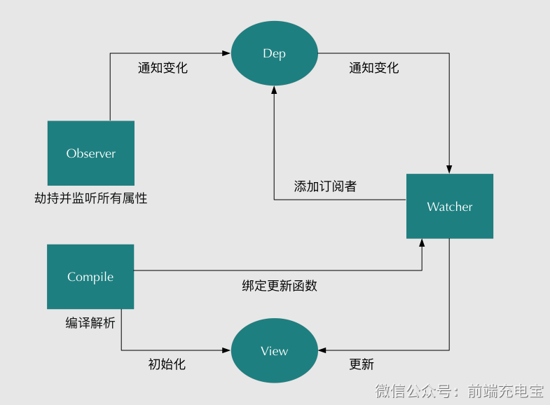

### 一、双向数据绑定原理

- 采用数据劫持结合发布者-订阅者模式的方式，通过 `Object.defineProperty()`（vue3 中是 `proxy` ） 来劫持各个属性的`setter`，`getter`，在数据变动时发布消息给订阅者，触发相应的监听回调。具体步骤为：
  - 需要 observe 的对象（`data`）进行遍历，包括子属性对象的属性，都加上 `getter` 和 `setter` 这样的话，给这个对象的某个值赋值，就会触发 `setter`，那么就能监听到数据变化
  - compile 编译模板，解析其中的指令，将模板中的变量替换成数据，然后初始化渲染页面视图，并将每个指令对应的节点绑定更新函数，添加监听数据的订阅者，一旦数据有变动，收到通知，更新视图
  - watcher 订阅者是 Observer 和 Compile 之间通信的桥梁，主要做的事情是:
    - 在自身实例化时往属性订阅器（`dep`）里面添加自己
    - 自身必须有一个 `update()` 方法
    - 待属性变动 `dep.notify()` 时，能调用自身的 `update()` 方法，并触发 `Compile` 中绑定的回调，则功成身退。

### 二、使用 `Object.defineProperty()` 来进行数据劫持的缺点

- 有些情况无法劫持到，比如：
  - 通过数组的下标来访问数组元素，无法监听到
  - 无法监听对象属性的新增或删除，需要使用 `Vue.set()` 或 `Vue.delete()` 方法来进行操作
