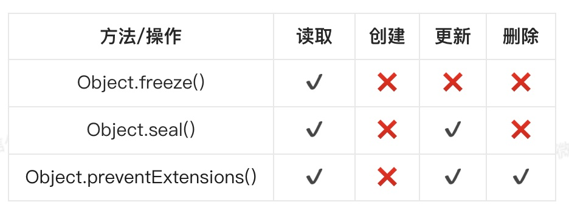

> 对象的不变性就是将对象的状态变为只读的，不可新增、修改、删除

### Object.freeze()

- `freeze()` 就是用来冻结对象的，接受一个对象作为参数，返回一个冻结后的对象
- 冻结后的对象是不可变的，不能新增、修改、删除属性

```js
const user = {
	name: 'CUGGZ',
  age: 24,
}

const freezeUser = Object.freeze(user);
```
- `Object.isFrozen()` 方法可以用来判断一个对象是否被冻结

```js
Object.isFrozen(freezeUser)  // true
```

- 需要注意的是，`Object.freeze()` 方法不会影响嵌套对象，对于嵌套对象，如果要冻结，需要使用递归的方式

```js
const deepFreeze = obj => {
  Object.keys(obj).forEach(prop => {
    if (typeof obj[prop] === 'object') {
    	deepFreeze(obj[prop]);
    }
  });
  return Object.freeze(obj);
};

deepFreeze(user);
```

- Object.freeze()方法除了可以用来冻结对象以外，还可以用于冻结数组

```js
const number = [1, 2, 3, 4, 5];
const freezeNumber = Object.freeze(number);
```

### 二、Object.seal()

- 与 freeze 类似，区别在与 seal 方法仅保护对象不能添加和删除属性，它允许更新现有的属性
- `Object.isSealed()` 方法来确认对象的密封状态

### 三、Object.preventExtensions()

- 让一个对象变的不可扩展，也就是永远不能再添加新的属性


