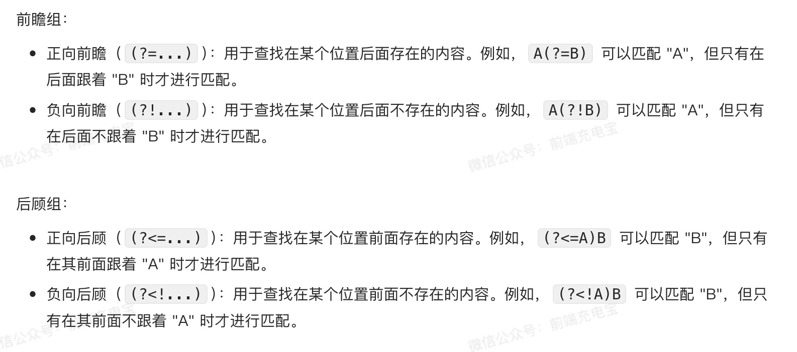

### 一、基本入门

#### 1.1 创建

- 语法： `/正则表达式主体/修饰符(可选)`
- 创建方式有两种：
  - 字面量：`/正则表达式主体/修饰符(可选)`
  - 构造函数：`new RegExp('正则表达式主体','修饰符(可选)')`

#### 1.2 RegExp 实例方法

- `test(str)`：测试字符串是否匹配正则表达式，返回布尔值
- `exec(str)`：执行正则表达式，返回匹配结果数组（类数组），没有匹配结果返回 null


### 二、模式匹配

#### 2.1 修饰符

- `g`：全局匹配，找到所有匹配的子串，默认匹配第一个
- `i`：忽略大小写，默认区分大小写
- `m`：多行匹配

#### 2.2 字符集合 []

- [] 表示会匹配包含的任意一个字符

```js
let reg = /[abc]d/;
console.log(reg.test('ad')); // true
console.log(reg.test('bd')); // true
```

#### 2.3 字符范围 [ - ]

- `[0-9]`：匹配 0-9 之间的任意一个数字
- `[a-z]`：匹配 a-z 之间的任意一个小写字母
- `[A-Z]`：匹配 A-Z 之间的任意一个大写字母
- `[a-zA-Z]`：匹配 a-z 或 A-Z 之间的任意一个字母
- `[a-zA-Z0-9]`，匹配所有数字、大小写字母中的任意字符

```js
let reg = /[a-z]d/;
console.log(reg.test('ad')); // true
console.log(reg.test('bd')); // true
```

#### 2.4 数字字符

- `{m,n}`：匹配前面的字符至少 m 次，最多 n 次
- `{m,}`：匹配前面的字符至少 m 次
- `{m}`：匹配前面的字符 m 次
- `?`：匹配前面的字符 0 次或 1 次，相当于 `{0,1}`
- `+`：匹配前面的字符 1 次或多次，相当于 `{1,}`
- `*`：匹配前面的字符 0 次或多次，相当于 `{0,}`

```js
let reg = /a{1,3}b/ig;
console.log(reg.test('aAb')); // true
console.log(reg.test('aaaab')); // false
```

#### 2.5 元字符

- `\d`：匹配一个数字字符，相当于 `[0-9]`
- `\w`：匹配一个数字、字母、下划线字符，相当于 `[a-zA-Z0-9_]`
- `\s`：匹配一个空白字符，包括空格、制表符、换行符、换页符、回车符
- `\D`：匹配一个非数字字符，相当于 `[^0-9]
- `\W`：匹配一个非数字、字母、下划线字符，相当于 `[^a-zA-Z0-9_]`
- `\S`：匹配一个非空白字符，相当于 `[^ \t\r\n\v\f]`

```js
let reg = /\d{3}/;
console.log(reg.test('123')); // true
console.log(reg.test('1234')); // false
```

#### 2.6 特殊字符

- `.`：匹配除换行符之外的任意字符
- `\`：转义字符，用于转义特殊字符
- `[^]`：匹配除了括号中的字符之外的任意字符
- `|`：或运算符，匹配两个表达式中的任意一个

```js
let reg = /a.b/;
console.log(reg.test('a1b')); // true
console.log(reg.test('a-b')); // false
```

#### 2.7 边界符

- `^`：匹配字符串的开头
- `$`：匹配字符串的结尾

```js
let reg = /^a/;
console.log(reg.test('a1b')); // true
console.log(reg.test('1a1b')); // false
```
#### 2.8 捕获组

> 正则表达式中的“捕获组”是指使用括号 () 将子模式括起来，以便于在搜索时同时匹配多个项或将匹配的内容单独提取出来

```js
const regex = /(Testing|tests) (123) aa/ig;

let str = `
Testing 123 aa
Tests 123 aa
`;

str = str.replace(regex, '$1 #$2');
console.log(str); 
// Testing #123
// Tests #123
```
##### 2.8.1 命名捕获组

- 上面 $1 $2 是捕获组引用，但是数量多不好处理，可以命名

```js
const regex = /Testing (?<num>\d{3})/  //创建一个名为 "num" 的组
let str = "Testing 123";
str = str.replace(regex, "Hello $<num>")
console.log(str); // "Hello 123"
```

##### 2.8.2 前瞻组和后瞻组



```js
const regex = /(?<=Testing )\d{3}/;
let str = "Testing 123";
console.log(regex.test(str)); // true
```
