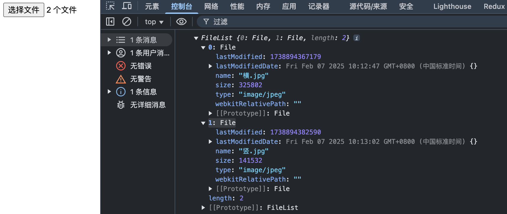

### 一、Blob
- Blob 对象就是一个不可修改的二进制对象，表示原始的类似文件的数据

#### 1.1 Blob 创建

- `new Blob(part, options)`
- part 是一个数组，数组中的每个元素都是一个 Blob 对象或字符串
- options 是一个可选的对象，包含以下属性：
  - type：指定 Blob 的 MIME 类型
  - endings：指定 Blob 的换行符类型，可选值为 'transparent' 或 'native'，默认为 'transparent'，不常用
- 常见 MIME类型
  - text/plain：纯文本文件
  - text/html：HTML文件
  - text/css：CSS文件

| MIME | 类型 | 描述 |
| --- | --- | --- |
| text/plain | 纯文本文件 |
| text/html | HTML文件 |
| text/css | CSS文件 |
| text/javascript | JavaScript文件 |
| application/xml | XML文件 |
| application/json | JSON文件 |
| application/pdf | PDF文件 |
| image/jpeg | JPEG图像 |
| image/png | PNG图像 |
| image/gif | GIF图像 |
| image/svg+xml | SVG图像 |
| audio/mpeg | MP3音频 |
| video/mpeg | MP4视频 |

- 有两个属性：
  - size：Blob 的大小，以字节为单位
  - type：Blob 的 MIME 类型

```js
const blob = new Blob(["Hello World"], {type: "text/plain"});
console.log(blob.size); // 11
console.log(blob.type); // "text/plain"
```

- `URL.createObjectURL()` 方法能将 Blob 对象转化为一个 url

```js
const blob = new Blob(["Hello World"], {type: "text/plain"});
const url = URL.createObjectURL(blob); // 'blob:http://localhost:8905/f881bd67-0ede-467d-94de-27e48052cccf'
```
#### 1.2 Blob 分片

- Blob 对象可以通过 `slice()` 方法进行分片，返回一个新的 Blob 对象

```js
const blob = new Blob(["Hello World"], {type: "text/plain"});
const blob2 = blob.slice(0, 5); // "Hello"
```

### 二、File

- File 对象是 Blob 对象的子类，用于表示本地文件,继承了 Blob 对象的所有属性和方法，同时还增加了一些自己的属性和方法
- JavaScript 中，主要有两种方法获取 File 对象：
  - 通过 `<input type="file">` 标签获取
  - 文件拖放操作生成的 `DataTransfer` 对象

#### 2.1 input

```js
<input type="file" id="fileInput" multiple="multiple">
const fileInput = document.getElementById('fileInput');
fileInput.onchange = (e) => {
    console.log(e.target.files);
}
```

- 点击上传后，输出一个 FileList 数组，这个数组的每个元素都是一个 File 对象




- `lastModified`：引用文件最后修改日期，为自1970年1月1日0:00以来的毫秒数；
- `lastModifiedDate`：引用文件的最后修改日期；

#### 2.2 文件拖放

- 将浏览器之外的文件拖到浏览器窗口中，触发 `dragover`、`drop` 事件

```js
<div id="drop-zone"></div>
const dropZone = document.getElementById("drop-zone");
dropZone.ondragover = (e) => {
    e.preventDefault();
}
dropZone.ondrop = (e) => {
    e.preventDefault();
    const files = e.dataTransfer.files;
    console.log(files)
}
```

- 实际输出与 input 一致

### 三、FileReader

- FileReader 是一个 Web API，用于读取本地文件或 Blob 对象中的数据

```js
const reader = new FileReader();
```

- FileReader 有以下几个方法：
  - `readAsArrayBuffer()`：读取文件为 ArrayBuffer 对象
  - `readAsBinaryString()`：读取文件为二进制字符串
  - `readAsDataURL()`：读取文件为 DataURL
  - `readAsText()`：读取文件为文本
- 常用属性
  - `result`：读取文件的结果
  - `readyState`：读取文件的状态
  - `error`：读取文件的错误

- 常用事件
  - `progress`：读取文件的进度
  - `load`：读取文件完成
  - `error`：读取文件错误
  - `abort`：读取文件被中止
  
```js
<input type="file" id="fileInput">
const fileInput = document.getElementById("fileInput");
const reader = new FileReader();
fileInput.onchange = (e) => {
    reader.readAsDataURL(e.target.files[0]);
}
reader.onload = (e) => {
    console.log(e.target.result);
}
```

### 四、ArrayBuffer

[原文访问](https://www.yuque.com/cuggz/feplus/fzcp69#yUVvR)

### 五、Object URL

- Object URL 是一个字符串，用于表示一个对象的 URL。这个对象即是 `Blob Object、File Object`
- 通过 `URL.createObjectURL()` 方法创建

```js
const blob = new Blob(["Hello World"], {type: "text/plain"});
const url = URL.createObjectURL(blob); // 'blob:http://localhost:8905/f881bd67-0ede-467d-94de-27e48052cccf'
```

- 上面处理传 blob，还可以传 file
- `URL.revokeObjectURL()` 方法释放一个 Object URL， 释放后，这个 URL 就不能再使用了

```js
URL.revokeObjectURL(url);
```

### 六、Base64

- Base64 是一种将二进制数据编码为 ASCII 字符的方法
- Base64 编码后的字符串可以直接在网络上传输，不需要进行额外的编码和解码操作
- 两个方法
  - `btoa()`：将字符串编码为 Base64 字符串
  - `atob()`：将 Base64 字符串解码为字符串

```js
btoa("JavaScript")       // 'SmF2YVNjcmlwdA=='
atob('SmF2YVNjcmlwdA==') // 'JavaScript'
```

- 应用场景，多数场景是基于 Data URL 来使用的
  - `toDataURL` 方法把 canvas 画布内容转成 base64 编码的字符串

```js
const canvas = document.getElementById('canvas'); 
const ctx = canvas.getContext("2d");
const dataUrl = canvas.toDataURL();
```

  - `readAsDataURL` 方法把文件转成 base64 编码的字符串

```js
const fileInput = document.getElementById("fileInput");
const reader = new FileReader();
fileInput.onchange = (e) => {
  reader.readAsDataURL(e.target.files[0]);
};
reader.onload = (e) => {
  console.log(e.target.result);
};
```