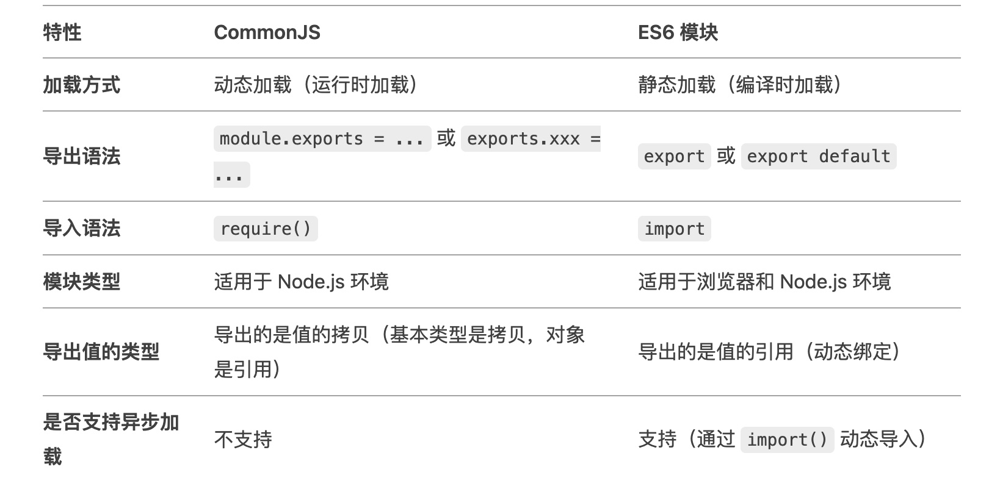

> 模块化是工程化的基础

- 实现模块化的规范有很对，比如 IIFE、CommonJS、AMD、CMD、UMD、ES6

### 一、IIFE 立即执行函数

- IIFE 是一种在 JavaScript 中创建私有作用域的技术（闭包的应用）

```js
(function () {
  // 在这里定义你的代码
})();
```
- 看个实际例子

```js
var module = (function(){
  var age = 20;
  var name = 'JavaScript'
  
  var fn1 = function(){
    console.log(name, age)
  };
  
  var fn2 = function(a, b){
    console.log(a + b)
  };
  
  return {
    age,
    fn1,
    fn2,
  };
})();

module.age;           // 20
module.fn1();         // JavaScript 20
module.fn2(128, 64);  // 192
```

### 二、CommonJS

> 浏览器不支持使用 CommonJS 规范，现在多使用 ES6 模块规范； NodeJS 两种规范都支持

> CommonJS 规范是同步加载模块，只有加载完成才能执行后面的操作

#### 2.1 CommonJS 模块特点

- 每个文件就是一个模块，有自己的作用域
- 模块可以被多次加载，但是只会在第一次加载时运行一次，然后缓存结果，以后再加载，就直接读取缓存结果（也就是说对值的浅拷贝，即普通数据类型不贡献，引入数据类型共享，因为对象浅拷贝的是引用地址）


#### 2.2 CommonJS 模块使用

- 导出模块
```js
// module.js
const age = 20;
const name = 'JavaScript'
const fn1 = function(){
  console.log(name, age)
};
const fn2 = function(a, b){
}
module.exports = {
  age,
  fn1,
  fn2,
}
```
- 导入模块
```js
const module = require('./module.js');
// 或者
// const {age, fn1, fn2} = require('./module.js');

module.age;           // 20
module.fn1();         // JavaScript 20
module.fn2(128, 64);  // 192
```

- 模块加载过程
  - 优先从缓存中加载
  - 缓存中没有，检查是否是核心模块，如果是，直接加载
  - 如果不是核心模块，检查是否是文件模块，解析文件路径，直到根目录的 node_modules 文件
  - 如果都不是，报错

- 注意，上面不是说一次加载多次使用吗，但是有种导出方式是导出一个构造函数，每次使用都 new 一个实例，就不会共享了

```js
// cart.js

function Cart () {
    this.items = [];
}

Cart.prototype.addItem = function (name, price) {
    this.items.push({
        name: name,
        price: price
    });
}

Cart.prototype.total = function () {
    return this.items.reduce(function(a, b) {
        return a + b.price;
    }, 0);
};

module.export = Cart;
```

### 三、AMD 模块

- AMD，是异步模块加载机制
- 与 CommonJS 不同，AMD 是异步加载模块，只有加载完成才能执行后面的操作
- 主要用于浏览器环境

### 四、CMD 模块

### 五、UMD 模块

### 六、ES6 模块

#### 6.1 ES6 特点

- 加上 `type="module"` 就是 ES 模块，模块默认是严格模式，分配未声明的变量会报错，this 指向 undefined

```js
<script type="module">
  a = 5; 
</script>
```

- ES6 是一个单例（类似单例设计模式，但不是单例设计模式的应用），模块在首次加载时会被执行一次，并且其导出的值会被缓存。所有引入该模块的地方都会共享同一个模块实例，这意味着模块中的状态（所有类型的变量）是全局共享的

#### 6.2 ES6 模块使用

- 使用 `export` 导出模块

```js
const first = 'JavaScript';
const second = 'TypeScript';
function func() {
    return true;
}
export {first, second, func};
export const first = 'JavaScript';
export function func() {
    return true;
}
// 默认导出，使用 default，只能有一个
export default function func() {
    return true;
}
// 默认导出可以省略变量/函数/类名，在导入时可以为其指定任意名称
export default function () {
    return true;
}
```
- 使用 `import` 导入模块

```js
import {first, second, func} from './module';  // 命名导出
import customName from './module.js';  // 默认导出
import React, {usestate, useEffect} from 'react';  // 命名默认一起

import * as circle from './circle'; // 导入所有导出并重命名，忽略默认导出
```

#### 6.3 动态导入

- 上面说的都是静态导入，整个模块需要先下载完成，然后再执行
- 动态导入是按需加载，只有在使用时才会下载模块，然后执行
- 动态导入使用 `import()` 函数，返回一个 Promise
- 动态导入可以使用 `async/await` 语法

```js
async loadComponent() {
  try {
    const module = await import('./MyComponent.vue');
    this.dynamicComponent = module.default;
  } catch (error) {
    console.error('加载组件失败:', error);
    this.dynamicComponent = null;
  }
}
```

### 七、CommonJs 和 ES6 模块的区别



