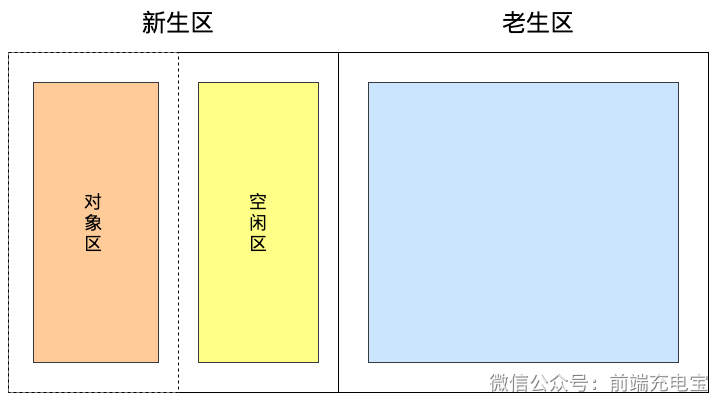
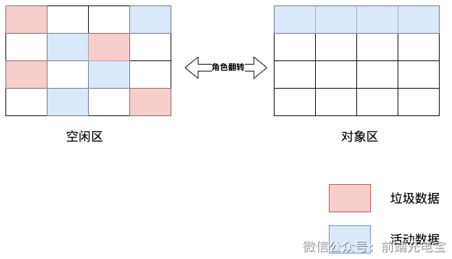
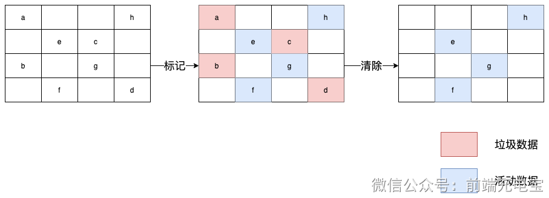
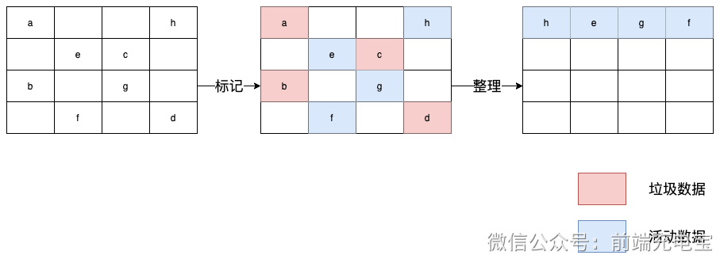
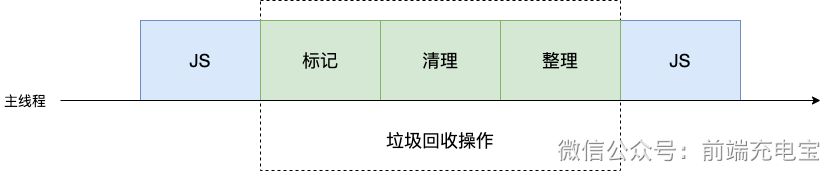
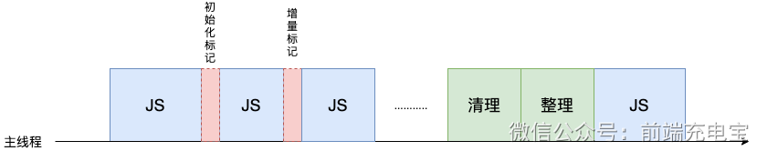

### 一、V8 执行代码过程

- V8 在执行过程中用到了解释器和编译器，过程如下
  - Parse 阶段： V8 引擎将 JS 代码代码转换成 AST（抽象语法树）
  - Ignition 阶段： 解释器将 AST 转换成字节码，解释执行字节码
  - TurboFan 阶段： 编译器将字节码优化为可以执行的机器码
  - Orinoco 阶段： 立即回收阶段，将程序中不再使用的内存释放掉

- 前三步是 JavaScript 代码执行的过程，最后一步是垃圾回收的过程

#### 1.1 生成 AST

- 这个过程是将 JavaScript 代码转换成抽象语法树（AST），并生成执行上下文
- 生成 AST 分成两个阶段：词法分析、语法分析

#### 1.2 生成字节码

- 有了 抽象语法树 AST 和执行上下文后，就轮到解释器登场了，它会根据 AST 生成字节码，并解释执行字节码
- 字节码就是介于 AST 和机器码之间的一种代码，相对于机器码而言，它的代码量更小，从而可以减少内存消耗

#### 1.3 生成机器码

- 字节码配合解释器和编译器的技术就是 即时编译（JIT）。在 V8 中就是指解释器在解释执行字节码的同时，收集代码信息，当它发现某一部分代码变热了之后，编译器便闪亮登场，把热点的字节码转换为机器码，并把转换后的机器码保存起来，以备下次使用】

### 二、执行过程优化

- 如果JavaScript代码在执行前都要完全经过解析才能执行，那可能会面临以下问题：
  - 代码执行时间变长
  - 内存占用增加

- 所以，V8 引擎使用了 `延迟解析`
  - 在解析过程中，对于不是立即执行的函数，只进行预解析，只有当函数调用时，才会进行完整的解析
  - 进行预解析时，只验证函数语法是否有效、解析函数声明、确定函数作用域 

### 三、垃圾回收机制

> JavaScript代码运行时，需要分配内存空间来储存变量和值。当变量不在参与运行时，就需要系统收回被占用的内存空间

#### 3.1 基本概念

- V8 垃圾回收过程

  - 通过 GC root 标记空间中的活动对象和非活动对象
    - 即通过 GC root 能遍历到的对象就是可访问的对象，反之就是不可访问的对象
  - 回收非活动对象所占据的内存空间
    - 即所有的标记完成后，统一清理内存中所有被标记可回收的对象
  - 内存整理
    - 为了防止内存碎片，需要对内存进行整理

- 在 V8 中，会把堆分为新生代和老生代两个区域，新生代用于存放生命周期短的对象，老生代用于存放生命周期长的对象
- 对于这两块区域，V8 分别采用不同的垃圾回收机制，以便更搞笑地实施垃圾回收
  - 副垃圾回收器：负责新生代的垃圾回收
  - 主垃圾回收器：负责老生代的垃圾回收

#### 3.2 副垃圾回收器 （新生代）

- 大多数对象最开始被分配到新生代中，该存储空间较小，分两个区域：对象区域和空闲区域
  - 对象区域写满后，进行一次垃圾回收，即标记处理
  - 标记处理后，将活动对象复制到空闲区域，然后将对象区域和空闲区域交换
  - 交换后，空闲区域变成了对象区域，对象区域变成了空闲区域

#### 3.3 主垃圾回收器 （老生代）

- 老生代的存储空间较大，除了新⽣代中晋升的对象，⼀些⼤的对象会直接被分配到⽼⽣代⾥
- 和新生代一样，存储空间满后，进⾏垃圾回收
- 垃圾回收过程（两种不同的垃圾回收算法）
  - 标记清除
    - 标记阶段：从根对象开始遍历，标记所有可达对象
    - 清除阶段：遍历堆中的所有对象，将未被标记的对象进行回收

  - 标记整理
    - 标记阶段：从根对象开始遍历，标记所有可达对象
    - 整理阶段：将所有可达对象移动到堆的一端，然后清除未被标记的对象

#### 3.4 全停顿

- 当垃圾回收器开始工作时，会导致 JavaScript 代码执行暂停，这就是全停顿

- 全停顿会导致页面卡顿，所以 V8 引擎使用了增量标记算法来减少全停顿的时间
- 增量标记算法可以把一个完整的垃圾回收任务拆分为很多小的任务，这些小的任务执行时间比较短，可以穿插在其他的 JavaScript 任务中间执行，直到任务完成

### 四、避免垃圾回收

- 数组优化：将数组长度设置为0
- 对象优化：将对象设置为null
