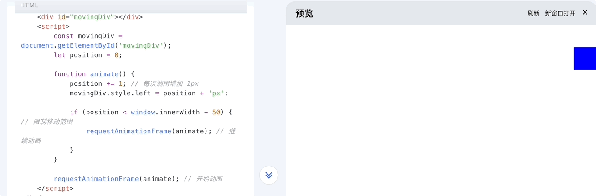

### 对 requestAnimationframe 的理解

> 实现动画效果的方式有很多，比如 html5 的 `canvas`，`css3` 的 `animation`，`js` 的 `setInterval`，`setTimeout`，`requestAnimationFrame` 等等。

---
---

- `requestAnimationFrame` 是请求动画帧的意思，是一个 `api`，用于在浏览器的下一帧重新绘制之前，对动画进行更新
- 它的使用方法是 `requestAnimationFrame(callback)`，其中 `callback` 是一个回调函数，会在浏览器重绘之前被调用
- 该方法是一个宏任务

- 该方法的优点是：
  - CPU节能：页面未激活时，动画不会执行
  - 函数节流：每帧执行一次，不会造成性能问题，一秒最多执行 60 次
  - 减少 DOM 操作：会把每帧中的所有 DOM 操作集中起来执行

- `cancelAnimationFrame()` 是取消动画帧的意方法，接收一个参数，即 `requestAnimationFrame` 的返回值 id，用于取消对应的动画帧

