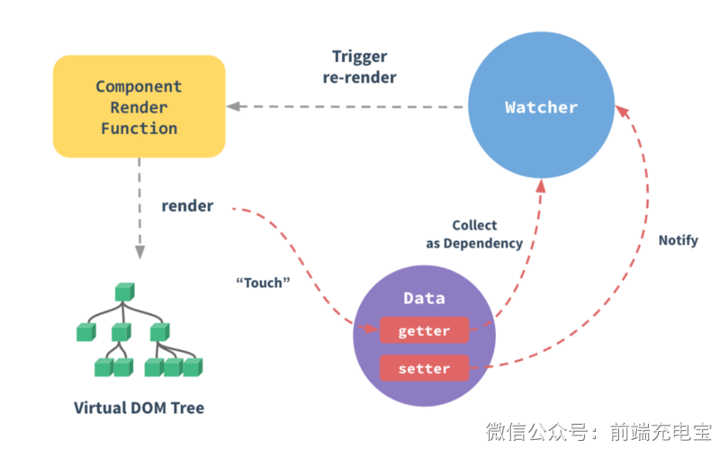

### 一、基本原理（完整循环）

- 黄色部分：组件渲染函数，负责生成虚拟 DOM
- 绿色部分：虚拟 DOM 转化为真实 DOM
- 蓝色部分：观察者（响应式系统），负责监听数据变化
- 紫色部分：通过 Object.defineProperty (Vue 2.x) 或 Proxy (Vue 3.x) 实现数据劫持，包含 getter 和 setter

### 二、数据流转过程

- 当组件渲染时，会访问数据的 getter
- getter 被访问时，会将当前属性收集为依赖（Collect as Dependency）
- 当数据变化时，setter 会被触发
- setter 触发后会通知（Notify）对应的 Watcher 程序实例（每个组件都有）
- Watcher 接收到通知后，触发组件的重新渲染（Trigger re-render）
- 重新渲染会生成新的虚拟 DOM 树

