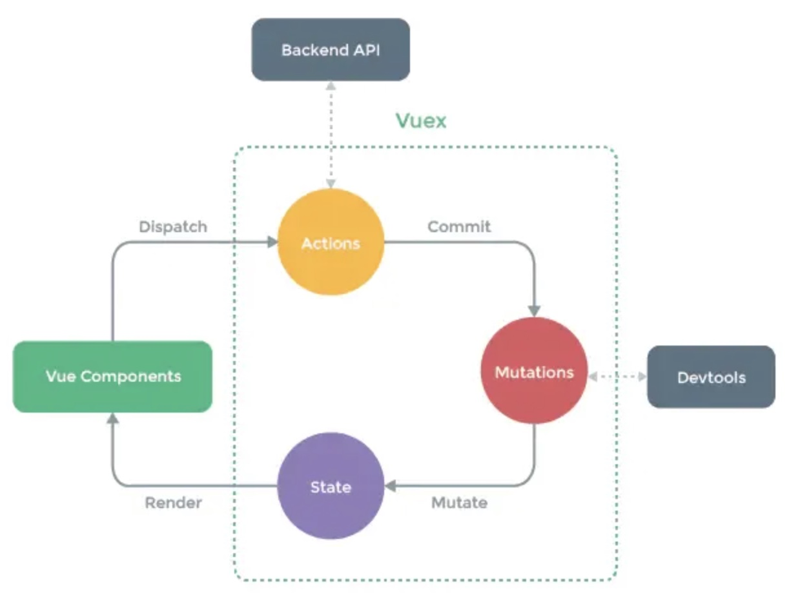

```js
const store = new Vuex.Store({
  state: {
    count: 0
  },
  getters: {
    doubleCount (state) {
      return state.count * 2
    }
  },
  mutations: {
    increment (state) {
      state.count++
    }
  },
  actions: {
    increment (context) {
      context.commit('increment')
    }
  }
})
```

### 一、有哪几种属性

- 有五种，分别是 `State、 Getter、Mutation 、Action、 Module`
  - state => 基本数据(数据源存放地)
  - getters => 从基本数据派生出来的数据
  - mutations => 提交更改数据的方法，只能同步操作，严格模式下是唯一能够更改 state 的属性
  - actions => 提交更改数据的方法，支持异步操作
  - module => 模块化


### 二、actions 和 mutations 的区别

- Mutation 专注于修改 State，理论上是修改 State 的唯一途径；Action 专注于业务代码、异步请求
- Mutation 必须同步执行；Action 可以异步，但不能直接操作State
- mutation 的参数是 state，它包含 store 中的数据；Action 的参数是 context，它是 state 的父级，包含 state、getters


### 三、为什么 Vuex 的 mutation 中不能做异步操作

- 因为 Vuex 的设计是单向数据流，mutation 是同步执行的，异步操作会导致数据不一致，所以 Vuex 不支持异步操作

### 四、Vuex的严格模式是什么,有什么作用，如何开启

- 严格模式是 Vuex 的一个配置项，它会在无论何时发生了状态变更且不是由 mutation 函数引起的，将会抛出错误
- 配置：

```js
const store = new Vuex.Store({
    strict:true,
})
```

### 五、如何在组件中批量使用 state、getter、mutation、action

- 批量使用 state、getter、mutation、action 的方法有以下几种：
  - 1.使用 mapState、mapGetters、mapMutations、mapActions 方法
  - 2.使用 this.$store.state、this.$store.getters、this.$store.commit、this.$store.dispatch 方法


```js
import {mapGetters} from 'vuex'
export default{
    computed:{
        ...mapGetters(['total','discountTotal']),
        ...mapState(['cartList']),
    },
    methods:{
        ...mapMutations(['addCart']),
        ...mapActions(['addCart']),
    }
}
```


### 六、模块化怎么使用

- 模块化是 Vuex 的一个配置项，它会将 store 中的数据进行模块化管理，每个模块都有自己的 state、getter、mutation、action
- 配置：
```js
const store = new Vuex.Store({
    modules:{
        a:{
            state:{
                count:1
            },
            getters:{
                doubleCount(state){
                    return state.count * 2
                }
            }
        },
        b:{
            state:{
                countB:2
            },
        }
    }
})
```

- 组件内使用 mapState 引入

```js
import {mapState} from 'vuex'
export default{
    computed:{
        ...mapState({
            count:state=>state.a.count,
            countB:state=>state.b.countB
        })
    }
}
```