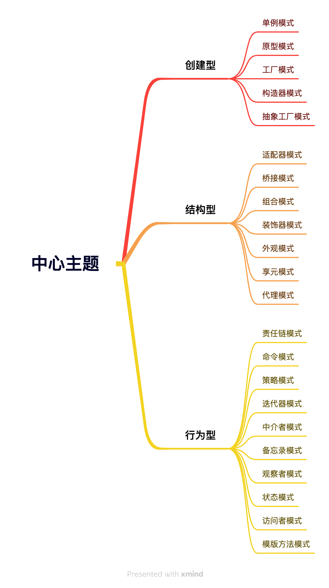

### 一、什么是设计模式

- `设计模式` 是一套被反复使用、多数人知晓的、经过分类编目的、代码设计经验的 `总结`
- 使用设计模式是为了可重用代码、让代码更容易被他人理解、保证代码可靠性

> 就像是在做数学题时，已知直角三角形两边长，求另一边，我们会直接用勾股定理，而不会去证明为什么勾股定理是成立的。所以，设计模式实际上是“拿来主义”在软件领域的贯彻实践，它是一套现成的工具，拿来即用

### 二、设计模式的核心思想

- 设计模式出现的背景，是软件设计的复杂度日益飙升，而越来越复杂的“罪魁祸首”就是 `变化`
- 我们能做的只有将这个变化造成的影响最小化
  - **将变与不变分离，确保变化的部分灵活，不变的部分稳定**，这个过程，就叫 `封装变化`
  - 只有这样的代码，才是“健壮”的代码，而设计模式出现的意义就是帮我们写出这样的代码

### 三、设计原则概述

- 设计原则是设计模式的指导理论，而设计模式是实现设计原则的具体方法和工具
- 设计原则有很多，遵循 `SOLID` 原则是最基本的原则，它是由 5 个单词组成，分别是：
  - **S** ：单一职责原则
  - **O** ：开放封闭原则
  - **L** ：里氏替换原则
  - **I** ：接口隔离原则
  - **D** ：依赖倒置原则
- JavaScript 设计模式主要是围绕 `单一职责原则（Single Responsibility Principle, SRP）` 和 `开放封闭原则（Open/Closed Principle, OCP）`


#### 3.1 单一职责原则

- 该原则指出，一个类（或模块、函数）应该只有一个发生变化的原因
  - 如果一个类承担了多个职责，那么这个类就会变得复杂、难以维护和扩展
  - 原则的核心思想是，将一个类的功能分解成多个独立的、可管理的职责，每个职责都有一个明确的责任
  
*举个例子：假设有一个 User 类，它既负责用户信息的存储，又负责发送通知，如何不使用单一职责原则实现，如下*

```js
class User {
  constructor(name, email) {
    this.name = name;
    this.email = email;
  }
  sendNotification(message) {
    // 发送通知
    console.log(`Sending email to ${this.email}: ${message}`);
  }
}
```
*上面的代码中，User 类承担了两个职责：存储用户信息和发送通知，这两个职责都与 User 类相关，因此违反了单一职责原则。我们可以将这两个职责分别提取出来，如下*
```js
class User {
  constructor(name, email) {
    this.name = name;
    this.email = email;
  }
}
class NotificationService {
  sendNotification(user, message) {
    // 发送通知
    console.log(`Sending email to ${user.email}: ${message}`);
  }
}

// 使用示例
const user = new User('Alice', 'alice@example.com');
const notificationService = new NotificationService();
notificationService.sendNotification(user, 'Welcome to our service!');
```

#### 3.2 开放封闭原则

- 开闭原则指出，软件实体（类、模块、函数等）应该对扩展开放，对修改封闭
  - 即当我们需要添加新功能时，应该通过扩展现有代码来实现，而不是修改现有代码
  - 开闭原则的核心思想是，通过抽象和封装，使得系统更加灵活、可扩展和可维护

*举个例子：不使用开闭原则，实现一个支付能力*


```js
class PaymentProcessor {
    processPayment(paymentType, amount) {
        if (paymentType === 'alipay') {
            // 支付宝支付逻辑
            console.log(`使用支付宝支付 ${amount} 元`);
        } else if (paymentType === 'wechat') {
            // 微信支付逻辑
            console.log(`使用微信支付 ${amount} 元`);
        } else {
            throw new Error('不支持的支付方式');
        }
    }
}

// 使用示例
const processor = new PaymentProcessor();
processor.processPayment('alipay', 100);
processor.processPayment('wechat', 200);
processor.processPayment('unionpay', 300);
```
*上面的代码中，`PaymentProcessor` 类负责处理各种支付方式，当我们需要添加新的支付方式时，需要修改 `processPayment` 方法，这违反了开闭原则。我们可以使用策略模式来实现，如下*
```js
// 支付策略接口
class PaymentStrategy {
    pay(amount) {
        throw new Error('pay method must be implemented');
    }
}
// 支付宝支付策略
class AlipayStrategy extends PaymentStrategy {
    pay(amount) {
        console.log(`使用支付宝支付 ${amount} 元`);
    }
}
// 微信支付策略
class WechatPayStrategy extends PaymentStrategy {
    pay(amount) {
        console.log(`使用微信支付 ${amount} 元`);
    }
}
// 支付处理器
class PaymentProcessor {
    constructor() {
        this.strategies = new Map();
    }

    // 注册支付策略
    registerStrategy(name, strategy) {
        this.strategies.set(name, strategy);
    }

    // 处理支付
    processPayment(paymentType, amount) {
        const strategy = this.strategies.get(paymentType);
        if (!strategy) {
            throw new Error('不支持的支付方式');
        }
        strategy.pay(amount);
    }
}

// 使用示例
const processor = new PaymentProcessor();

// 注册各种支付策略
processor.registerStrategy('alipay', new AlipayStrategy());
processor.registerStrategy('wechat', new WechatPayStrategy());

// 处理支付
processor.processPayment('alipay', 100);
processor.processPayment('wechat', 200);

// 添加新的支付方式（比如添加京东支付）
class JDpayStrategy extends PaymentStrategy {
    pay(amount) {
        console.log(`使用京东支付 ${amount} 元`);
    }
}

// 注册新的支付策略
processor.registerStrategy('jdpay', new JDpayStrategy());
processor.processPayment('jdpay', 400);
```

*可以看到，上面没有遵循单一职责原则，优化后*
```js
// 支付策略接口
class PaymentStrategy {
    pay(amount) {
        throw new Error('子类必须实现 pay 方法');
    }
}

// 支付宝支付策略
class AlipayStrategy extends PaymentStrategy {
    pay(amount) {
        console.log(`使用支付宝支付 ${amount} 元`);
    }
}

// 微信支付策略
class WechatPayStrategy extends PaymentStrategy {
    pay(amount) {
        console.log(`使用微信支付 ${amount} 元`);
    }
}
// 支付策略管理器（单一职责：管理支付策略）
class PaymentStrategyManager {
    constructor() {
        this.strategies = new Map();
    }

    registerStrategy(name, strategy) {
        this.strategies.set(name, strategy);
    }

    getStrategy(name) {
        const strategy = this.strategies.get(name);
        if (!strategy) {
            throw new Error('不支持的支付方式');
        }
        return strategy;
    }
}

// 支付处理器（单一职责：处理支付）
class PaymentProcessor {
    constructor(strategyManager) {
        this.strategyManager = strategyManager;
    }

    processPayment(paymentType, amount) {
        const strategy = this.strategyManager.getStrategy(paymentType);
        strategy.pay(amount);
    }
}
// 使用示例
const strategyManager = new PaymentStrategyManager();

// 注册各种支付策略
strategyManager.registerStrategy('alipay', new AlipayStrategy());
strategyManager.registerStrategy('wechat', new WechatPayStrategy());

// 创建支付处理器
const processor = new PaymentProcessor(strategyManager);

// 处理支付
processor.processPayment('alipay', 100);
processor.processPayment('wechat', 200);

// 添加新的支付方式（比如添加京东支付）
class JDpayStrategy extends PaymentStrategy {
    pay(amount) {
        console.log(`使用京东支付 ${amount} 元`);
    }
}

// 注册新的支付策略
strategyManager.registerStrategy('jdpay', new JDpayStrategy());
processor.processPayment('jdpay', 400);
```

- 以上，就是js遵循的两大设计原则。是不是突然简单的代码变得很复杂了～～～

### 四、设计模式的分类

- 目前总共提出了23种设计模式，并按照创建型、结构型和行为型进行了分类



- 前端常用到的设计模式有以下几种：
  - 单例模式
  - 工厂模式
  - 状态模式
  - 策略模式
  - 代理模式
  - 装饰器模式
  - 观察者模式
  - 发布订阅模式
  - 迭代器模式
  - 适配器模式
  - 组合模式
  - 命令模式