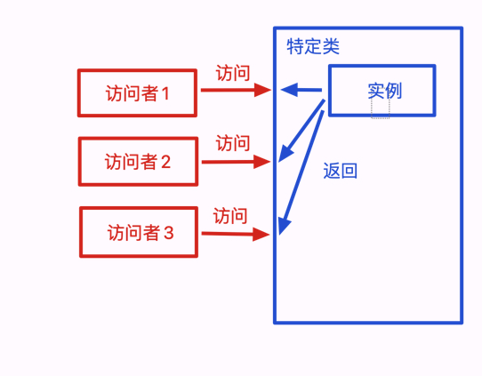

### 一、什么是单例模式

- 单例模式又称单体模式，保证一个类只有一个实例，并提供一个全局的访问点
  - 也就是说，第二次使用同一个类创建新对象的时候，应该得到与第一次创建的对象完全相同的对象
- 它有以下特点：
  - 每次执行获得的对象都是第一次创建的对象
  - 如果一开始没有创建对象实例，那么这个特定类需要自行创建这个对象实例
- 常见的单例（并非单例模式的应用，只是单例）
  - 浏览器中的 `window / document `
  - ES6中的模块特性
  - vue 项目中 Vuex 维护的全局状态、vue-router 维护的路由状态

### 二、单例模式的实现

- 需要注意这几个点：
  - 访问时始终返回一个实例
  - 自行实例化，无论是一开始加载的时候就创建好，还是在第一次被访问时
  - 一般还有提供一个 `getInstance` 方法，用于获取实例



- 主要有以下几个概念：
  - `Singleton`：特定类，即要访问的类，访问者拿到的是它的实例
  - `instance`：单例，是特定类的实例，特定类一般会提供一个 `getInstance` 方法，用于获取实例
  - `getInstance`：获取实例的方法

- 具体实现：
```js
class SingleCase {
    show() {
        console.log('我是一个单例对象')
    }
    static getInstance() {
        // 判断是否已经new过1个实例
        if (!SingleCase.instance) {
            // 若这个唯一的实例不存在，那么先创建它
            SingleCase.instance = new SingleCase()
        }
        // 如果这个唯一的实例已经存在，则直接返回
        return SingleCase.instance
    }
}
const s1 = SingleCase.getInstance()
const s2 = SingleCase.getInstance()
s1 === s2    // true
```
- `getInstance` 的逻辑还可以用闭包来实现：

```js
SingleCase.getInstance = (function() {
    // 定义自由变量instance，模拟私有变量
    let instance = null
    return function() {
        // 判断自由变量是否为null
        if(!instance) {
            // 如果为null则new出唯一实例
            instance = new SingleCase()
        }
        return instance
    }
})()
```

### 三、Vue 中的单例模式

- Vuex 是一个专为 Vue.js 应用程序开发的状态管理模式。实现了一个全局的 `Store` 用于存储应用的所有状态，这个 Store 的实现，正是单例模式的典型应用
  - vue 中，组件之间是独立的，使用 props 进行通信，稍微复杂一点的场景，组件关系复杂，嵌套很深，那通信逻辑就变得复杂难以维护，从而就需要将共享数据抽出来，放在全局
- vue 项目中使用 `Vue.use()` 方法安装 vuex 插件，内部实现了一个 `install` 方法，这个方法内部有一部分和 `getInstance` 方法类似
```js
let Vue // 这个Vue的作用和楼上的instance作用一样
...
export function install (_Vue) {
  // 判断传入的Vue实例对象是否已经被install过Vuex插件（是否有了唯一的state）
  if (Vue && _Vue === Vue) {
    if (process.env.NODE_ENV !== 'production') {
      console.error(
        '[vuex] already installed. Vue.use(Vuex) should be called only once.'
      )
    }
    return
  }
  // 若没有，则为这个Vue实例对象install一个唯一的Vuex
  Vue = _Vue
  // 将Vuex的初始化逻辑写进Vue的钩子函数里
  applyMixin(Vue)
}
```
- 通过这种方法，可以保证一个 Vue 实例只会 install 一次 Vuex 插件，从而保证了 Vuex 的唯一性

### 四、单例模式的优缺点

- 优点：
  - 可以保证一个类只有一个实例，减少了内存的占用
  - 可以保证一个类只有一个实例，避免了多个实例之间的冲突
- 缺点：
  - 单例模式的职责过重，违反了单一职责原则，将两个不同的功能：单例模式和业务逻辑混合在一起
  - 单例模式的扩展性差，因为单例模式中没有抽象层