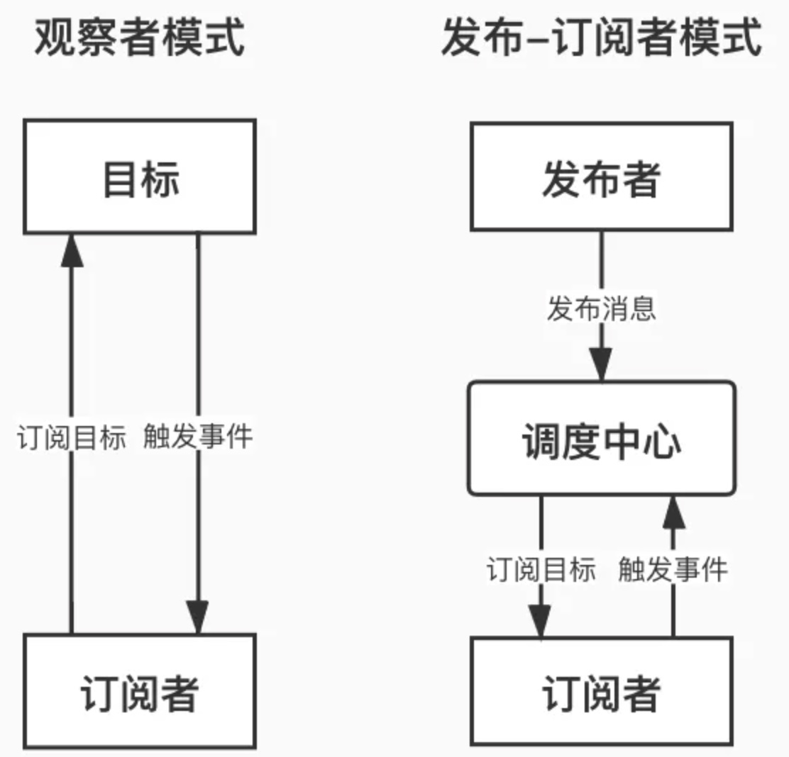

### 一、什么是观察者模式与发布订阅模式

#### 1.1 观察者模式

- 观察者模式是一种行为型设计模式，它定义了一种一对多的依赖关系，让多个观察者对象同时监听某一个主题对象（发布者），当主题对象的状态发生变化时，它的所有观察者都会收到通知并自动更新

#### 1.2 发布订阅模式

- 在23种设计模式中没有发布订阅模式，他是观察者模式的一个憋闷，但两者又有所区别，经过发展，已经独立于观察者模式，成为一种比较重要的设计模式

> 比如在抖音上关注了 A ，当 A 发布视频时，抖音就会通知所有关注了 A 的用户。在这个例子中，A 就是发布者，我们是订阅者，抖音是调度中心

#### 1.3 区别

- 观察者模式：
  - 主题和观察者之间是直接的耦合关系
  - 主题需要维护观察者列表，并且在状态变化时通知所有观察者
- 发布订阅模式：
  - 发布者和订阅者之间是松耦合的，通过调度中心进行通信
  - 发布者和订阅者不需要直接交互，而是通过调度中心进行消息的传递
  - 发布订阅模式通常用于异步通信，比如事件驱动的编程模型




### 二、观察者模式的实现

- 发布者

```js
// 定义发布者类
class Publisher {
  constructor() {
    this.observers = []
    console.log('Publisher created')
  }
  // 增加订阅者
  add(observer) {
    console.log('Publisher.add invoked')
    this.observers.push(observer)
  }
  // 移除订阅者
  remove(observer) {
    console.log('Publisher.remove invoked')
    this.observers.forEach((item, i) => {
      if (item === observer) {
        this.observers.splice(i, 1)
      }
    })
  }
  // 通知所有订阅者
  notify() {
    console.log('Publisher.notify invoked')
    this.observers.forEach((observer) => {
      observer.update(this)
    })
  }
}
```

- 订阅者

```js
// 定义订阅者类
class Observer {
    constructor() {
        console.log('Observer created')
    }
    update() {
        console.log('Observer.update invoked')
    }
}
```

### 三、发布订阅模式的实现

- 先看几个概念
  - Publisher：发布者，当消息发生时负责通知对应的订阅者
  - Subscriber：订阅者，当消息发生时被通知的对象
  - SubscriberMap：持有不同 type 的数组，存储所有订阅者的数组
  - type：订阅者的类型，用于区分不同的订阅者
  - subscribe：订阅方法，用于将订阅者添加到对应的 type 数组中
  - unSubscribe：取消订阅方法，用于将订阅者从对应的 type 数组中移除
  - notify：通知方法，用于通知所有订阅者

```js
class Publisher {
    constructor() {
        this._subsMap = {}
    }
    
    // 消息订阅 
    subscribe(type, cb) {
        if (this._subsMap[type]) {
            if (!this._subsMap[type].includes(cb))
                this._subsMap[type].push(cb)
        } else this._subsMap[type] = [cb]
    }
    
    // 消息退订 
    unsubscribe(type, cb) {
        if (!this._subsMap[type] ||
            !this._subsMap[type].includes(cb)) return
        const idx = this._subsMap[type].indexOf(cb)
        this._subsMap[type].splice(idx, 1)
    }
    
    // 消息发布 
    notify(type, ...payload) {
        if (!this._subsMap[type]) return
        this._subsMap[type].forEach(cb => cb(...payload))
    }
}
const adadis = new Publisher()
adadis.subscribe('运动鞋', message => console.log('152xxx' + message))    // 订阅运动鞋
adadis.subscribe('运动鞋', message => console.log('138yyy' + message))
adadis.subscribe('帆布鞋', message => console.log('139zzz' + message))    // 订阅帆布鞋
adadis.notify('运动鞋', ' 运动鞋到货了 ')   // 打电话通知买家运动鞋消息
adadis.notify('帆布鞋', ' 帆布鞋售罄了 ') // 打电话通知买家帆布鞋消息
// 输出:  152xxx 运动鞋到货了 
// 输出:  138yyy 运动鞋到货了 
// 输出:  139zzz 帆布鞋售罄了 
```