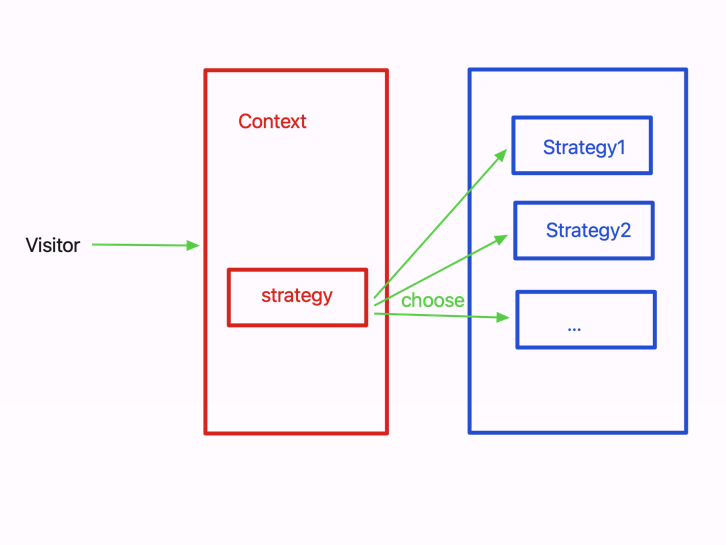

### 一、什么是策略模式

- 又称政策模式，其定义一系列的策略算法，把他们一个个封装起来，并且使它们可以互相替换
- 关键是策略的实现和使用分离，策略的实现是独立的，策略的使用是通过上下文来完成的

*举个例子： 生活中，螺丝规格有很多，对应螺丝刀种类也不少，如果每碰到一中规格的螺丝就买一个螺丝刀，就很浪费。所以现在有了多功能螺丝刀，一个刀把，多种规格的螺丝刀头*

- 这就是策略模式的实例，螺丝刀属于`封装上下文`，封装和使用不同的螺丝刀头，螺丝刀头就相当于`策略`，可以根据需求不同选择不同的策略

### 二、策略模式的实现

- 主要概念
  - Context（上下文）：封装了策略的使用，提供了一个接口来访问策略
  - Strategy（策略）：定义了具体的策略算法，可以相互替换
  - StrategyMap（策略映射）：用于管理和存储策略的映射关系
  


- 看一个售价的例子

```js
function priceCalculate(discountType, price) {
    if (discountType === 'minus100_30') {   		// 满100减30
        return price - Math.floor(price / 100) * 30
    }
    else if (discountType === 'minus200_80') {  // 满200减80
        return price - Math.floor(price / 200) * 80
    }
    else if (discountType === 'percent80') {    // 8折
        return price * 0.8
    }
}
priceCalculate('minus100_30', 270)    // 输出: 210
priceCalculate('percent80', 250)      // 输出: 200
```
- 当售价种类越来越多时，if else 就越来越臃肿，可以改为策略模式

```js
const DiscountMap = {
    minus100_30: function(price) {
        return price - Math.floor(price / 100) * 30
    },
    minus200_80: function(price) {
        return price - Math.floor(price / 200) * 80
    },
    percent80: function(price) {
        return price * 0.8
    }
}
// 计算总售价
function priceCalculate(discountType, price) {
    return DiscountMap[discountType] && DiscountMap[discountType](price)
}
priceCalculate('minus100_30', 270)
priceCalculate('percent80', 250)
// 输出: 210
// 输出: 200
```

- 也可以进一步封装成模块

```js
const PriceCalculate = (function() {
    /* 售价计算方式 */
    const DiscountMap = {
        minus100_30: function(price) {      // 满100减30
            return price - Math.floor(price / 100) * 30
        },
        minus200_80: function(price) {      // 满200减80
            return price - Math.floor(price / 200) * 80
        },
        percent80: function(price) {        // 8折
            return price * 0.8
        }
    }
    
    return {
        priceClac: function(discountType, price) {
            return DiscountMap[discountType] && DiscountMap[discountType](price)
        },
        addStrategy: function(discountType, fn) {		// 注册新计算方式
            if (DiscountMap[discountType]) return
            DiscountMap[discountType] = fn
        }
    }
})()
PriceCalculate.priceClac('minus100_30', 270)	// 输出: 210
PriceCalculate.addStrategy('minus150_40', function(price) {
    return price - Math.floor(price / 150) * 40
})
PriceCalculate.priceClac('minus150_40', 270)	// 输出: 230
```