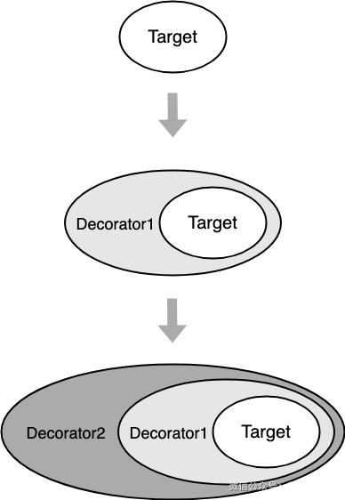

### 一、什么是装饰器模式

- 在不改变原对象的基础上，通过对其进行包装扩展（添加属性或方法），使原有对象可以动态具有更多功能，从而满足用户更复杂的需求
- 特点：
  - 不影响原有的功能，原有功能可以照常使用
  - 可以增加多个，共同给目标对象添加额外功能

### 二、装饰器模式的原理




### 三、装饰器的使用场景

- 给浏览器事件添加新功能

```js
window.onload = function() {
    console.log('原先的 onload 事件 ')
}
/* 发送埋点信息 */
function sendUserOperation() {
    console.log('埋点：用户当前行为路径为 ...')
}
/* 给原生事件添加新的装饰方法 */
function originDecorateFn(originObj, originKey, fn) {
    originObj[originKey] = function() {
        var originFn = originObj[originKey]
        return function() {
            originFn && originFn()
            fn()
        }
    }()
}
// 添加装饰功能
originDecorateFn(window, 'onload', sendUserOperation)
// 输出： 原先的 onload 事件
// 输出： 埋点：用户当前行为路径为 ...
```

### 四、装饰器的优缺点

- 优点
  - 可维护性高：给对象功能扩展可以不再使用继承的方式，继承会产生很多子类
  - 灵活性好：可以使用装饰器动态的增加或删除功能
  - 复用性高：一个装饰器可以装饰多个对象
  - 多样性：可以通过组合不同的装饰器来创建不同的功能组合
- 缺点
  - 装饰器模式会增加许多小装饰对象，增加系统的复杂性
  - 灵活性高也就容易出错，调试起来比较麻烦

