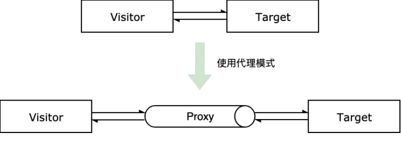
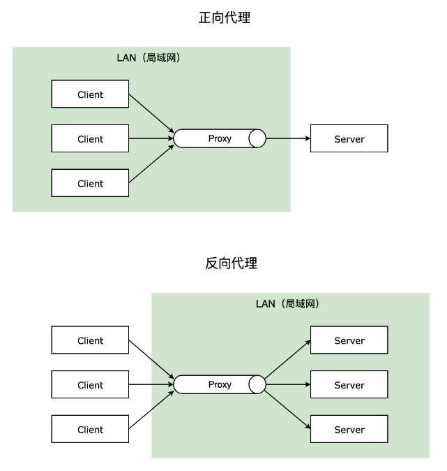

### 一、什么是代理模式

- 该模式为目标对象创造了一个代理对象，以控制对目标对象的访问
- 特点
  - 访问者对目标对象的访问都是经过代理对象来完成
  - 代理对象对访问有过滤的功能

- 主要有以下几个概念
  - `Target` 目标对象，也就是被代理的对象，是具体业务的实际执行者
  - `Proxy` 代理对象，是对目标对象的代理，用于控制对目标对象的访问



- ES6 原生提供了 `Proxy` 构造函数，可以直接创建代理对象

```js
const proxy = new Proxy(target, handler)
```
- `target` 是目标对象，`handler` 是代理对象的处理器，用于定义代理对象的行为
- `handler` 是一个对象，包含了代理对象的各种行为，比如 `get`、`set`、`apply` 等代理属性

```js
const obj = { name: "张三", age: 18 };
const proxy = new Proxy(obj, {
    get(target, prop) {
      if (prop in target) {
        return Reflect.get(target, prop);
      } else {
        console.error("字段不存在")
        return undefined;
      }
    },
    set(target, propKey, value, receiver) {
      if (propKey === "age") {
        if (typeof value === "number") {
          return Reflect.set(target, propKey, value, receiver);
          // or
          // target[propKey] = value 
          // return true
        } else {
          console.error("年龄只能输入正整数");
          return false;
        }
      } else {
        return false;
      }
    }
});
proxy.age = 20;  
console.log(proxy.age);  // 20
proxy.age = "22";
console.log(proxy.age);  // 20
console.log(proxy.test); // undefined
```

- 在 ES6 之前，一般是使用 `Object.defineProperty` 来完成相同的功能

### 二、代理模式的实际应用

- 拦截器

  - 比如 Axios 中的请求拦截器和响应拦截器
  - 处理与 HTTP 相关的拦截器，还有路由跳转的拦截器

- vue 框架的数据响应式
- 缓存代理
  - 比如 vue 中的 computed 计算属性，就是使用了缓存代理
- 保护代理和虚拟代理
  - 保护代理其实就是对访问的过滤，而虚拟代理是为一个开销很大的操作先占位，之后再执行
- 正向代理和反向代理
  - 正向代理： 一般的访问流程是客户端直接向目标服务器发送请求并获取内容，使用正向代理后，客户端改为向代理服务器发送请求，并指定目标服务器（原始服务器），然后由代理服务器和原始服务器通信，转交请求并获得的内容，再返回给客户端。正向代理隐藏了真实的客户端，为客户端收发请求，使真实客户端对服务器不可见
  - 反向代理： 与一般访问流程相比，使用反向代理后，直接收到请求的服务器是代理服务器，然后将请求转发给内部网络上真正进行处理的服务器，得到的结果返回给客户端。反向代理隐藏了真实的服务器，为服务器收发请求，使真实服务器对客户端不可见




### 三、代理模式的优缺点

- 优点
  - 代理模式可以隐藏目标对象，保护目标对象的访问
  - 代理对象可以扩展目标对象的功能

- 缺点
  - 代理模式会增加系统的复杂度