### 一、背景

- 日常项目开发中，不说本地开发，在测试环境和线上环境运行的代码都是打包压缩后的，也就是转换后的代码
- 当代码报错需要调试时，调试转换后的代码是很困难的，比如下面：


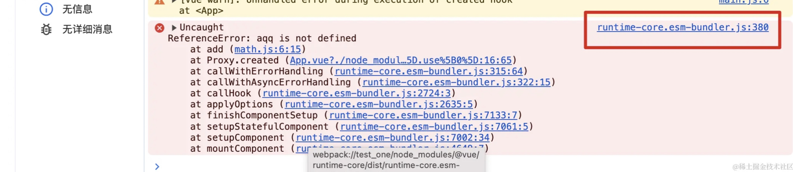


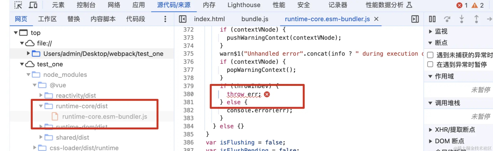

- 可以看到，报错定位到的是打包后的文件，也是转换后的代码


### 二、什么是 Source Map

> Source Map 是一个json格式的信息文件，里面存储了代码打包转换后的位置信息，能将转换后的代码映射回原始源代码

- 最初 source map 生成的文件大小是原始文件的10倍，第二版减少了约50%，第三版又减少了50%，所以目前一个133kb的文件， 最终的source-map的大小大概在300kb
- source map 文件格式如下：


```json
{
  "version": 3,
  "file": "bundle.js",
  "mappings": ";;;;;AAAAA,OAAO,CAACC,GAAG,CAAC,MAAM,CAAC,C",
  "sources": [
    "webpack://test_two/./src/main.js"
  ],
  "sourcesContent": [
    "console.log('2121');"
  ],
  "names": [
    "console",
    "log"
  ],
  "sourceRoot": ""
}
```

- *version*：当前使用的版本，上面是最新的第三版
- *file*：打包后的文件，也是浏览器加载的文件
- *mappings*：source map用来和源文件映射的信息，比如位置信息等，是一串可变长度的base64 VLQ编码
- *sources*：从哪些文件转换过来的source map和打包的代码（最初始的文件）
- *sourcesContent*：转换前的具体代码信息（打包压缩后的）
- *names*：转换钱的变量和属性名称
- *sourceRoot*：所有的 sources 相对的根目录

### 三、怎么使用 Source Map

- 首先打包时会根据配置信息生成一个 map 文件
- 然后在转换后的代码最后面添加一个注释，它指向 source map


```js
//# sourceMappingURL=bundle.js.map
```

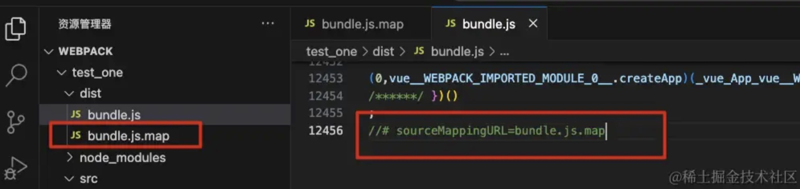

- 在chrome中需要打开相应配置才能使用source map（默认是打开的）


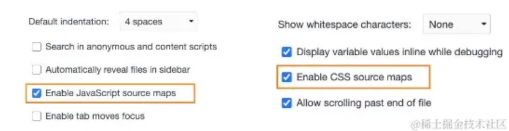

- 然后，调试错误信息就可以转接定位到源码信息（可以看到错误在第4行第17列）

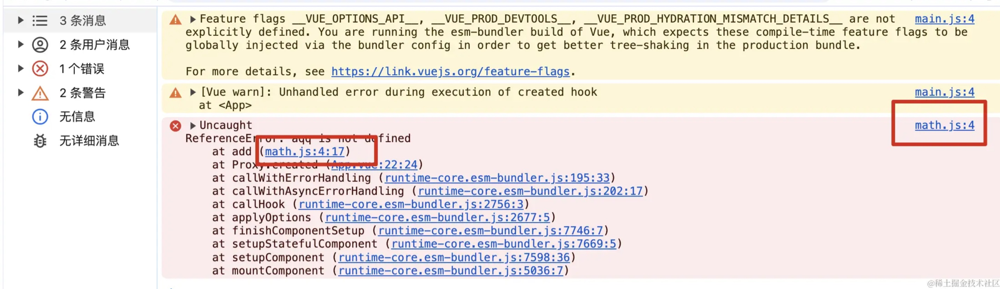

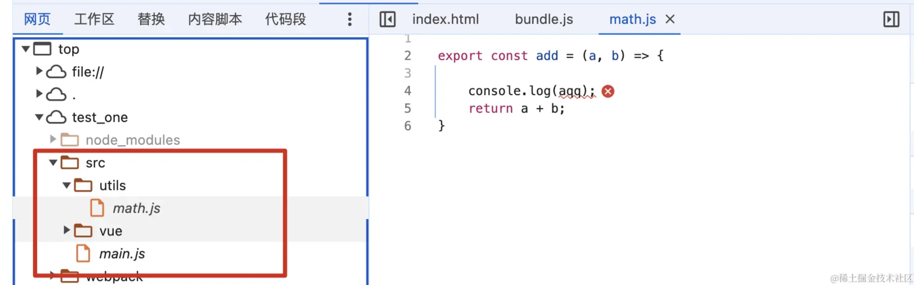

### 四、怎么生成 Source Map 文件

- 配置方式很简单，在 webpack.config.json 中配置`devtool`


```js
module.exports = {
    mode: "development",
    devtool: "source-map",
    entry: "./src/main.js",
    ...
}
```
- webpack 为该配置项提供了26个值，选择不同的值，生成的 source-map 会稍微有差异，打包的过程也会有性能的差异，可以针对不同的环境配置不同的值
- 官网：https://webpack.docschina.org/configuration/devtool/


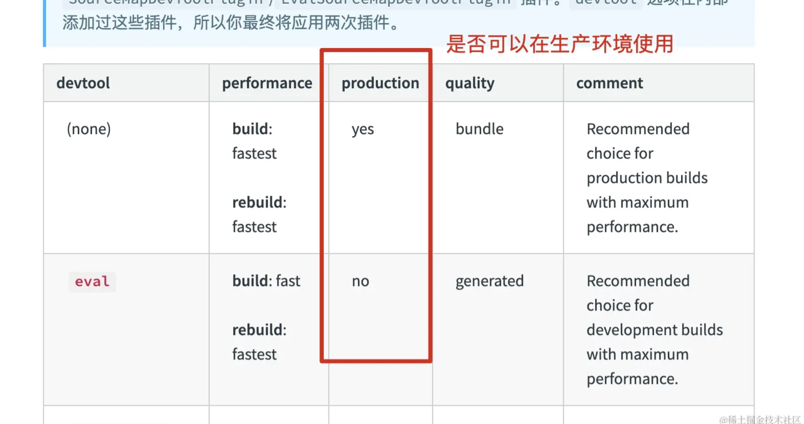

- 下面几个值不会生成 source-map
    - *false*：不使用 source-map
    - *none*：production 模式下的默认值
    - *eval*：development 模式下的默认值
        - 但是它会在 eval 执行的代码中，添加 `//# sourceURL=;`，有部分源码调试能力


- 简单介绍几个常用的值

#### *source-map 值*

- 生成一个独立的 source-map 文件，并且在打包后的文件下面有个注释，指向 source-map 文件


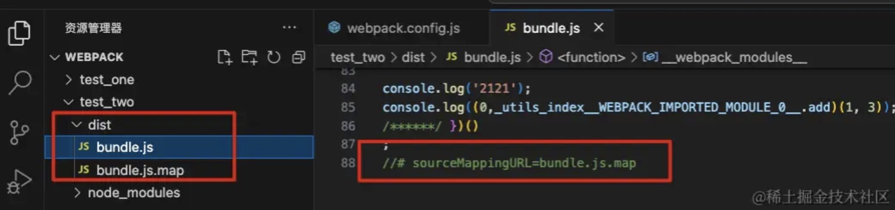


#### *eval-source-map 值*

- 会生成 source-map ，但是没有独立文件，而是以 DataUrl 添加到 eval 函数后面


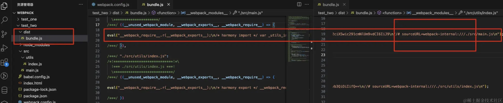

- eval 函数执行的就是打包压缩后的代码

#### *inline-source-map 值*

- 会生成 source-map，但是没有独立文件，以 DataUrl 添加到打包文件的后面


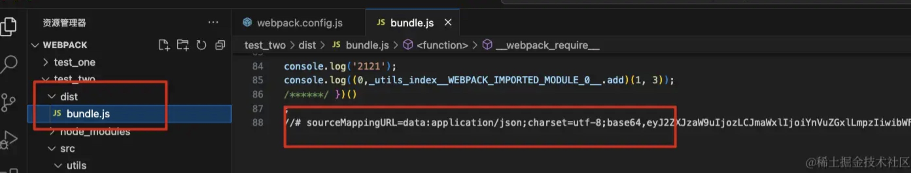

#### *cheap-source-map 值*

- 和 source-map 类似，但更高效些，没有生成具体的列映射，明确了第2行


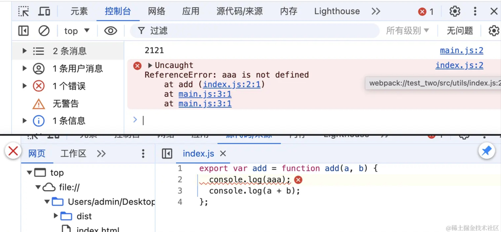

#### *cheap-module-source-map 值*

- 和 cheap-source-map 类似，但对于用loader处理后的代码调试更友好


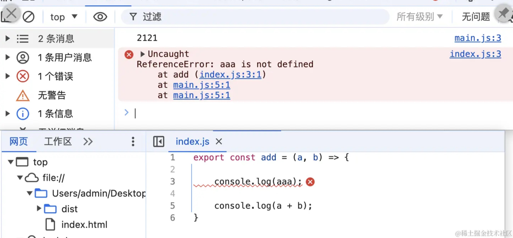


- 源代码长这样

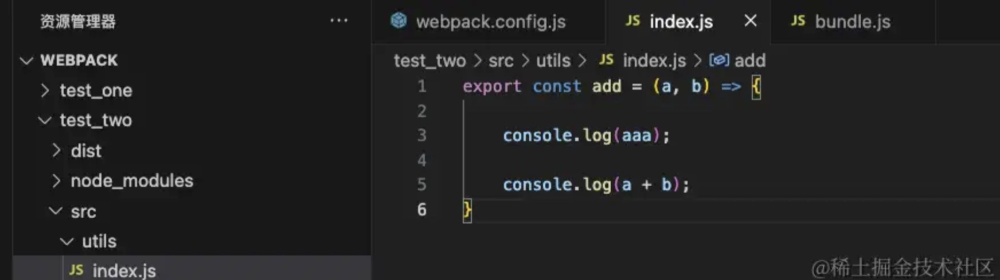

- 可以看出来，loader处理后，空格都被处理了，但是 cheap-module-source-map 映射的更准确


### 五、总结

- 一般情况下
    - 开发阶段：推荐使用 source-map 和 cheap-module-source-map
    - 测试阶段：同上
    - 发布阶段：false 或者 不写默认none
        - 发布阶段不推荐使用是因为一是为了加快构建速度，二是防止有技术的人获取项目源码信息

- 特殊情况下，发布阶段也是可以使用 source map，但是要做特别的处理，比如将生成的map文件存储到一个固定的地方，需要调试的时候将其取出赋值给 DataUrl


