### 1. 前言

- webpack 性能优化较多，大致可以分为两类
    - 优化一：**打包后的结果**，上线时的性能优化（比如分包处理、CDN服务器、减小包体积等）
    - 优化二：**优化打包速度**，开发或者构建时优化打包速度（比如 exclude、cache-loader等）

- 大多数情况下，侧重优化一

### 2. 代码分离（分包处理）

- 默认情况下，所有的 js 代码（比如业务代码、第三方依赖、暂时没有用到的模块）在首页全部加载，会影响首页的加载速度
- 代码分离通常指的是将代码拆分成多个包（bundle）或块（chunk）的过程，好处包括：
    - **减少初始加载时间**：用户在首次访问应用时，不需要下载整个应用的所有 JavaScript，只需加载当前页面或路由所需的代码
    - **提高缓存效率**：分离的文件可以被浏览器单独缓存，如果某个文件没有变化，就不需要重新下载
    - **按需加载**：对于大型应用，可以按需加载那些只有在特定功能或页面上才需要的代码，从而加快应用的响应速度

- 常用的代码分离有三种
    - **入口起点**：使用entry配置手动分离代码
    - **防止重复**：使用 Entry Dependencies 去重或分离代码
    - **动态导入**：通过模块的内联函数调用来分离代码（用的最多）


#### 2.1 多入口起点

- 一般vue项目都会有一个入口文件，是 main.js，现在，可以在同目录位置配置一个 index.js
- 然后在 webpack.config.json 文件中配置多个入口即可，当然也要配置对应的出口


```js
module.exports = {
    entry: {
        index: './src/index.js',
        main: './src/main.js'
    },
    output: {
        path: path.resolve(__dirname, './build'),
        // name 是占位符
        filename: '[name]-bundle.js'
    }
}
```
- 然后打包可以看到会有两个出口文件

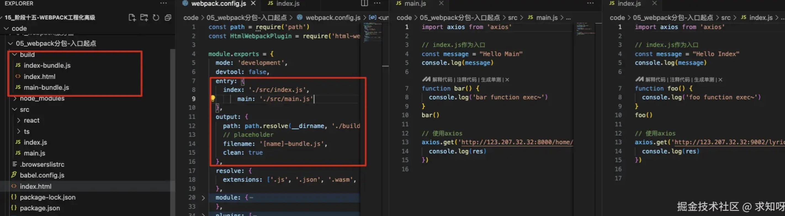

#### 2.2 入口依赖（Entry Dependencies）

- 上面文件可以看到，两入口文件都用到了 axios 依赖库，如果只是单纯的进行入口分离，那么打包后的两个 bunlde 都会有一份 axios（其他依赖包同理）
- 而入口依赖可以实现共同依赖包的共享

```js
module.exports = {
    entry: {
        index: {
          import: './src/index.js',
          dependOn: 'shared'
        },
        main: {
          import: './src/main.js',
          dependOn: 'shared'
        },
        shared: ['axios']
    },
    output: {
        path: path.resolve(__dirname, './build'),
        // placeholder
        filename: '[name]-bundle.js'
    }
}
```
- 可以看出多了一个共享依赖包，shared 可以有多个

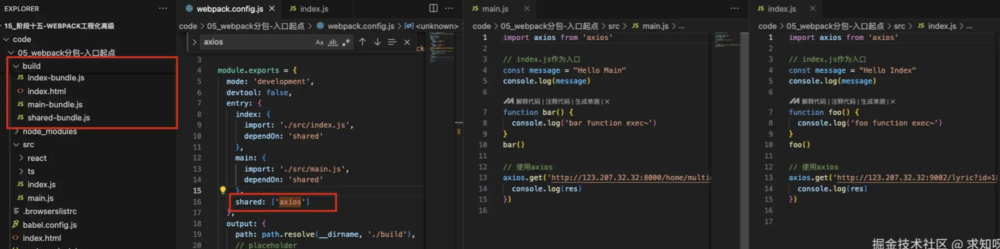


#### 2.3 动态导入

- webpack 提供了两种动态导入的方式
    - 使用 ECMAScript 中的 `import()` 语法来完成，目前推荐的方式
    - 使用 webpack 遗留的 require.ensure，目前不推荐使用

- 目前有两js文件（vue中可以当作路由组件），这两文件希望在代码运行过程中加载它，因为不确定在运行中会不会用到，所以最好拆分成独立文件
- 一般引入都是在文件顶部引入，比如

```js
import './router/about'
import './router/category'
```
- 但是这样会在打包时将内容放在主包里，而通过动态导入的方式一定会打包成独立的包
- 因为一定会打包成独立的文件，可以通过 `chunkFilename` 对打包后的文件重命名

```js
  output: {
    clean: true,
    path: path.resolve(__dirname, './build'),
    // placeholder
    filename: '[name]-bundle.js',
    // 单独针对分包的文件进行命名
    chunkFilename: '[name]_chunk.js'
}
```
- name 可以自定义，比如下面的魔法注释 `/* webpackChunkName: "about" */`

```js
btn1.onclick = function() {
  import(/* webpackChunkName: "about" */'./router/about').then(res => {
    res.about()
    res.default()
  })
}

btn2.onclick = function() {
  import(/* webpackChunkName: "category" */'./router/category')
}
```

- 点击按钮才动态加载文件添加标签元素，打包后的文件如下


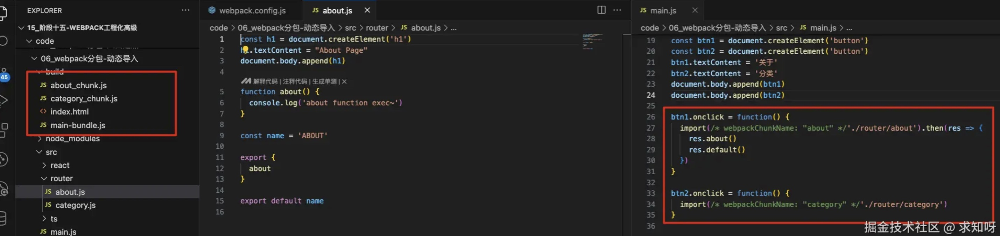

- 运行打包的 html 文件，可以看出只加载了主包，点击按钮会动态加载其他包

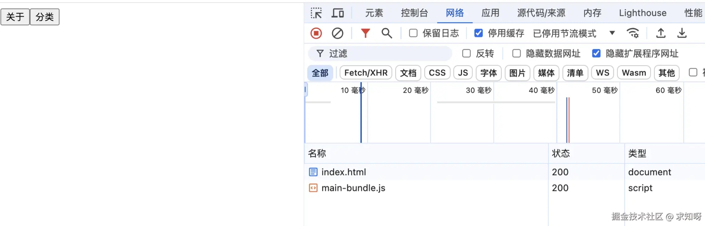


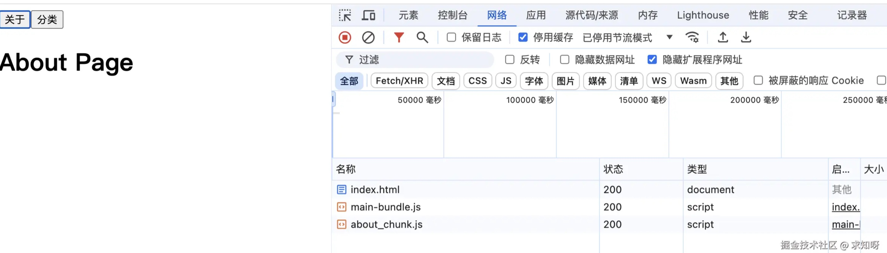

#### 2.4 Prefetch 和 Preload

- webpack 4.6.0 之后增加了对**预获取**和**预加载**的支持
- **Prefetch 预获取**：将来某些导航下可能需要的资源
- **Preload 预加载**：当前导航下可能需要的资源
- 在声明 import 时，使用下面的这些内置指令

```js
btn1.onclick = function() {
  import(
    /* webpackChunkName: "about" */
    /* webpackPrefetch: true */
    './router/about').then(res => {
    res.about()
    res.default()
  })
}

btn2.onclick = function() {
  import(
    /* webpackChunkName: "category" */
    /* webpackPrefetch: true */
    './router/category')
}
```
- 打包文件没变化，但是 html 运行时文件的加载有变化


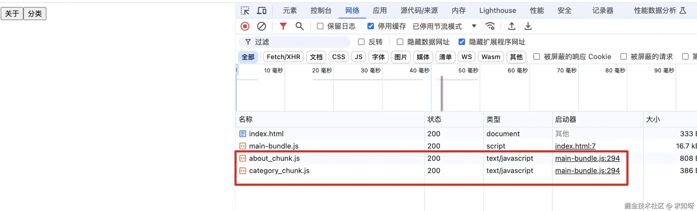

- 可以看出两动态导入的文件都预获取了
- Prefetch 和 Preload 区别如下：
    - Preload chunk 会在父 chunk 加载时并行加载，Prefetch chunk 会在父 chunk 加载结束后开始加载
    - Preload chunk 会立即下载，Prefetch chunk 在浏览器闲置时下载
    - Preload chunk 会在父 chunk 中立即请求，用于当下时刻，Prefetch chunk 会用于未来的某个时刻


#### 2.5 自定义分包

- 另一种分包方式是 `splitChunk`，底层是使用 SplitChunksPlugin 插件，该插件 webpack 已经默认安装和集成
- webpack 中默认的配置是

```js
module.exports = {
    optimization: {
        splitChunks: {
            chunks: 'async'
        }
    }
}
```
- 也可以手动配置相关参数，主要是 `splitChunks` 里的参数
    - **chunks**：默认 async ，只对异步代码处理，还有 initial、all，一般设置 all，对同步异步代码都处理
    - **minSize**：拆分包大小，最小值，不足不拆分包
    - **maxSize**：大于 maxSize 的包，拆分成不小于 minSize 的包
    - **cacheGroups**：匹配需要拆分的文件，并设置拆分包的名字


```js
module.exports = {
    optimization: {
        // 分包插件: SplitChunksPlugin
        splitChunks: {
            chunks: "all",
                // 当一个包大于指定的大小时, 继续进行拆包
                // maxSize: 20000,
                minSize: 10,

                // 自己对需要进行拆包的内容进行分包
                cacheGroups: {
                    utils: {
                        test: /utils/,
                        filename: "[id]_utils.js"
                    },
                    vendors: {
                        test: /[\\/]node_modules[\\/]/,
                        filename: "[id]_vendors.js"
                    }
                }
          },
     }
}
```
- 没设置最大值，是因为可以将第三方依赖都打包在一个文件里


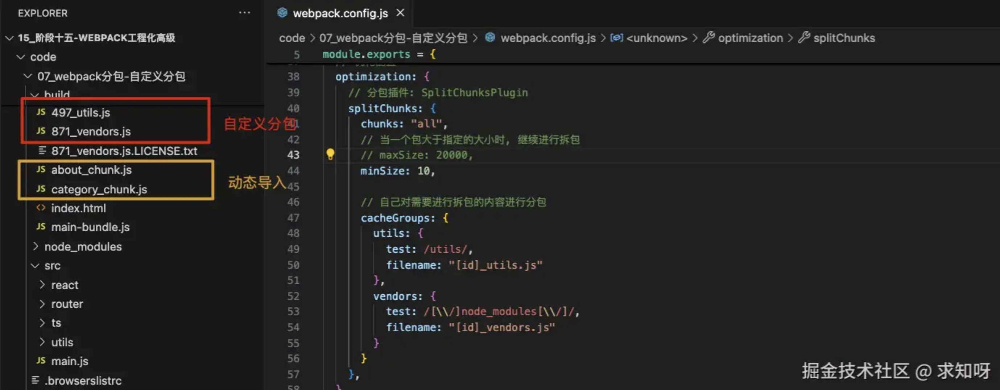

- 打包文件里有个 `871_vendors.js.LICENSE.txt` 文件，这个是类似版本注释的文本，可以删除，`extractComments` 默认是true，改为false即可（下一章会详讲 minimizer 压缩相关）


```js
module.exports = {
    optimization: {
        splitChunks: {
            chunks: 'async'
        },
        minimizer: [
            new TerserPlugin({
                extractComments: false
            })
        ]
    }
}
```
- 上面打包配置，都用到了 id 的占位符 `filename: "[id]_utils.js"`，该 id 的生成是可以配置的，配置 `optimization.chunkIds` 值即可，有三个值
    - **natural**：按照数字顺序生成 id
    - **named**：development 下的默认值，一个可读的名称 id，比如`vendors-node_modules_react_index_js-node_modules_axios_lib_axios_js_vendors.js`，就是上面对应的 node_modules 打包，另一个是 `utils-src_utils_foo_js_utils.js`
    - **deterministic**：确定性的，在不同的编译中不变的短数字 id（推荐打包时使用）

### 3. CDN 服务器加速

> CDN（Content Delivery Network，内容分发网络）是一种分布式网络服务，旨在通过将内容缓存到离用户更近的服务器上，来加速内容的分发和访问速度，同时提高网站的可用性和性能 <br />
> CDN 通过减少数据在网络中的传输距离，可以显著减少数据传输的延迟时间

- 在开发中，我们使用 CDN 主要是两种方式：
    - 方式一：打包的所有静态资源，放到 CDN 服务器，用户所有资源都是通过 CDN 服务器加载的
    - 方式二：一些第三方资源放到 CDN 服务器上

#### 3.1 方式一

- 如果所有的资源都放在 CDN 服务器上，需要购买自己的 CDN 服务器，然后在 webpack.config.json 中配置 CDN 地址


```js
module.exports = {
    output: {
        clean: true,
        path: path.resolve(__dirname, './build'),
        publicPath: 'http://xxx.xxx.cdn.com/'
    }
}
```
- 然后打包后的 html 对文件的引入有变化


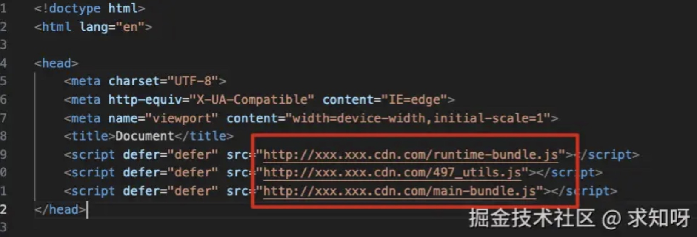

#### 3.2 方式二

- 一些比较出名的开源第三方库都会将打包后的源码放在出名且免费的 CDN 服务器上
- 在项目中，如果使用可以直接在 html模板中引入，然后配置下相关信息即可


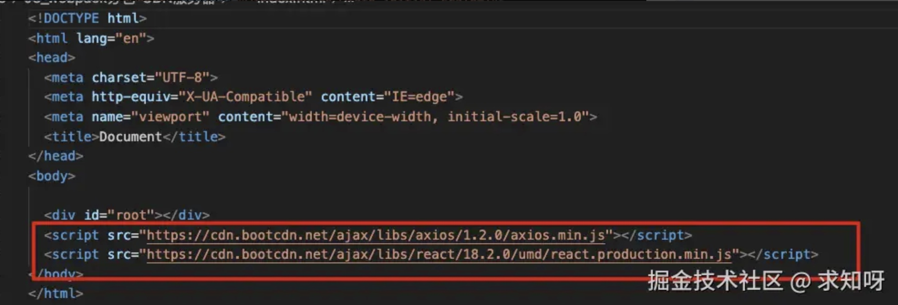

```js
module.exports = {
    // 排除某些包不需要进行打包
      externals: {
          react: "React",
          // key属性名: 排除的框架的名称
          // value值: 从CDN地址请求下来的js中提供对应的名称
          axios: "axios"
      }
}
```

### 4. 提取 css 文件

- 对 css 文件进行打包时，之前只用 loader 简单处理了下，并未单独抽取出来一个文件，css 样式是以 style 标签的形式放在 html 页面中的
- 提取 css 作为单独的文件，好处有：
    - 减少 html 页面大小，加快页面加载速度
    - css 文件不会频繁更改，可以使用缓存文件

- `MiniCssExtractPlugin` 可以将 css 提取到一个单独的 css 文件中，首先需要安装


```js
npm install mini-css-extract-plugin -D
```
- 然后配置 rules 和 plugins


```js
const MiniCssExtractPlugin = require('mini-css-extract-plugin')

module.exports = {
    module: {
        rules: [
            {
                test: /\.css$/,
                use: [
                    // 'style-loader', 开发阶段
                    MiniCssExtractPlugin.loader, // 生产阶段
                    'css-loader'
                ]
            }
        ]
    },
    plugins: [
        // 完成css的提取
        new MiniCssExtractPlugin({
            filename: 'css/[name].css',
            chunkFilename: 'css/[name]_chunk.css'
        })
    ]
}
```

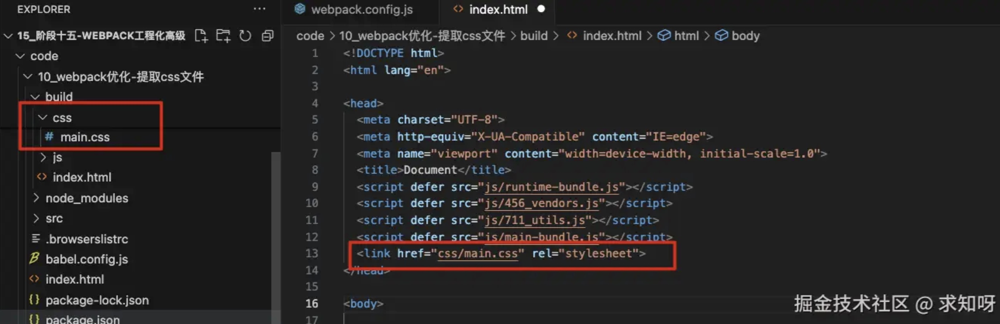

### 5. 认识 Hash、ContentHash、ChunkHask

- 给打包文件进行命名时，会使用到`placeholder`(占位符)，占位符中有几个属性比较相似
- `hash` 值的生成和整个项目有关系
    - 比如，现在有两js文件，打包到不同的 bundle 文件中，文件名称都使用了 hash
    - 此时，其中一个文件发生变化，hash 也会变化，从而第二个文件名称也会变化，文件都需要重新加载

- `chunkhash` 有效解决上面问题，它会根据不同的入口进行解析生成 hash 值
    - 如果第一个文件变化，第二个文件与其没有引入关系，那第二个文件的 chunkhash 不会变化，名称也不会变化
    - 但是有引入关系的话，仍然会都会变化


- `contenthash`生成 hash 值，只跟当前文件内容有关，一般推荐使用这个
    - 两个文件，哪个文件变更都不会影响其他文件


```js
const path = require('path')
const MiniCssExtractPlugin = require('mini-css-extract-plugin')

module.exports = {
  mode: 'development',
  entry: {
    index: './src/index.js',
    main: './src/main.js',
  },
  output: {
    clean: true,
    path: path.resolve(__dirname, './build'),
    filename: '[name]_[contenthash]_bundle.js',
    chunkFilename: '[contenthash]_chunk.js'
  },
  module: {
    rules: [
      {
        test: /\.css$/,
        use: [
          MiniCssExtractPlugin.loader,
          'css-loader'
        ]
      }
    ]
  },
  plugins: [
    new MiniCssExtractPlugin({
      filename: '[contenthash]_[name].css'
    })
  ]
}
```
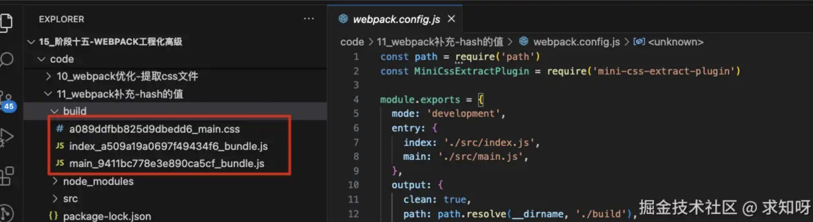


