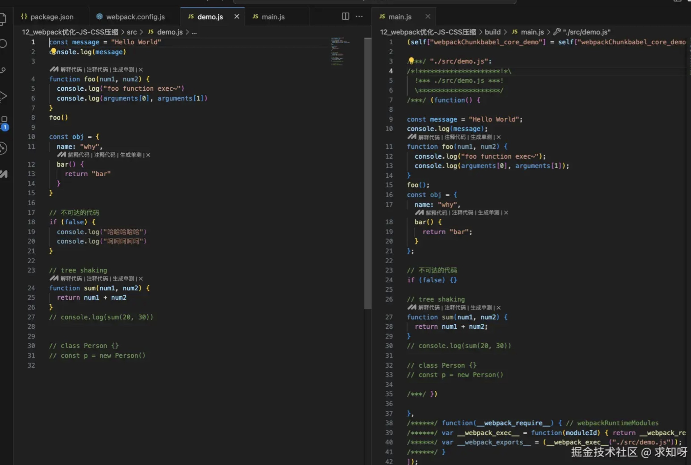
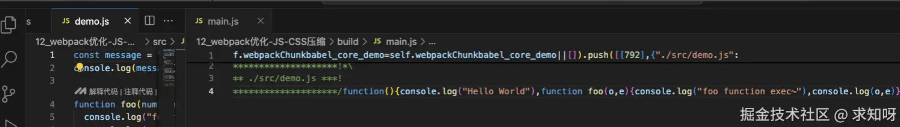
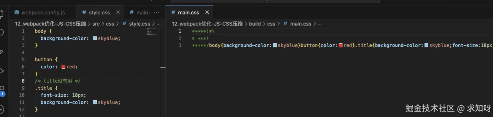
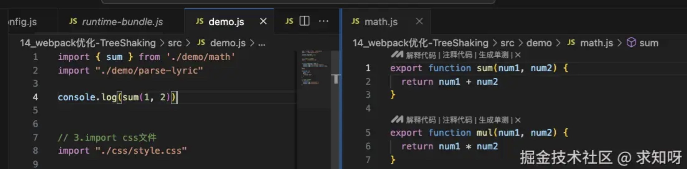
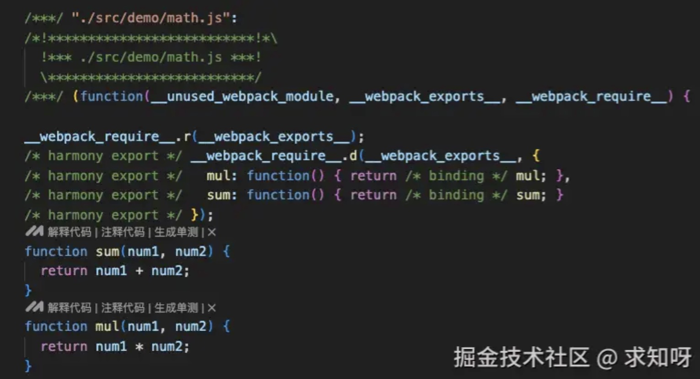
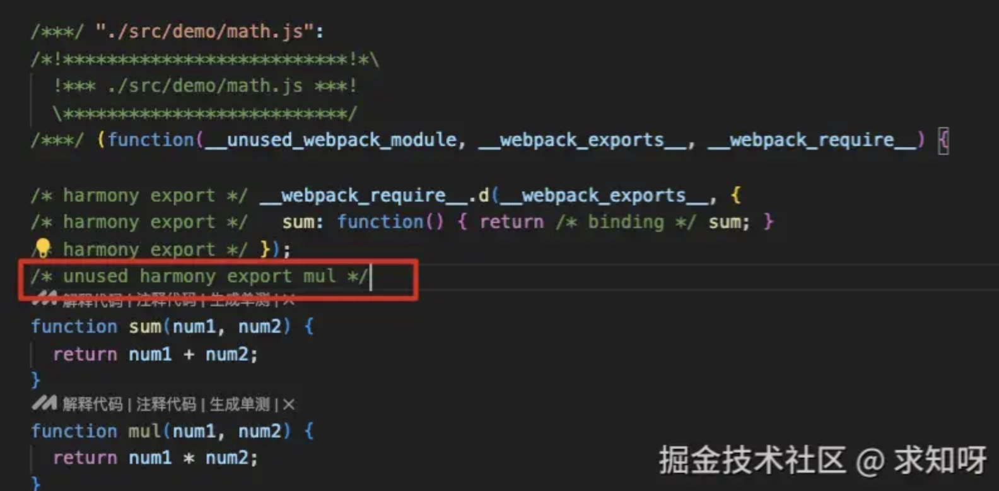
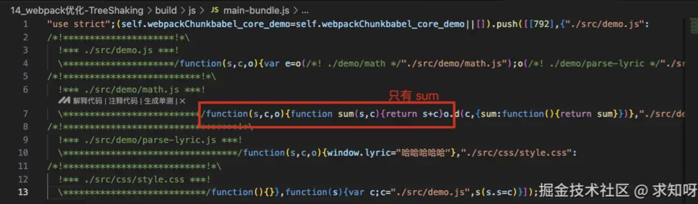
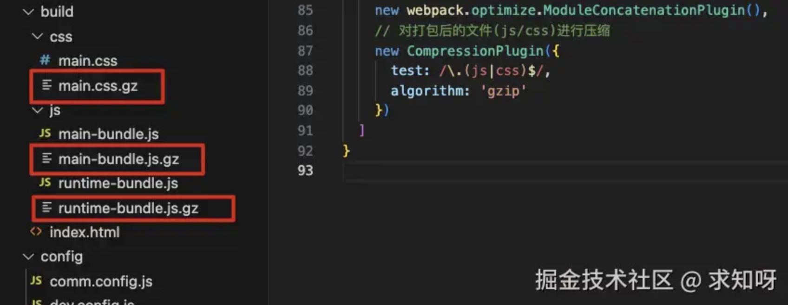
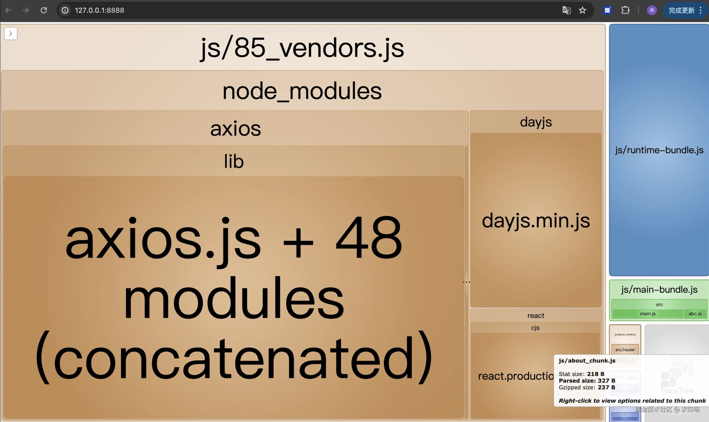

### 1. JS 压缩

- 先看下没有经过压缩打包的js代码（mode 为 development 模式，以为 production 模式下，webpack 有默认配置js压缩优化处理）




- 可以看出空格大量保留，未被使用的函数也被保留，且函数名字也很长，未被 *丑化*
- 当业务代码量上来后，再使用第三方资源，打包后的js代码不经过压缩的话，会出现大量的存储占用，文件体积较大
- 因此在打包时需要对 js 代码进行压缩、丑化处理
- 在看一张经过压缩、丑化后的js代码




- 与上面做对比，会发现空格、换行变少了，函数名、参数名都被丑化了，无用函数被删除了

#### 1.1 Terser 介绍


- Terser 是一个JavaScript的解释(Parser)、Mangler(绞肉机)/Compressor(压缩机)的工具集
- Terser 可以帮助我们压缩、丑化我们的代码，让我们的 bundle 变得更小
- 它是一个独立的工具，和 postcss、babel类似，可以单独安装，然后命令行使用，但此处不介绍其单独使用的情况，而是介绍其在 webpack 中的配置使用

#### 1.2 Terser 在webpack中配置

- 在webpack中有一个`minimizer`属性，在 production 模式下，默认就是使用`TerserPlugin`来处理我们的代码的;
- 如果我们对默认的配置不满意，也可以自己来创建 TerserPlugin 的实例，并且覆盖相关的配置;
- 配置 demo 如下

```js
const TerserPlugin = require('terser-webpack-plugin')

module.exports = {
    // 此处使用 development ，是为了更好的体会压缩功能，production 模式有默认配置
    mode: 'development',
    // 优化配置
    optimization: {
        // 需要打开minimize，让其对代码进行压缩，production 模式下默认是打开的
        minimize: true,
        minimizer: [
            // JS压缩的插件: TerserPlugin
            new TerserPlugin({
                extractComments: false,
                terserOptions: {
                    compress: {
                        arguments: true,
                        unused: true
                    },
                    mangle: true,
                    // toplevel: false
                    keep_fnames: true
                 }
            })
        ]
    }
}
```
- `minimizer` 属性是用于代码压缩处理的，包括下面的 css 代码压缩
- js 代码压缩使用的是 `TerserPlugin` 插件，在配置项里可以根据自己的需要进行配置，用于覆盖默认配置
    - `extractComments`：默认为true，表示将注释抽取到一个单独文件中，一般开发生成都不需要注释，可以设置为 false
    - `terserOptions`：用于设置 Terser 相关配置
        - compress：设置压缩相关的选项
            - arguments 将函数中使用类数组 arguments[index] 转换为对应的形参名称
            - unused: 设置为 `true` 表示启用压缩未使用的代码
            - ...

        - mangle：设置丑化相关的选项，可以直接设置为 true
        - keep_fnames：保留函数名称
        - ...

- 关于 Terser 的配置有很多，可以查看官方文档

### 2. CSS 压缩

- 和 JS 压缩类似，但是 CSS 压缩一般是去除无用的空格，因为很难去修改选择器、属性的名称、值等
- CSS 压缩，用到另一个插件 `css-minimizer-webpack-plugin`（任何模式都需要手动配置，打包才有css压缩能力）


```js
npm install css-minimizer-webpack-plugin -D
```

- 然后在 `optimization.minimizer` 中配置，最好配合 css 提取使用


```js
const CSSMinimizerPlugin = require('css-minimizer-webpack-plugin')
const MiniCssExtractPlugin = require('mini-css-extract-plugin')

module.exports = {
    // 此处使用 development ，是为了更好的体会压缩功能，production 模式有默认配置
    mode: 'development',
    // 优化配置
    optimization: {
        // 需要打开minimize，让其对代码进行压缩，production 模式下默认是打开的
        minimize: true,
        minimizer: [
            // CSS压缩的插件: CSSMinimizerPlugin
            new CSSMinimizerPlugin({})
        ]
    },
    plugins: [
        // 完成css的提取
        new MiniCssExtractPlugin({
            filename: 'css/[name].css',
            chunkFilename: 'css/[name]_chunk.css'
        })
    ]
}
```



### 3. JS 实现 Tree Shaking 

> Tree Shaking 是一个术语，在计算机中表示消除死代码
> <br />
> 对 js 进行 Tree Shaking 是源自打包工具 rollup（后续篇章会有）
> <br />
> Tree Shaking 依赖于 ES Module 的静态语法分析，webpack5中，也提供了对部分 CommonJS 的支持

- 事实上 webpack 实现 Tree Shaking 采用了两种不同的方案
    - `usedExports`：通过标记某些函数是否被使用，之后通过 Terser 来进行优化去除
    - `sideEffects`：跳过整个文件，直接查看该文件是否有副作用


#### 4. usedExports 的使用

- mode 设置为 development ，因为 production 模式下，webpack 默认的一些优化会影响实际效果
- 实际配置 `optimization.usedExports`


```js
module.exports = {
    // 此处使用 development ，是为了更好的体会压缩功能，production 模式有默认配置
    mode: 'development',
    // 优化配置
    optimization: {
        // 导入模块时, 分析模块中的哪些函数有被使用, 哪些函数没有被使用
        usedExports: true,
        
        // minimize: true,
        // minimizer: []
    }
}
```

- 对比下设置为 false 和 true 时的不一样，举个例子，在入口 demo.js 文件，引入一个 math.js 文件，文件里导出两个函数 sum 和 mul ，但是入口文件只导入 sum 使用





- 关闭 Terser ，然后进行打包，找个 math.js 文件位置，此时 usedExports 为 false




- 在将 usedExports 设置为 true，打包



- 设置为 true 后，会发现多了一行魔法注释，然后这行注释配合 Terser 配置，就可以删掉这个无用函数 mul



#### 4.1 sideEffects 使用

- sideEffects 用于告知 webpack 在解析模块时是否有副作用
- sideEffects 是直接在 package.json 文件中进行配置的

```js
{
  "name": "my-package",
  "version": "1.0.0",
  "sideEffects": false
}
```
- 配置这个后，默认文件中没有副作用，js 文件没有被导出使用，以及直接在window上赋值的代码都被认为无作用，从而打包时都删除处理

*生成环境中，usedExports 可以直接设置为 true，但是 sideEffects 是否使用持保留态度，因为有些老项目js代码书写并不是很规范，有些副作用代码说不定就有用呢*

### 5. CSS 实现 Tree Shaking

- 回顾上面的 css 压缩，title 样式没用，但是还是打包进去了，所以需要 Tree Shaking 删除无用代码
- CSS 实现 Tree shaking 是借助 purgecss-webpack-plugin 插件实现的。


```js
npm install purgecss-webpack-plugin -D
```

- 因为是借助第三方插件，所以不像 js 的 Tree Shaking 在 production 模式下有默认配置，css 的 Tree Shaking，如果不借助第三方插件实现，是没有删除无用代码能力的（包括上面的css压缩操作）

- purgecss 也可以对 less 文件进行处理，因为它是对打包后的 css 进行 Tree Shaking 操作

#### 5.1 配置 purgeCss


```js
const glob = require('glob')
const { PurgeCSSPlugin } = require('purgecss-webpack-plugin')

module.exports = {
    plugins: [
        // 对CSS进行TreeShaking
        new PurgeCSSPlugin({
            paths: glob.sync(`${path.resolve(__dirname, '../src')}/**/*`, { nodir: true })
        })
    ]
}
```

- 除了安装上面插件，可能还需要安装 glob 依赖


### 6. Scope Hoisting 使用

- 功能是对作用域进行提升，并且让 webpack 打包后的代码更小、运行更快
- 记下这个东西就行，production 模式下默认开启的，development 模式下需要手动打开


```js
const webpack = require('webpack')

module.exports = {
    plugins: [
        // 作用域提升
        new webpack.optimize.ModuleConcatenationPlugin()
    ]
}
```

### 7. HTML 压缩

- 在前面，有使用 HtmlWebpackPlugin 插件来生成 HTML 模板，事实上它还有一些其他的配置
- 先看 demo


```js
const HtmlWebpackPlugin = require('html-webpack-plugin')

module.exports = {
    plugins: [
        new HtmlWebpackPlugin({
        template: './index.html',
        cache: true,
        minify: isProdution? {
            // 移除注释
            removeComments: true,
            // 移除属性
            removeEmptyAttributes: true,
            // 移除默认属性
            removeRedundantAttributes: true,
            // 折叠空白字符
            collapseWhitespace: true,
            // 压缩内联的CSS
            minifyCSS: true,
            // 压缩JavaScript
            minifyJS: {
                mangle: {
                    toplevel: true
                }
            }
        }: false
      })
    ]
}
```

- `cache`：设置为 true，只有当文件改变时，才会生成新的文件，默认值也是 true
- `minify`：默认会使用一个插件 html-minifier-terser（即 production 模式下，有默认优化压缩），但是也可以自己配置。设置的值可以是一个对象，也可以是 false（不使用任何压缩优化）


### 8. HTTP 压缩

- HTTP 压缩是一种内置在服务器与客户端之间的，以改进传输速度和带宽利用率的方式。通俗的说就是将打包的静态资源压缩成 gzip 等文件（压缩包），浏览器直接获取 gzip 文件，然后解压成其他文件，在运行
- 压缩的流程：
    - 第一步：HTTP 数据在服务器发送前就已经被压缩（可以在 webpack 中完成）
    - 第二步：兼容的浏览器向服务器发送请求时，会告知服务器自己支持哪些压缩格式
    - 第三步：服务器在浏览器支持的压缩格式下，直接返回对应的压缩后的文件，并在相应头中告知文件压缩格式
- 目前的压缩格式有很多，但是较为流行的是 gizp 压缩

#### 8.1 webpack 对文件压缩

- HTTP 的压缩优化就主要集中在上面的第一步中，需要使用 compression-webpack-plugin


```js
npm install compression-webpack-plugin -D
```
- 然后进行配置即可


```js
const CompressionPlugin = require("compression-webpack-plugin")

module.exports = {
    plugins: [
        // 对打包后的文件(js/css)进行压缩
        new CompressionPlugin({
            test: /\.(js|css)$/,
            minRatio: 0.7,
            algorithm: 'gzip'
        })
    ]
}
```
- `test`：匹配哪些文件需要压缩
- `algorithm`：采用的压缩算法
- `minRatio`：只要的压缩比例，默认0.8。 当文件太小，压缩效率不足0.8时，不进行压缩
- 还有很多配置可查看官网





### 9. 扩展：对打包后的文件进行分析

- 现在有很多对打包后的文件进行分析的方案，这里挑选一个常用的介绍下
- 使用 webpack-bundle-analyzer 工具，先安装它


```js
npm install webpack-bundle-analyzer -D
```
- 安装完成后在 webpack 中进行配置

```js
const { BundleAnalyzerPlugin } = require('webpack-bundle-analyzer')

module.exports = {
    plugins: [
        // 对打包后的结果进行分析
        new BundleAnalyzerPlugin()
    ]
}
```
- 配置完成后，运行打包命令时，这个工具会打开一个8888端口上的服务，我们可以直接看到每个包的大小
- 看个 demo





- 当对打包的文件进行分析时，可以看到axios很大，花费时间较多，类似这种的都可以试着优化，比如换成其他等等
- demo 项目代码较少，可以看右下角，是demo代码的打包情况，占据的面积很少


### 10. 总结

- 这篇主要是将压缩和Tree Shaking相关的事情，在实际开发中，生成环境下，默认配置基本都会对 js、html 进行优化处理，但是 css 的压缩和 Tree Shaking 需要自己手动配置


