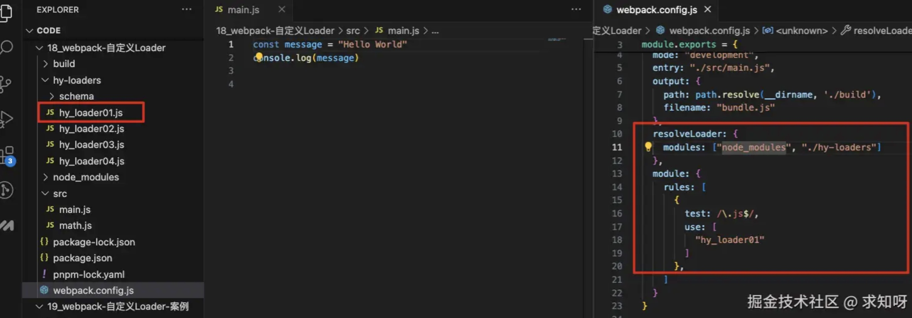
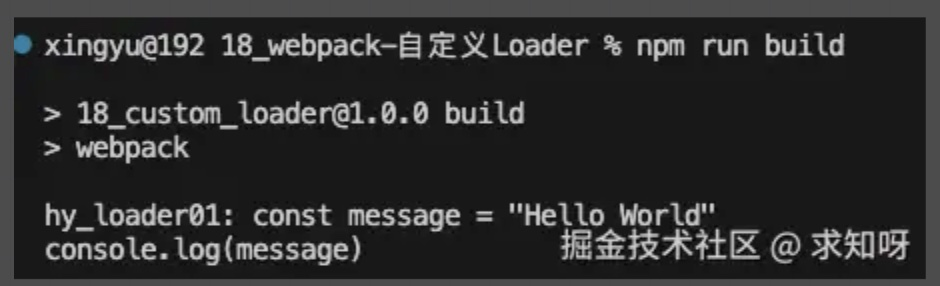
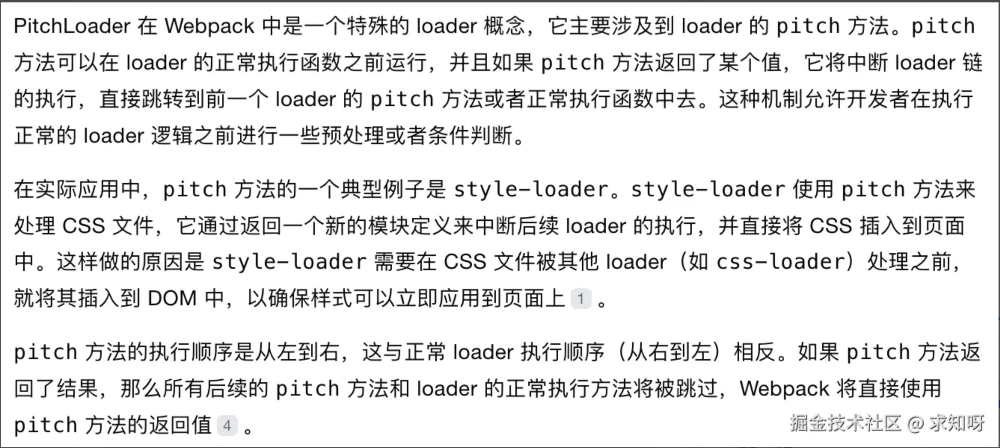
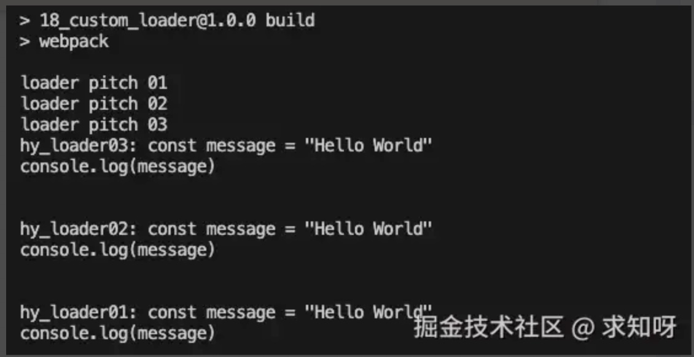
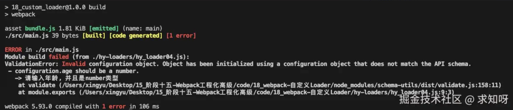

> Loader 是用于对模块的源代码进行转换得，使其能在浏览器上运行。之前使用过很多 loader，比如 css-loader、less-loader、babel-loader


### 自定义 loader

- loader 本质上是一个导出为函数的 js 模块，函数会接受三个参数
    - `content`：资源文件的内容
    - `map`：sourcemap 相关的数据
    - `meta`：一些元数据
- `loader runner` 库会调用这个函数，然后将上一个 loader 产生的结果或资源文件传入进去
- 自定义一个 loader js 模块


```js
module.exports = function(content, map, meta) {
  console.log("hy_loader01:", content)
  return content
}
```
- 然后定义好打包入口文件，配置好 webpack.config.js 文件



- 解释下 `resolveLoader` 属性运用
    - 上面的 loader 模块是在 hy-loaders 文件夹下的 hy_loader01.js 模块
    - 在 webpack 打包中，对 loader 进行解析时会默认去 node_modules 文件夹下去找对应的 loader，如果想使用上面模块，书写 use 参数时应该是 `use: ['./hy-loaders/hy_loader01.js']`
    - 如果不想使用文件路径的书写方式，就可以借助 resolveLoader 属性，它用于控制 Webpack 如何解析 loader 的路径，modules 是一个数组，指出搜索 loader 的目录

- 进行打包，可以看到 hy_loader01.js 模块输出结果，content 就是 main.js 文件内容





### loader 执行顺序

- 前面有讲过，loader 执行顺序是从后向前、从右向左的
- 实际上，在解析 loader 时，顺序仍然是从前向后，但是起作用时是从后向前
- 在上面的 hy_loader01.js 文件中加个另一个loader，称之为 PitchLoader
- 简单了解 PitchLoader




```js
module.exports = function(content, map, meta) {
  console.log("hy_loader01:", content)
  return content
}

module.exports.pitch = function() {
  console.log("loader pitch 01")
}
```

- 然后整三个这样的文件，改变下数字，然后配置好 webpack


```js
use: [
    "hy_loader01",
    "hy_loader02",
    "hy_loader03",
]
```

- 看下输出结果




- 出现这个原因是，webpack 源码里有个 run-loader 的功能，优先执行 PitchLoader，执行时进行 loaderIndex++，之后执行 NormalLoader(类似css-loader、babel-loader)，执行时进行 loaderIndex--

- 在配置好 use 参数后，执行顺序默认是从后向前执行的，但是进行一些特殊配置，仍然是能改变执行顺序的，比如使用行内设置loader，又或者通过 enforce 设置 pre 和 post，这里不做展开


### 同步 loader

- 默认创建的 loader 就是同步的，这个 loader 必须通过 `return` 或 `this.callback` 来返回结果，交给下一个 loader 处理
- 通常在有错误的情况下，会使用 this.callback，一般时候，同步 loader 仍是使用 return 返回结果
- 下面两个代码段返回的东西是一样的


```js
module.exports = function(content, map, meta) {
  return content
}

module.exports = function(content, map, meta) {
    // 获取到同步的callback
    const callback = this.callback
    // callback进行调用:
    // 参数一: 错误信息，一般设置为 null
    // 参数二: 传递给下一个loader的内容
    callback(null, content)
}
```

### 异步 loader

- 有些时候需要在 loader 里进行一些异步操作，希望在异步操作完成后，再返回这个 loader 处理的结果
- 这个时候就需要异步 loader 了


```js
module.exports = function(content) {
    const callback = this.async()

    // 进行异步操作
    setTimeout(() => {
        // 传参与上面一样
        callback(null, content + "aaaa")
    }, 2000);
}
```

### loader 传参处理

- webpack 中 use 配置 loader，可以是字符串写法，也可以是对象写法，对象写法时可以往 loader 中传递参数


```js
use: [
    {
        loader: "hy_loader04",
        options: {
            name: "why",
            age: 18
        }
    }
]
```

- 在 loader 定义中可以获取传递进来的参数


```js
module.exports = function(content) {

  // 方式一: 早期时, 需要单独使用loader-utils(webpack开发)的库来获取参数
  // 方式二: 目前, 已经可以直接通过this.getOptions()直接获取到参数
  const options = this.getOptions()
  console.log(options)

  return content
}
```
- 除了获取参数外，也可以对参数进行校验。需要借助 webpack 官方提供的校验库 `schema-utils`


```js
npm install schema-utils -D
```

- 校验是需要配置校验规则的，配置文件是一个 json 文件，有固定的格式


```js
{
  "type": "object",
  "properties": {
    "name": {
      "type": "string",
      "description": "请输入名称, 并且是string类型"
    },
    "age": {
      "type": "number",
      "description": "请输入年龄, 并且是number类型"
    }
  }
}
```

```js
const { validate } = require('schema-utils')
const loader04Schema = require('./schema/loader04_schema.json')

module.exports = function(content) {
  
  const options = this.getOptions()

  // 校验参数是否符合规则
  validate(loader04Schema, options)

  return content
}
```
- 如果 age 格式设置为 string 类型，然后进行打包，会报错




### 自定义 babel-loader 案例

- babel-loader 可以对 js 代码进行转换，比如ES6转换为ES5。如果是自己一点点写的话，需要写大量的词法分析等，但是一般这些东西都有第三方库支持，这里就借助 `@babel/core` 库


```js
npm install @babel/core -D
```

- 直接看demo


```js
const babel = require('@babel/core')

module.exports = function(content) {
  // 1.使用异步loader
  const callback = this.async()

  // 2.获取options
  let options = this.getOptions()
  if (!Object.keys(options).length) {
    options = require('../babel.config')
  }

  // 使用Babel转换代码
  babel.transform(content, options, (err, result) => {
    if (err) {
      callback(err)
    } else {
      callback(null, result.code)
    }
  })
}
```

- 使用的是异步 loader 的方式，前面篇章有讲，bable的配置可以在 webpack.config.js 中配置，也可以在根目录中配置 babel.config.js 文件，类似下面的


```js
module.exports = {
  presets: [
    "@babel/preset-env"
  ]
}
```

- 上面获取 options 的操作兼顾了两种情况
- `babel.transform` 就是借助第三方库对代码进行转换


