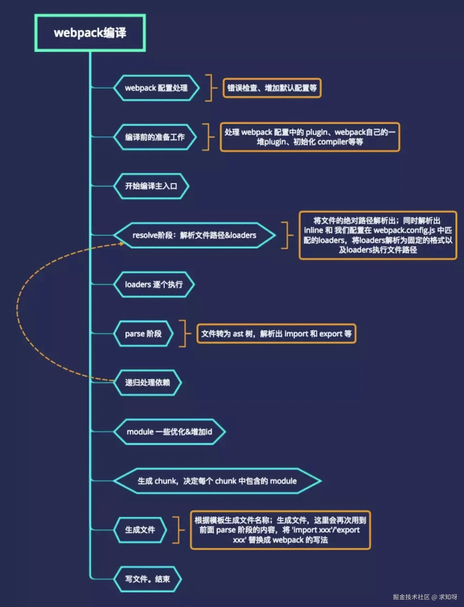
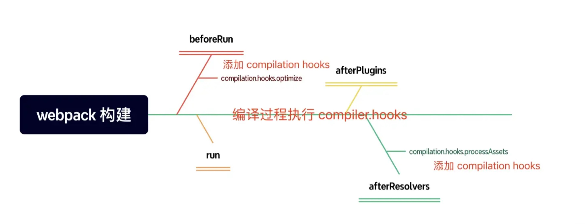
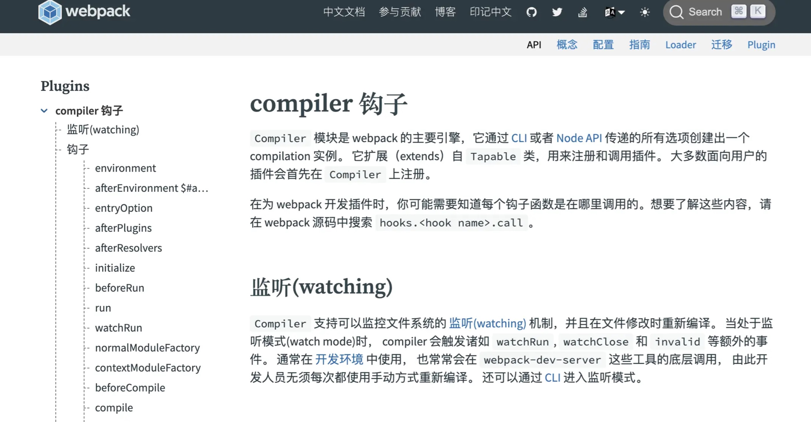
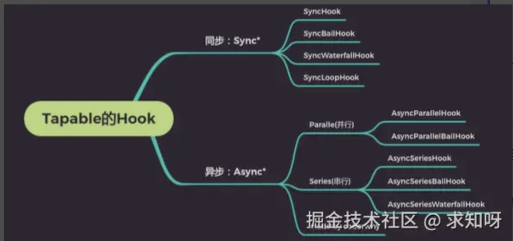
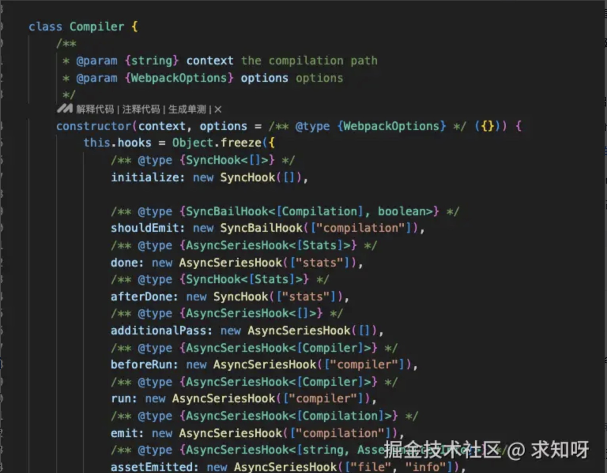
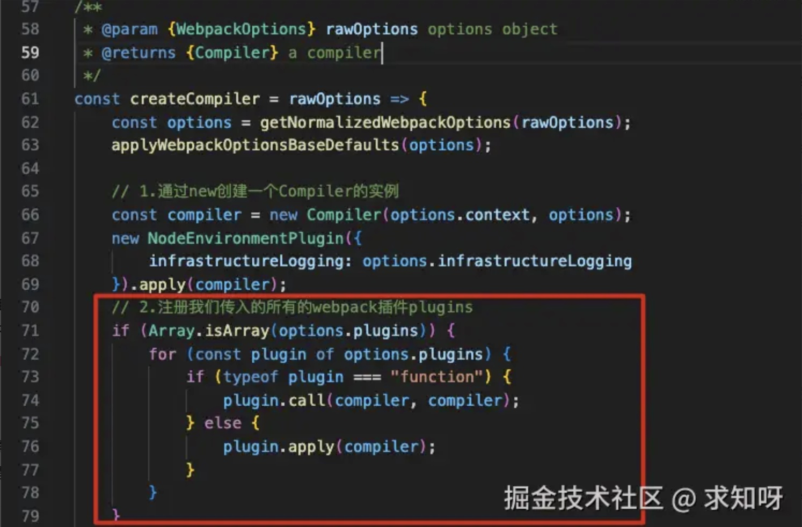
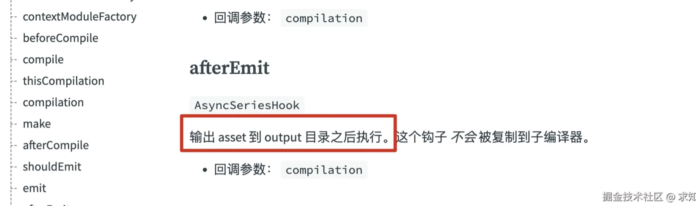

> Webpack 插件是一种可扩展的机制，允许你对 Webpack 构建过程中的不同阶段进行操作和调整。这些插件可以在 Webpack 的生命周期的不同点被触发，从而让你能够实现各种自动化任务，比如优化输出文件、清理目录、注入变量、生成额外的文件（如 HTML 文件）、热替换模块等等。

### 1. 一个简单的插件结构

- 一个带有 apply 方法的类

```js
class AutoUploadWebpackPlugin {
  constructor(options) {
  }

  apply(compiler) {
    console.log("AutoUploadWebpackPlugin被注册:")
    // 完成的事情: 注册hooks监听事件
    // 等到assets已经输出到output目录上时
    compiler.hooks.afterEmit.tapAsync("AutoPlugin", async (compilation, callback) => {
      
      // 添加业务逻辑

      // 完成所有的操作后, 调用callback()
      callback()
    })
  }
}

module.exports = AutoUploadWebpackPlugin
module.exports.AutoUploadWebpackPlugin = AutoUploadWebpackPlugin
```

### 2. webpack 构建流程
- 直接看编译流程图，可以看到插件在编译前就已经完成处理了。然后插件起作用的时机取决于插件内使用的哪个 hook 注册的事件，作用于构建的不同阶段



### 3. Compiler 与 Compilation

- 这是 webpack 中两个非常重要的类，可以生成对应的实例 `compiler` 与 `compilation`
- `compiler`可以看作是 Webpack 的环境实例，它是 Webpack 的主要引擎，负责整个构建过程的管理。当你运行 Webpack 时，实际上是在启动一个`compiler`实例。可以把`compiler`想象成一个工厂，它负责组织和调度所有的资源和工作流程。因此`Plugin`可以通过该对象获取到Webpack的配置信息进行处理
- `compilation`负责具体的构建逻辑，如模块的解析、加载、转换、优化和打包。它跟踪构建过程中产生的模块、chunk、asset以及错误和警告。你可以把`compilation`想象成是工厂中的一次生产批次，它关注的是如何从原料（源代码）生产出成品（输出文件）的具体步骤
- 两者的关系：
    - 主线是执行 compiler hooks（钩子）
    - 如果在主线的 hooks 上添加回调会执行 compiler.hooks 对应回调
    - 可以在 compiler.hooks 回调中给 compilation.hooks 添加了回调



  
- 可从[官网](https://webpack.docschina.org/api/compiler-hooks/)查看所有的 hook



- 其实，简单的说就是 webpack 内部会在各个执行点对外触发一个事件（上面图片里的钩子，是固定的），自定义插件如果想在对应的执行点搞事情，就可以注册这个事件，等到 webpack 执行到这个地方时执行自定义插件的功能


### 4. tapable 介绍

- `tapable`是一个用于定义和调用钩子的抽象层，它是Webpack的核心机制之一，用于插件系统。`tapable`提供了一种机制，让不同的插件可以注册回调函数到特定的事件上，这样当事件触发时，这些回调函数就可以按照一定的顺序被调用
- `Tapable`也是一个小型的 library，类似于`node`中的`events`库，核心原理就是一个订阅发布模式
- webpack中最核心的负责编译的`Compiler`和负责创建bundles的`Compilation`都是Tapable的实例，可以直接在 `Compiler` 和 `Compilation` 对象上广播和监听事件


#### 4.1 tapable 的 hook 分类

- 同步和异步的
    - 以 sync 开头的，是同步的 hook
    - 以 async 开头的，两个事件处理回调，不会等待上一次处理回调结束后再执行下一次回调

- 其他类别
    - `bail`：当有返回值时，就不会执行后续的事件触发了
    - `loop`：当返回值为 true，就会反复执行该事件，当返回值为 undefind 或者不返回内容，就退出事件
    - `waterfall`：当返回值不为 undefined 时，会将这次返回的结果作为下次事件的第一个参数
    - `parallel`：并行，会同时执行这次事件处理回调结束，才执行下一次事件处理回调
    - `series`：串行，会等待上一次异步的 hook



#### 4.2 tapable 的使用

- 先安装对应的 tapable


```js
npm install tapable
```
 
- tapable 有许多 hook，这里只是了解 tapable 这个东西，所以不介绍所有的 hook，以 syncHook 为例，看下面的 demo


```js
const { SyncHook } = require('tapable')

class HYCompiler {
  constructor() {
    this.hooks = {
      // 1.创建hooks
      syncHook: new SyncHook(["name", "age"])
    }


    // 2.用hooks监听事件(自定义plugin)
    this.hooks.syncHook.tap("event1", (name, age) => {
      console.log("event1事件监听执行了:", name, age)
    })
    
    this.hooks.syncHook.tap("event2", (name, age) => {
      console.log("event1事件监听执行了:", name, age)
    })
  }
}

const compiler = new HYCompiler()
// 3.发出去事件
setTimeout(() => {
  compiler.hooks.syncHook.call("why", 18)
}, 2000);
```
- 上述代码中，如果对比 webpack 中源码，会发现，webpack 中就是做了 `compiler 实例化`和 `compiler.hooks.syncHook.call()`。而自定义插件中则是做了 `this.hooks.syncHook.tap("event1", () => {})`
 
- 看源码 Compiler 类，声明了很多 hook，然后在特定的时机发布事件(call)。之后自定义插件里注册事件(tap)



### 5. 自定义 Plugin

- 简单说下 plugin 是如何被注册到 webpack 的生命周期的
    - 第一：在 webpack 函数的 createCompiler 方法中，注册所有的插件
    - 第二：在注册插件时，会调用插件函数或插件对象的 apply 方法
    - 第三：插件方法接收 compiler 实例对象，可以通过 compiler 对象注册 hook 事件
    - 第四：某些插件也会传入一个 compilation 的对象，我们也可以监听 compilation 的 hook 事件

- 简单看下 webpack 注册 plugin 的源码




- `options.plugins`获取的就是 webpack 配置中的 plugins 数组。可以看出，plugin 实例可以是函数，也可以是类的实例对象。一般情况下，都是使用类的实例对象，比如 `new HtmlWebpackPlugin()`，然后可以看到，定义插件类时，里面需要有个 `apply` 方法


#### 5.1 开发个自己的插件


- 这个插件的能力是将静态文件自动上传到服务器中
- 思考：这个插件肯定是在打包文件放到 output.path 文件夹后才起作用，那应该注册哪个 hook 事件呢
- 去 webpack 官网查看，可以找到 `afterEmit`





- 直接看 demo


```js
const { NodeSSH } = require('node-ssh')
const { PASSWORD } = require('./config')

class AutoUploadWebpackPlugin {
  constructor(options) {
    this.ssh = new NodeSSH()
    this.options = options
  }

  apply(compiler) {
    // console.log("AutoUploadWebpackPlugin被注册:")
    // 完成的事情: 注册hooks监听事件
    // 等到assets已经输出到output目录上时, 完成自动上传的功能
    compiler.hooks.afterEmit.tapAsync("AutoPlugin", async (compilation, callback) => {
      // 1.获取输出文件夹路径(其中资源)
      const outputPath = compilation.outputOptions.path

      // 2.连接远程服务器 SSH
      await this.connectServer()

      // 3.删除原有的文件夹中内容
      const remotePath = this.options.remotePath
      this.ssh.execCommand(`rm -rf ${remotePath}/*`)

      // 4.将文件夹中资源上传到服务器中
      await this.uploadFiles(outputPath, remotePath)

      // 5.关闭ssh连接
      this.ssh.dispose()

      // 完成所有的操作后, 调用callback()
      callback()
    })
  }

  async connectServer() {
    await this.ssh.connect({
      host: this.options.host,
      username: this.options.username,
      password: this.options.password
    })
    console.log('服务器连接成功')
  }

  async uploadFiles(localPath, remotePath) {
    const status = await this.ssh.putDirectory(localPath, remotePath, {
      recursive: true,
      concurrency: 10
    })
    if (status) {
      console.log("文件上传服务器成功~")
    }
  }
}

module.exports = AutoUploadWebpackPlugin
module.exports.AutoUploadWebpackPlugin = AutoUploadWebpackPlugin
```

- 在 webpack 中配置


```js
const path = require('path')

const AutoUploadWebpackPlugin = require('./plugins/AutoUploadWebpackPlugin')

module.exports = {
  plugins: [
    new AutoUploadWebpackPlugin({
      host: "123.207.32.32",
      username: "root",
      password: PASSWORD,
      remotePath: "/root/test"
    })
  ]
}
```

- 可以看到该类里有个 apply 方法，接收 webpack 里的 compiler 实例对象，然后通过该对象注册 hooks 监听事件。完成主要功能逻辑后需要调用 `callback()`

<br/>

**插件可以用来修改输出文件、增加输出文件、甚至可以提升 `Webpack` 性能、等等，总之插件通过调用`Webpack` 提供的 `API` 能完成很多事情。 由于 `Webpack`提供的 `API` 非常多，这里不做介绍了，想实现什么样的功能都需要临时学**


*此篇结束，至此，webpack 系统学习篇章结束，后续记录也仅仅是针对性记录了*


 
 
 
 