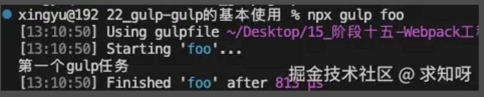
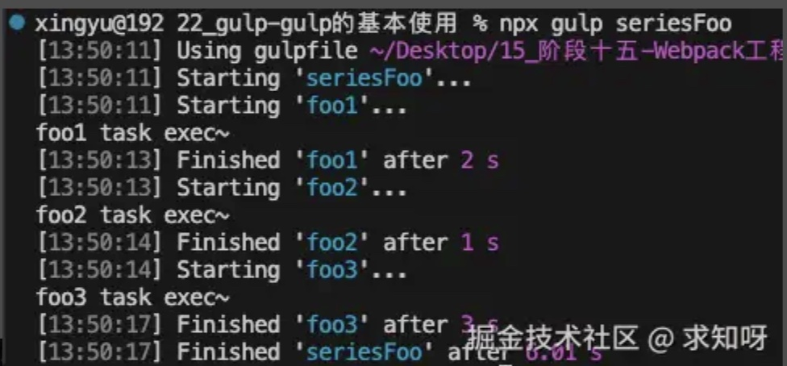
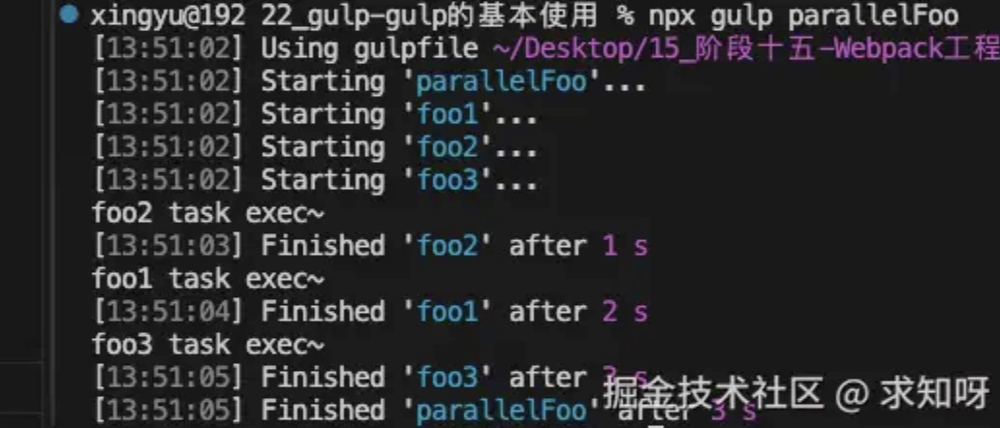
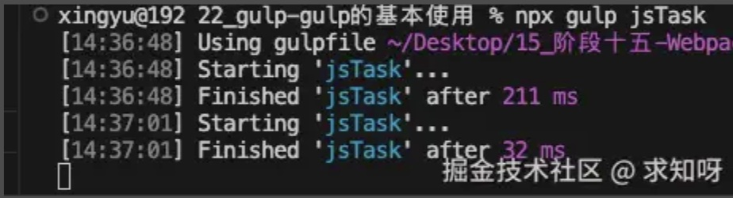

### gulp 和 webpack

Gulp 和 Webpack 都是现代前端开发中常用的自动化构建工具，但它们有着不同的侧重点和使用场景

- **Gulp** 是一个基于流的自动化构建工具，它通过配置一系列的任务（task）来规范前端开发流程。Gulp 的核心在于流程控制，它适合多页面应用开发。通过 `gulp.src` 读取数据源，然后通过 `pipe` 进行处理，最后通过 `gulp.dest` 输出到目标路径
- **Webpack** 是一个模块化的前端资源管理和打包工具，它将许多松散的模块按照依赖和规则打包成符合生产环境部署的前端资源。Webpack 特别适合单页面应用（SPA）开发，它可以将按需加载的模块进行代码分割，并在实际需要时异步加载。Webpack 的核心在于模块打包，通过 loader 和 plugins 对资源进行处理

gulp 相对于 webpack 思想更加的简单、易用，更适合编写一些`自动化`的任务。<br/><br/>目前对于大型项目(Vue、React、Angular)并不会使用 gulp 来构建，比如默认 gulp 是不支持模块化的

### gulp 基本使用

- 首先安装 gulp，可以全局安装也可以局部安装


```js
npm install gulp -g
```

- 执行命令就是 `npx gulp [定义的任务名]`，比如下面这个简单的 demo
- gulp 脚本的编写和 webpack 类似都要有个固定的文件，gulp 脚本需要在 `gulpfile.js` 文件中编写，这样执行命令才会去这个文件中查找


```js
const gulp = require('gulp')

// 编写简单的任务
const foo = async (cb) => {
  console.log("第一个gulp任务")
  cb()
}

// 导出的任务
module.exports = {
  foo
}
```
- 然后执行 `npx gulp foo`





### gulp 任务

- 每个 gulp 任务都是一个异步的 js 函数
    - 此函数接收一个 callback 函数，调用 callback 函数后任务才会结束
    - 或者是一个返回 stream、promise、event emitter、child process或observable类型的函数

- 任务可以是 public 或者 private 类型的
    - **公开任务**（Public Tasks）从 gulpfile 中被导出，可以通过 gulp 命令直接调用
    - **私有任务**（Private tasks）被设计为在内部使用，通常作为 `series()` 或 `parallel()` 组合的组成部分


#### 默认任务

- 比如下面这个demo

```js
module.exports.default = (cb) => {
  console.log("default task exec~")
  cb()
}
```
- 没有导出具体的名字，而是执行 `npx gulp` 会执行


### 任务组合 series 和 parallel

- 从上面可以看出，执行任务是执行一个函数，但是通常一个函数中能完成的任务是有限的，且函数不能过于臃肿，所有功能放在一个函数中不方便维护
- gulp 提供了两个强大的组合方法：
    - `series()`：串行任务组合
    - `parallel()`：并行任务组合

- 比如下面这个 demo


```js
const { series, parallel } = require('gulp')

const foo1 = (cb) => {
  setTimeout(() => {
    console.log("foo1 task exec~")
    cb()
  }, 2000)
}

const foo2 = (cb) => {
  setTimeout(() => {
    console.log("foo2 task exec~")
    cb()
  }, 1000)
}

const foo3 = (cb) => {
  setTimeout(() => {
    console.log("foo3 task exec~")
    cb()
  }, 3000)
}

const seriesFoo = series(foo1, foo2, foo3)
const parallelFoo = parallel(foo1, foo2, foo3)


module.exports = {
  seriesFoo,
  parallelFoo
}
```
- 执行 `npx gulp seriesFoo`，结果如下
- 


- 执行 `npx gulp parallelFoo`，结果如下




### 读取和写入文件

核心来了，gulp 一般用于自动化任务，那主要是干啥呢，就是读取一个文件，经过一系列处理，然后写入另一个文件。比如这样，能讲 src 文件夹下的文件都复制到 dist 目录中


```js
const copyFile = () => {
  // 1.读取文件 2.写入文件
  return src("./src/**/*.js").pipe(dest("./dist"))
}
```


- gulp 暴露了 `src()` 和 `dest()` 方法用于处理计算机上存放的文件
- `src()` 接受参数，并从文件系统中读取文件然后生成一个**Node流(Stream)**，它将所有匹配的文件读取到内存中并通过流 (Stream)进行处理
    - `src()` 方法接收一个 glob 字符串或多个 glob 字符串组成的数组作为参数，用于确定哪些文件需要被操作。至少要匹配到一个匹配项，不然会报错
- `流 (Stream)`提供的主要 API 就是 `.pipe()` 方法，它接受一个转换流或可写流，拿到数据后可以对数据进行处理，再次传递给下一个转换流或可写流
- `dest()` 接受一个输出目录作为参数，并且它还会产生一个 Node流(stream)，通过该流将内容输出到文件中

### 对文件进行转换

- 上面的读取写入，仅仅做了类似复制文件到另一目录下的功能
- 对文件进行转换，即对文件进行处理，比如希望 ES6 转换成 ES5；比如对代码进行压缩和丑化
- 但是和 webpack 有区别的，gulp 使用的依赖是不一样的
- 比如我要对所有的js文件进行上述处理，先安装对应依赖

```js
"@babel/preset-env": "^7.20.2",
"gulp": "^4.0.2",
"gulp-babel": "^8.0.0",
"gulp-terser": "^2.1.0"
```
- 然后配置 gulpfile.js 文件

```js
const { src, dest, watch } = require('gulp')

const babel = require('gulp-babel')
const terser = require('gulp-terser')

const jsTask = () => {
  return src("./src/**/*.js")
    .pipe(babel())
    .pipe(terser({ mangle: { toplevel: true } }))
    .pipe(dest("./dist"))
}

// watch函数监听内容的改变
watch("./src/**/*.js", jsTask)

module.exports = {
  jsTask
}
```
- 当然也需要像 webpack 一样配置 babel.config.js 文件


```js
module.exports = {
  presets: ["@babel/preset-env"]
}
```

- 上面代码有用到 `watch()` 方法，该方法会利用文件系统的监控程序，随时根据文件变动重新处理，也因此任务不会结束，每次改动都会重新执行，有点像热模块更新，类似下面




### gulp 案例

- gulp 基础知识了解的差不多了，直接编写案例，通过 gulp 来开启本地服务和打包，做类似 webpack 的打包能力
- 打包 html 文件，使用 gulp-htmlmin 插件
- 打包 js 文件，使用 gulp-babel、gulp-terser 插件
- 打包 less 文件，使用 gulp-less 插件
- html 资源注入，使用 gulp-inject 插件
- 开启本地服务器，使用 browser-sync 插件


```js
    "@babel/core": "^7.20.5",
    "@babel/preset-env": "^7.20.2",
    "browser-sync": "^2.27.10",
    "gulp": "^4.0.2",
    "gulp-babel": "^8.0.0",
    "gulp-htmlmin": "^5.0.1",
    "gulp-inject": "^5.0.5",
    "gulp-less": "^5.0.0",
    "gulp-terser": "^2.1.0"
```

- 使用知识较为简单，不拆分介绍了，直接上代码，仍然是在 gulpfile.js 文件中编写


```js
const { src, dest, parallel, series, watch } = require("gulp");

const htmlmin = require("gulp-htmlmin");
const babel = require('gulp-babel')
const terser = require('gulp-terser')
const less = require('gulp-less')

const inject = require('gulp-inject')
const browserSync = require('browser-sync')

// 1.对html进行打包
const htmlTask = () => {
  return src("./src/**/*.html")
    .pipe(htmlmin({ collapseWhitespace: true }))
    .pipe(dest("./dist"));
};

// 2.对JavaScript进行打包
const jsTask = () => {
  return src("./src/**/*.js")
    .pipe(babel({ presets: ["@babel/preset-env"] }))
    .pipe(terser({ toplevel: true }))
    .pipe(dest('./dist'))
};

// 3.对less进行打包
const lessTask = () => {
  return src("./src/**/*.less")
    .pipe(less())
    .pipe(dest("./dist"))
}

// 4.在html中注入js和css
const injectTask = () => {
  return src('./dist/**/*.html')
    .pipe(inject(src(['./dist/**/*.js', './dist/**/*.css']), { relative: true }))
    .pipe(dest('./dist'))
}

// 5.开启一个本地服务器
const bs = browserSync.create()
const serve = () => {
  watch("./src/**", buildTask)

  bs.init({
    port: 8080,
    open: true,
    files: './dist/*',
    server: {
      baseDir: './dist'
    }
  })
}

// 创建项目构建的任务
const buildTask = series(parallel(htmlTask, jsTask, lessTask), injectTask)
const serveTask = series(buildTask, serve)
// webpack搭建本地 webpack-dev-server

module.exports = {
  buildTask,
  serveTask
};
```
- 打包运行 `npx gulp buildTask`，本地开发运行 `npx gulp serveTask`。实际体验和 webpack 类似


