### 1. 认识 Rollup

- Rollup 是一个 js 的模块化打包工具，可以编译小的代码到一个大的、复杂的代码中，比如一个库或者一个应用程序
- webpack 也是模块化打包工具，两者的区别在于
    - Rollup 主要是针对 ES Moudle 进行打包的
    - Webpack 可以通过各种 loader 处理各种各样的文件，以及处理他们的依赖关系，Rollup 专注于处理 js 代码（当然也可以处理css、vue等文件）

- 在实际项目开发过程中，一般都会使用 Webpack，但是在对库文件进行打包时，通常会使用 Rollup
- Rollup 支持的打包文件的格式有 `amd, cjs, es\esm, iife, umd`。其中，amd 为 AMD 标准，cjs 为 CommonJS 标准，esm\es 为 ES 模块标准，iife 为立即调用函数， umd 同时支持 amd、cjs 和 iife

### 2. 基本使用

- 安装依赖


```js
npm install rollup -D
```
- 新建文件 src/utils/foo.js


```js
export const foo = 'foo';
```

- 新建文件 src/index.js


```js
import { foo }  from './utils/foo.js'

export default function() {
    console.log(foo);
}
```
- 在项目根目录新建 `rollup.config.js` 文件（固定命名，也可以是 rollup.config.mjs）


```js
module.exports = {
    input: "./src/index.js",
    output: {
        file: "./dist/bundle.umd.js",
        format: "umd",
        name: "myBundle"
    }
};
```
- 然后就可以执行`npx rollup -c`命令进行打包


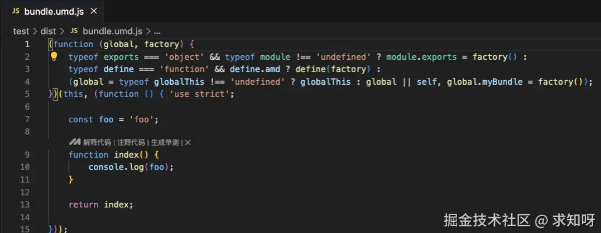


- 然后新建 test.js 文件


```js
const foo = require('./dist/bundle.umd.js');
foo();
```
- `node test.js` 执行该文件，就会输出 foo 字符串

#### 2.1 各种打包格式

- 上面有说 Rollup 支持的打包文件的格式有 `amd, cjs, es\esm, iife, umd`，体现在配置上即是


```js
export default[{
  // 入口
  input: "./lib/index.js",
  // 出口
  output: [
    {
      format: "umd",
      name: "whyUtils",
      file: "./build/bundle.umd.js"
    },
    {
      format: "amd",
      file: "./build/bundle.amd.js"
    },
    {
      format: "cjs",
      file: "./build/bundle.cjs.js"
    },
    {
      format: "iife",
      name: "whyUtils",
      file: "./build/bundle.browser.js"
    }
  ]
}];
```


### 3. 引入外部资源

- 举个例子，安装 lodash-es 库，在 src/index.js 中使用其中的方法


```js
import { foo, del }  from './utils/foo.js'
import { sum } from 'lodash-es'

export default function test() {
    console.log(foo);
    console.log(sum([1, 2]))
}
```
- 然后 npx rollup -c 打包，会发现报错


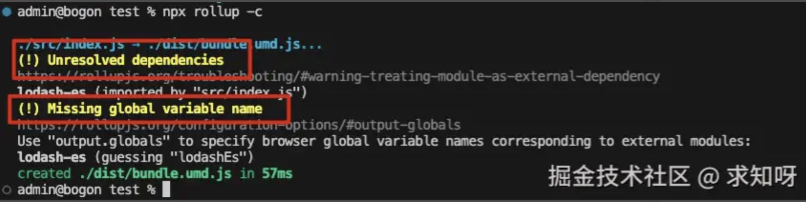

- 这是因为当项目中引入外部资源时，如 npm 包，`rollup` 不知道如何打破常规去处理这些依赖。

- 有 2 种方法引入外部资源：
    - 添加插件 `@rollup/plugin-node-resolve` 将我们编写的源码与依赖的第三方库进行合并；
    - 配置 external 属性，告诉 rollup.js 哪些是外部的类库


#### 3.1 resolve 插件

- 安装依赖：


```js
npm i @rollup/plugin-node-resolve -D
```

- 配置 rollup.config.js 文件


```js
const nodeResolve = require('@rollup/plugin-node-resolve')

module.exports = {
    input: "./src/index.js",
    output: {
        file: "./dist/bundle.umd.js",
        format: "umd",
        name: "myBundle"
    },
    plugins: [
        nodeResolve()
    ]
};
```

- 然后重新打包


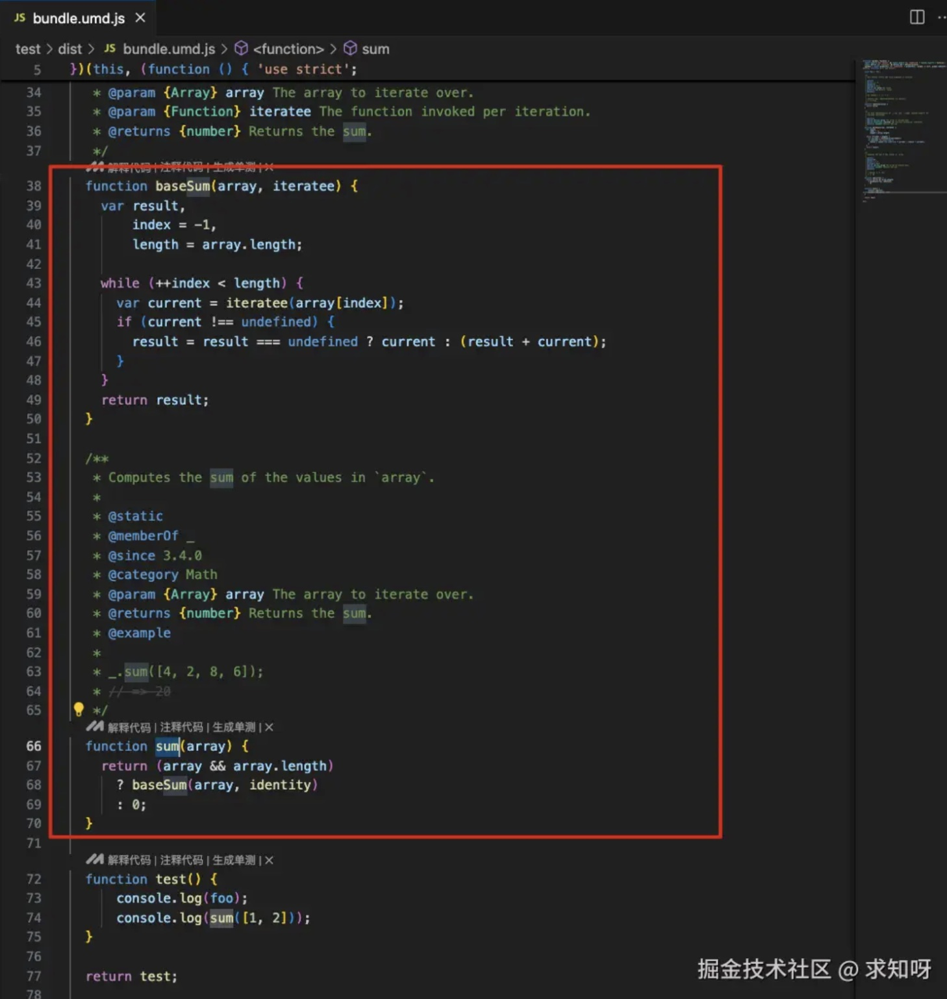

- 观察打包后的文件，发现已经包含了第三方库 lodash-es


#### 3.2 external 属性

- 有些场景下，虽然我们使用了 resolve 插件，但可能我们仍然想要某些库保持外部引用状态，这时我们就需要使用 external 属性，来告诉 rollup.js 哪些是外部的类库
- 配置 rollup.config.js 文件


```js
const nodeResolve = require('@rollup/plugin-node-resolve')

module.exports = {
    input: "./src/index.js",
    output: {
        file: "./dist/bundle.umd.js",
        format: "umd",
        name: "myBundle"
    },
    external: ["lodash"],
    plugins: [
        nodeResolve()
    ]
};
```

- 打包后的文件又简洁了


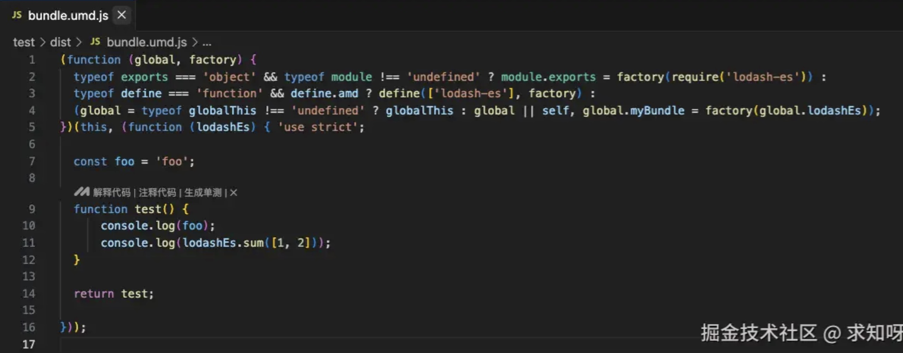


### 4. CommonJs 插件

- 更改 src/utils/foo.js 文件


```js
module.exports = {
  foo: "bar"
};
```
- 重新打包会报错


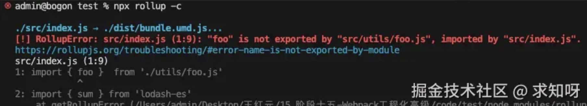

- rollup.js 编译源码中的模块引用默认只支持 ES6+的模块方式 import/export。然而大量的 npm 模块是基于 CommonJS 模块方式，这就导致了大量 npm 模块不能直接编译使用。

- 需要添加 `@rollup/plugin-commonjs` 插件来支持基于 CommonJS 模块方式 npm 包
- 安装依赖


```js
npm i @rollup/plugin-commonjs -D
```
- 配置 rollup.config.js 文件


```js
const commonjs = require('@rollup/plugin-commonjs')
const nodeResolve = require('@rollup/plugin-node-resolve')

module.exports = {
    input: "./src/index.js",
    output: {
        file: "./dist/bundle.umd.js",
        format: "umd",
        name: "myBundle"
    },
    external: ["lodash"],
    plugins: [
        commonjs(),
        nodeResolve()
    ]
};
```

### 5. Babel 代码转换

- 更改 src/utils/foo.js 文件


```js
module.exports = {
  foo: "bar",
  add: (a, b) => {
    console.log(a + b);
  }
};
```

- 更改 src/index.js 文件


```js
import { foo, add }  from './utils/foo.js'

export default function() {
    console.log(foo);
    console.log(add(1, 2));
}
```

- 然后打包观察


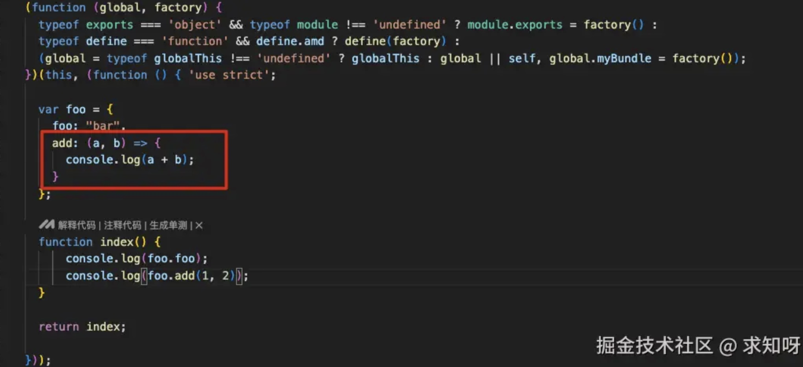


- 现在，我想将 ES6 相关转换成 ES5 的代码，可以在 rollup 中使用 babel
- 安装对应的插件


```js
npm i @babel/core @babel/preset-env @rollup/plugin-babel -D
```
- 然后需要配置 babel.config.js 文件


```js
module.exports = {
  presets: [
    ["@babel/preset-env"]
  ]
}
```
- 更改 rollup.config.js 文件配置


```js
const commonjs = require('@rollup/plugin-commonjs')
const nodeResolve = require('@rollup/plugin-node-resolve')
const { babel } = require('@rollup/plugin-babel')

module.exports = {
    input: "./src/index.js",
    output: {
        file: "./dist/bundle.umd.js",
        format: "umd",
        name: "myBundle"
    },
    external: ["lodash"],
    plugins: [
        commonjs(),
        nodeResolve(),
        babel({
            babelHelpers: "bundled",
            exclude: /node_modules/
        }),
    ]
};
```
- 打包观察


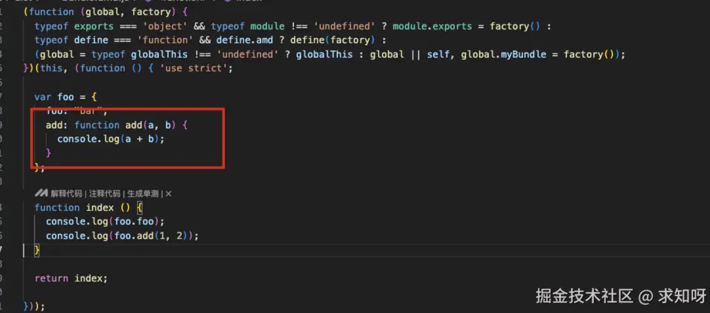


### 6. Teser 代码压缩

- 安装依赖


```js
npm i @rollup/plugin-terser -D
```
- 配置 rollup.config.js 文件


```js
const commonjs = require('@rollup/plugin-commonjs')
const nodeResolve = require('@rollup/plugin-node-resolve')
const { babel } = require('@rollup/plugin-babel')
const terser = require('@rollup/plugin-terser')

module.exports = {
    input: "./src/index.js",
    output: {
        file: "./dist/bundle.umd.js",
        format: "umd",
        name: "myBundle"
    },
    external: ["lodash"],
    plugins: [
        commonjs(),
        nodeResolve(),
        babel({
            babelHelpers: "bundled",
            exclude: /node_modules/
        }),
        terser()
    ]
};
```
- 观察打包文件


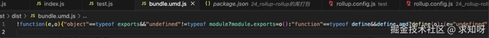

### 7. 引入 css 资源

- 新增 src/css/index.css 文件


```js
.title {
    color: red;
}
```

- 在 src/index.js 文件中引入


```js
import './css/index.css'
```

- 尝试打包观察


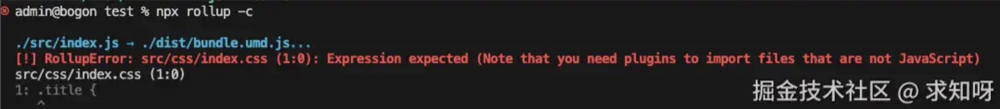

- 这个时候可以使用 postcss 处理，安装相关依赖


```js
npm i postcss postcss-preset-env rollup-plugin-postcss -D
```

- 配置 postcss.config.js 文件


```js
module.exports = {
  plugins: [require("postcss-preset-env")]
}
```
- 配置 rollup.config.js 文件，暂时关闭丑化压缩

```js
const commonjs = require('@rollup/plugin-commonjs')
const nodeResolve = require('@rollup/plugin-node-resolve')
const { babel } = require('@rollup/plugin-babel')
// const terser = require('@rollup/plugin-terser')
const postcss = require('rollup-plugin-postcss')

module.exports = {
    input: "./src/index.js",
    output: {
        file: "./dist/bundle.umd.js",
        format: "umd",
        name: "myBundle"
    },
    external: ["lodash"],
    plugins: [
        commonjs(),
        nodeResolve(),
        babel({
            babelHelpers: "bundled",
            exclude: /node_modules/
        }),
        // terser()
        postcss()
    ]
};
```

- 观察打包文件


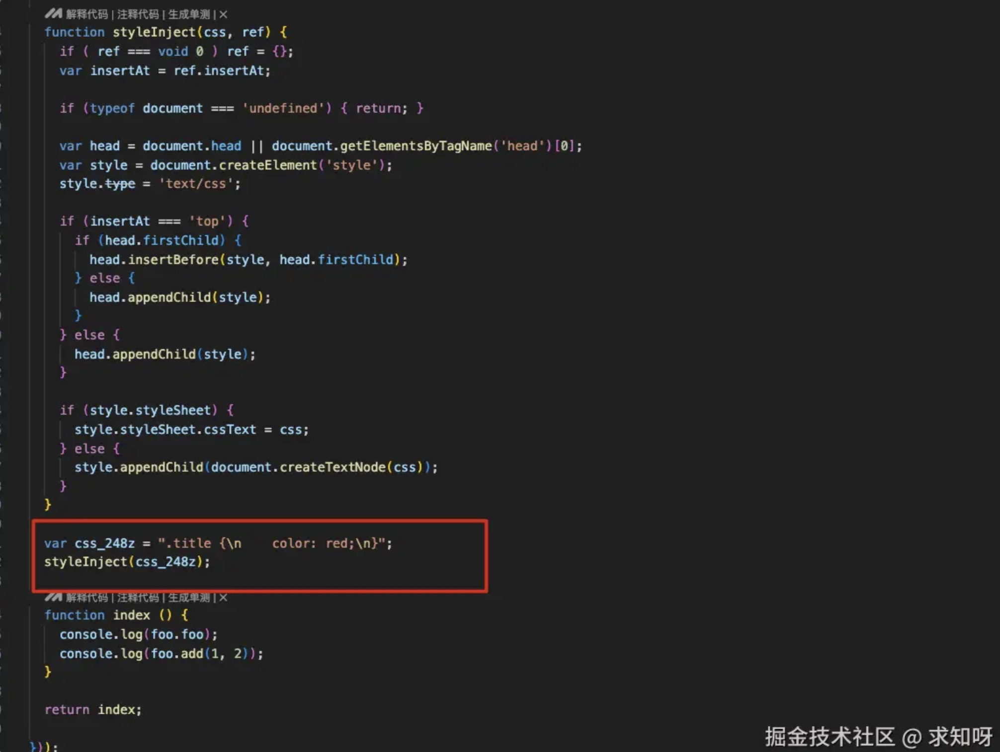


### 8. 引入 typescript 资源

- 安装依赖


```js
npm i @rollup/plugin-typescript -D
```

- 配置 rollup.config.js 文件


```js
import typescript from "@rollup/plugin-typescript";
export default [
  {
    plugins: [typescript()];
  }
];
```
- 导出类型声明文件


```js
import typescript from "@rollup/plugin-typescript";
export default [
  {
    plugins: [
        typescript({
            cacheDir: '.rollup.cache', // ts编译比较耗时，建议开启缓存
            declaration: true, // 生成声明文件
            declarationDir: "dist", // 声明文件输出目录
        })
    ];
  }
];
```
### 9. 引入 vue 资源

- 安装依赖


```js
npm i rollup-plugin-vue @vue/compiler-sfc -D
npm i vue
```

- 配置 src/vue/App.vue 文件


```js
<template>
  <div class="app">
    <h2>App计数器: {{ count }}</h2>
    <button @click="increment">+1</button>
    <button @click="decrement">-1</button>
  </div>
</template>

<script setup>
import { ref } from 'vue'

const count = ref(100)
function increment() {
  count.value++
}
function decrement() {
  count.value--
}
</script>

<style scoped>

</style>
```

- 配置 rollup.config.js 文件


```js
const vue = require('rollup-plugin-vue')

module.exports = {
    plugins: [
        vue()
    ]
};
```
- 创建一个 index.html 文件，引入打包后的js文件，并声明一个 id 为 app 的标签


```js
<body>
    <div id="app"></div>
    <script src="./dist/bundle.umd.js"></script>
</body>
```
- 打包后运行


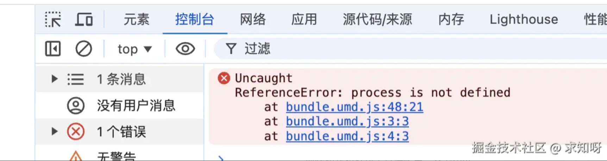

- 打包有报错的原因是在我们打包的vue代码中，用到 process.env.NODE_ENV，所以我们可以使用一个插件 rollup-plugin-replace 设置它对应的值


```js
npm i @rollup/plugin-replace -D  
```
- 配置 rollup.config.js 文件
```js
const vue = require('rollup-plugin-vue')
const replace = require('@rollup/plugin-replace')

module.exports = {
    plugins: [
        vue(),
        replace({
            "process.env.NODE_ENV": JSON.stringify('production'),
            preventAssignment: true
        })
    ]
};
```
- 然后打包运行


### 10. 搭建本地服务器

- 安装依赖


```js
npm i rollup-plugin-serve -D
```

- 当文件发生变化时，自动刷新浏览器，安装依赖


```js
npm i rollup-plugin-livereload -D
```

- 配置 rollup.config.js 文件
```js
const vue = require('rollup-plugin-vue')
const replace = require('@rollup/plugin-replace')
const serve = require('rollup-plugin-serve')
const livereload = require('rollup-plugin-livereload')

module.exports = {
    plugins: [
        vue(),
        replace({
            "process.env.NODE_ENV": JSON.stringify('production'),
            preventAssignment: true
        }),
        serve({
            port: 8000,
            open: true,
            contentBase: "."
        }),
        livereload()
    ]
};
```

- 然后执行 `npx rollup -c ` 运行就会自动打开页面

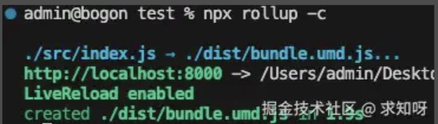


