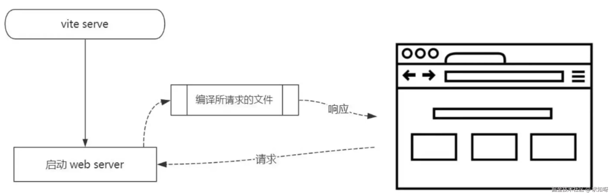
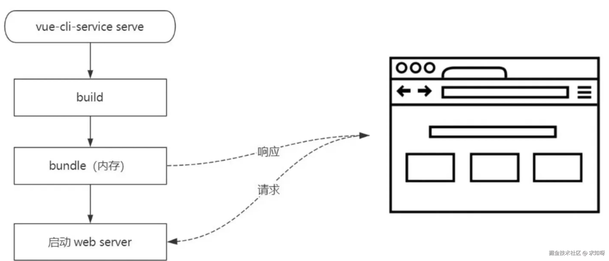
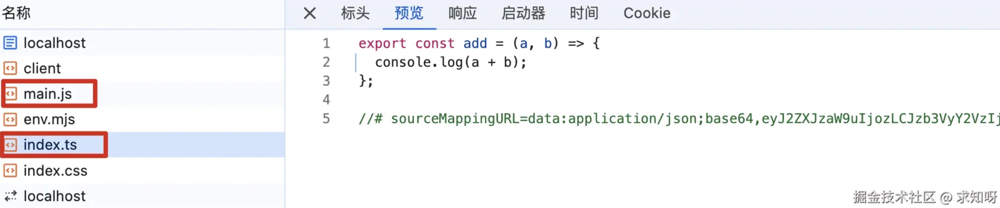
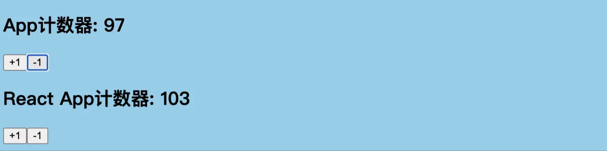
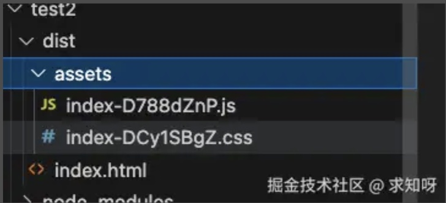

### 1. 认识 vite

*   Vite 是一个现代化的前端构建工具。它提供了快速的冷启动和热模块替换（HMR），使得开发体验更加流畅和高效

*   它由两部分组成：
    *   一个开发服务器：基于**原生 ES 模块**提供了丰富的内建功能，HMR 的速度非常快

    *   一套构建指令：使用 rollup 打开我们的代码，并且是预配置的，可以输出生产环境的优化过的静态资源

*   Vite 的快，主要体现在两个方面: 快速的冷启动和快速的热更新
    *   **快速冷启动**：Vite只启动一台静态页面的服务器，不会打包全部项目文件代码，服务器根据客户端的请求加载不同的模块处理，实现按需加载。而 Webapack 是一开始就将整个项目都打包一遍，再开启dev-server，如果项目规模庞大，打包时间必然很长





*   *   **热模块更新**：在HRM热更新⽅⾯，当某个模块内容改变时，让浏览器去重新请求该模块即可，⽽不是像webpack重新将该模块的所有依赖重新编译

### 2. 浏览器原生支持模块化

*   Vite 之所以能有如此优秀的表现，完全归功于 Vite 借助了浏览器对 ES 模块化规范的支持

*   那什么是原生支持模块化呢，举个例子

*   新建 test/src/utils/index.js 文件

```js
export const add = (a, b) => {
    console.log(a + b);
};
```

*   新建 test/src/main.js 文件

```js
import { add } from './utils/index.js';

add(1, 2);
```

*   新建 test/index.html 文件

```html
<!DOCTYPE html>
<html lang="en">
<head>
    <meta charset="UTF-8">
    <meta name="viewport" content="width=device-width, initial-scale=1.0">
    <title>Document</title>
</head>
<body>
    <script src="./src/main.js" type="module"></script>
</body>
</html>
```

*   注意，必须使用 `type="module"`，不然有报错，不能区分是模块化资源。然后运行 html 文件，控制台是由正常输出的

*   查看控制台的网络



*   可以看到，文件是模块文件，而不是像 webpack 那样打包后的 js 文件。因此，当模块文件发生变化时，只需要重新加载对应的模块文件就行，不需要像 webpack 那样重新编译

*   在举个例子，安装 lodash-es，正常 npm 安装，然后在 main.js 文件使用相对路径去 node\_modules 文件里导入，也是能直接运行的。上面就是浏览器原生支持 ES 模块化

### 3. vite 安装使用

*   安装依赖

```js
npm install vite -D
```

*   通过 vite 来启动项目，直接运行 index.html

```js
npx vite
```

#### 3.1 对 TypeScript 的支持

*   vite 对 TypeScript 是原生支持的，它会直接使用 ESBuild 来完成编译。只需要直接导入 ts 文件即可

*   将 test/src/utils/index.js 改为 test/src/utils/index.ts 文件

```js
export const add = (a: number, b: number) => {
    console.log(a + b);
};
```

*   改变 main.js 文件的引入，然后 vite 运行也是能正常输出的

#### 3.2 对 css 的支持

*   vite 可以直接支持 css 的处理，直接导入 css 文件即可

*   创建 test/src/style/index.css 文件

```js
body {
  background-color: skyblue;
}
```

*   然后在 main.js 文件中引入

```js
import "./style/index.css"
```

*   然后 vite 运行也能看到效果

*   vite 也可以直接支持 css 预处理器，比如 less
    *   直接导入 less
    *   之后安装 less 编译器 `npm i less -D`

*   vite 也直接支持 postcss 的转换，只需要安装 postcss 与 postcss-preset-env，然后配置 postcss.config.js 文件即可

```js
npm i postcss postcss-preset-env -D
```

```js
// postcss.config.js 文件
module.exports = {
  plugins: [require("postcss-preset-env")]
}
```

#### 3.3 对 vue 的支持

*   vite 对 vue 提供第一优先级支持
    *   vue3 单文件组件支持： @vitejs/plugin-vue
    *   vue3 jsx 支持：@vitejs/plugin-vue-jsx
    *   vue2 支持：underfin/vite-plugin-vue2

*   以 vue3 为例，安装插件

```js
npm install @vitejs/plugin-vue -D
```

*   在 vite.config.js 中配置插件

```js
import { defineConfig } from 'vite'
import vue from '@vitejs/plugin-vue'

export default defineConfig({
  plugins: [
    vue()
  ]
})
```

*   创建 test/src/vue/App.vue 文件

```js
<template>
  <div class="app">
    <h2>App计数器: {{ count }}</h2>
    <button @click="increment">+1</button>
    <button @click="decrement">-1</button>
  </div>
</template>

<script setup>
import { ref } from 'vue'

const count = ref(100)
function increment() {
  count.value++
}
function decrement() {
  count.value--
}
</script>
```

*   然后在 main.js 文件引入

```js
import VueApp from './vue/App.vue'
import { createApp } from 'vue'

const app = createApp(VueApp)
app.mount(document.querySelector("#app"))
```

*   然后`npx vite`运行即可


#### 3.4 对 react 的支持

*   jsx 和 tsx 文件同样开箱即用，也是通过 ESBuild 来完成编译

*   安装相关插件后，只需要直接编写 react 的代码即可

```js
 npm install react react-dom
```

*   创建 test/src/react/App.jsx 文件

```js
import React, { useState } from 'react'

function App() {
  const [count, setCount] = useState(100)

  return (
    <div className="app">
      <h2>React App计数器: {count}</h2>
      <button onClick={e => setCount(count+1)}>+1</button>
      <button onClick={e => setCount(count-1)}>-1</button>
    </div>
  )
}

export default App
```

*   将 main.js 文件改为 main.jsx 文件，并配置 react 引入

```js
import ReactApp from './react/App.jsx'
import React from 'react'
import ReactDom from 'react-dom/client'

const root = ReactDom.createRoot(document.querySelector("#root"))
root.render(<ReactApp />)
```

*   和 vue 一样，都需要在 html 文件配置一个 div 挂载容器

```html
<body>
    <div id="app"></div>
    <div id="root"></div>
    <script src="./src/main.js" type="module"></script>
</body>
```

*   然后 `npx vite` 运行



#### 3.5 打包项目

*   可以直接通过 vite build 来完成对当前项目的打包

```js
npx vite build
```

*   打包后的文件如下



### 4. vite 脚手架工具

*   在开发中，不可能所有的项目都使用 vite 从零搭建，比如一个 vue 项目。这个时候就可以使用对应的脚手架工具

*   Vite 实际上是有两个工具的
    *   vite：相当于是一个构建工具，类似 webpack、rollup
    *   @vitejs/create-app：类似 vue-cli、create-react-app

*   使用脚手架工具也很简单

```js
npm create vite
yarn create vite
pnpm create vite
```

*   使用命令后，按照顺序选择需要创建的项目信息即可
