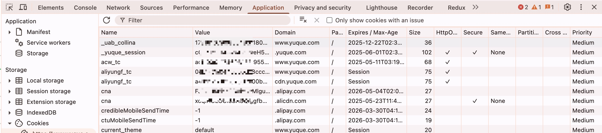
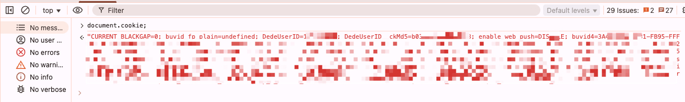
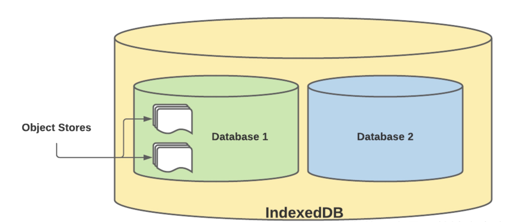

### 一、Web Storage

#### 1.1 概述

- HTML5 中引入 Web Storage 规范，它提供了一种在客户端存储数据的机制。
- Web Storage 有两种类型：localStorage 和 sessionStorage。
- localStorage 用于持久化存储数据，数据在浏览器关闭后仍然存在。
- sessionStorage 用于存储临时会话数据，页面重新加载后仍然存在，关闭浏览器选项卡时数据丢失。

#### 1.2 属性和方法

- `setItem(key, value)`：设置指定键的值。
- `getItem(key)`：获取指定键的值。
- `removeItem(key)`：移除指定键的值。
- `clear()`：清空所有键值对。
- `key(index)`：获取指定索引位置的键名。
- `length`：获取键值对的数量。

#### 1.3 存储事件

- 通过监听 `storage` 事件，可以在浏览器上监听 localStorage 和 sessionStorage 的存储变化

```js
window.addEventListener('storage', e => {
  console.log(e.key);
  console.log(e.oldValu);
  console.log(e.newValue);
});

window.onstorage = e => {
  console.log(e.key);
  console.log(e.oldValu);
  console.log(e.newValue);
});
```
- 事件对象
  - `key`：存储键名
  - `oldValue`：存储旧值
  - `newValue`：存储新值
  - `url`：发生变化的文档的 URL
  - `storageArea`：发生变化的对象，localStorage 或 sessionStorage

- **注意事项**：该功能不会在发生更改的同一浏览器选项卡上触发，而是由同一域的其他打开的选项卡或窗口触发

#### 1.4 补充

- localStorage 和 sessionStorage 只能存储 5 MB 的数据，超出限制会抛出异常。
- Web Storage 使用了同源策略，也就是说，存储的数据只能在同一来源上可用。如果域和子域相同，则可以从不同的选项卡访问 localStorage 数据，而无法访问 sessionStorage 数据
- Web Storage 很容易被 XSS 攻击，敏感信息不应存储在本地存储中
- 它是同步的，这意味着所有操作都是一次一个。对于复杂应用，它会减慢应用的运行时间
- 无法在 web worker 或 service worker 中访问 Web Storage

### 二、Cookie

#### 2.1 概述

- Cookie 主要用于身份验证和用户数据持久性，它由服务器发送给浏览器，并在浏览器中存储。浏览器限制每个域的 Cookie 数量，通常为 20 个，每个 Cookie 的大小通常为 4 KB。
- Cookie 通常用于存储用户会话信息、个性化设置、跟踪用户行为等。
- Cookie 分为两种类型：
  - **会话 Cookie**：没有指定 Expires 或 Max-Age 等属性，因此在关闭浏览器时会被删除；
  - **持久 Cookie**：指定了 Expires 或 Max-Age 属性，这些 cookie 在关闭浏览器时不会过期，但会在特定日期 (Expires) 或时间长度 (Max-Age) 后过期

#### 2.2 Cookie 属性

- `Name`：Cookie 的名称，必须唯一
- `Value`：Cookie 的值
- `Domain`：Cookie 有效的域名，默认为当前域名
  - 如果设置为 `.example.com`，则所有子域名 `sub.example.com` `abc.example.com` 都可以访问该 Cookie
- `Path`：Cookie 有效的路径，默认为当前路径
  - 路径属性为 Path=/store 的 cookie 只能在路径 /store 及其子路径 /store/cart、/store/gadgets 等上访问
- `Expires / Max-Age`：Cookie 的过期时间，默认为会话结束，默认值是 `Session`
- `Secure`：Cookie 是否只能通过 HTTPS 协议传输，而不会通过 HTTP 协议传输
- `HttpOnly`：Cookie 是否只能通过 HTTP 协议访问，不能通过 JavaScript 访问
- `SameSite`：Cookie 的 SameSite 属性，用于防止 CSRF 攻击



#### 2.3 Cookie 操作

- 客户端（浏览器）
  - 通过 `document.cookie` 来读取当前位置可访问的所有 cookie
  - 它提供了一个字符串，其中包含一个以分号分隔的 cookie 列表，使用 key=value 格式



- 同样也可以使用 `document.cookie` 来设置 cookie

```js
document.cookie = "hello=world; domain=example.com; Secure";
```
- 也可以使用第三方库来操作 cookie，如 `js-cookie`

```js
Cookies.set('hello', 'world', { domain: 'example.com', secure: true });
Cookies.get('hello'); // -> world
Cookies.remove('hello', { domain: 'example.com', secure: true });
```

- 服务端（nodejs）
    - 服务端可以通过 HTTP 请求的请求头和响应头来访问和修改 cookie
    - 服务端可以使用第三方库来操作 cookie，如 `cookie-parser` 中间件

```js
http.createServer(function (request, response) {
    const cookies = request.headers.cookie;
    // "cookie1=value1; cookie2=value2"
    ...
}).listen(8124);

response.writeHead(200, {
    'Set-Cookie': 'mycookie=test; domain=example.com; Secure'
});
```

### 三、IndexedDB

#### 3.1 概述

- IndexedDB 提供了一个类似 NoSQL 的 key/value 数据库，它可以存储大量结构化数据，甚至是文件和 blob。 每个域至少有 1GB 的可用空间
- 一些专业术语
  - **数据库**：一个域可以创建多个数据库，只有同一域内的页面才能访问同一个数据库
  - **object store**：相关数据项的容器，类似于关系型数据库中的表
  - **key**：用于引用 object store 中每条记录（值）的唯一名称。它可以使用自动增量数字生成，也可以设置为记录中的任何唯一值
  - **index**：组织数据的另一种方式，搜索查询只能检查 key 或 index
  - **schema**：object store、key 和 index 的定义
  - **version**：分配给 schema 的版本号（整数）




#### 3.3 特点

- 异步的，不会在数据加载时停止页面渲染
- 可以存储结构化数据
- 可以存储大量数据
- 支持数据库食物和版本控制
- 可以快速定位搜索数据
- 数据库是域专用的，不同域之间的数据库是无法共享的

#### 3.4 使用场景

- 存储用户生成的内容，例如表单草稿
- 存储应用状态，例如用户首次加载应用时的设置
- 对于离线工作的应用，例如应用离线时编辑添加数据，然后在网络可用时同步数据

#### 3.5 操作

- 不同的浏览器支持的 API 不同，通常使用第三方库来操作 IndexedDB，如 `idb` 库，以下是原生 IndexedDB 的操作步骤：
```js
const indexedDB =
  window.indexedDB ||
  window.mozIndexedDB ||
  window.webkitIndexedDB ||
  window.msIndexedDB ||
  window.shimIndexedDB;

if (!indexedDB) {
  console.log("不支持 IndexedDB");
}
```

- 打开数据库
  - 调用 `indexedDB.open()` 方法打开数据库
  - 第一个参数是数据库名称，第二个参数是数据库版本号
  - 如果数据库不存在，则会创建一个新的数据库

```js
const request = indexedDB.open("myDatabase", 1);
```
- 数据库打开成功后，会触发 `onupgradeneeded` 事件
  - 在事件处理程序中，可以创建或删除 object store、index 等
  - 可以使用 `event.target.result` 来访问数据库对象

```js
request.onupgradeneeded = function (event) {
  const db = event.target.result;
  const objectStore = db.createObjectStore("myObjectStore", {
    keyPath: "id",
    autoIncrement: true,
  });
  objectStore.createIndex("name", "name", { unique: false });
};
```
- 数据库打开失败后，会触发 `onerror` 事件
  - 在事件处理程序中，可以处理错误
```js
request.onerror = function (event) {
  console.log("数据库打开出错");
};  
```
- 数据库打开成功后，会触发 `onsuccess` 事件
  - 在事件处理程序中，可以访问数据库对象
  - 可以使用 `event.target.result` 来访问数据库对象
  - 可以使用 `db.transaction()` 方法来创建事务
  - 可以使用 `transaction.objectStore()` 方法来访问 object store
  - 可以使用 `objectStore.add()`、`objectStore.put()`、`objectStore.delete()` 等方法来操作数据
  - 可以使用 `objectStore.index()` 方法来访问 index

