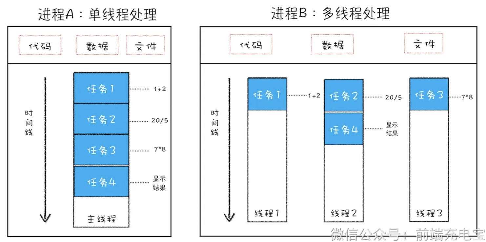
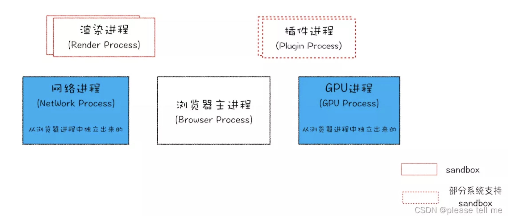
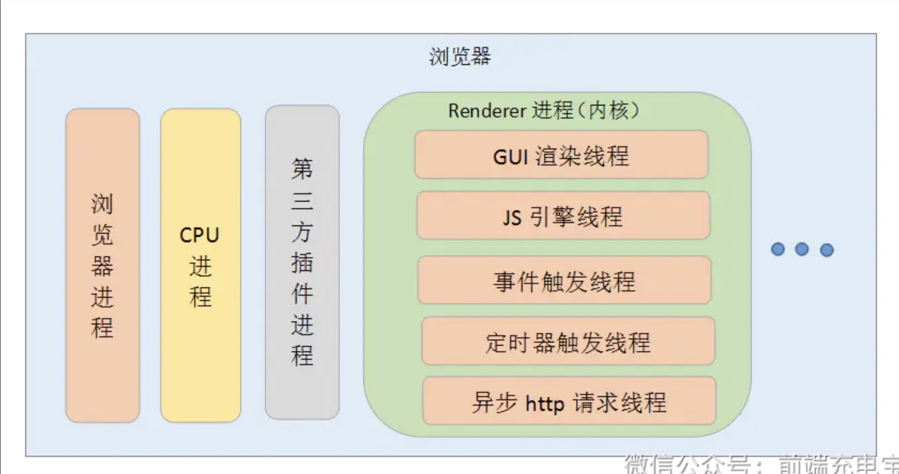

### 一、进程与线程

- 本质上来说，进程和线程都是 CPU 工作时间片的一个描述

  - 进程描述了 CPU 在运行指令及加载和保存上下文所需的时间

  - 线程是进程中更小单位，描述了执行一段指令所需的时间
  
- 一个进程就是一个程序的运行实例
  - 启动一个程序的时候，操作系统会为该程序创建一块内存，用来存放代码、运行中的数据和一个执行任务的主线程，我们把这样的一个运行环境叫**进程** 

- 线程是依附于进程的，进程中可以有多个线程，至少有一个线程

#### 1.1 关系与区别

- 关系

  - 一个线程只能属于一个进程，而一个进程可以有多个线程，但至少有一个线程
  - 资源分配给进程，同一进程的所有线程共享该进程的所有资源

  - 线程在执行过程中，需要协作同步。不同进程的线程间要利用消息通信的办法实现同步
- 区别

  - **根本区别**：进程是操作系统资源分配的基本单位，而线程是处理器任务调度和执行的基本单位
  - **内存分配**：同一进程的线程共享本进程的地址空间和资源，而进程之间的地址空间和资源是相互独立的

  - **影响关系**：一个进程崩溃后，在保护模式下不会对其他进程产生影响，但是一个线程崩溃整个进程都死掉
  - **执行过程**：每个独立的进程有程序运行的入口、顺序执行序列和程序出口。但是线程不能独立执行，必须依存在应用程序中，由应用程序提供多个线程执行控制，两者均可并发执行

### 二、浏览器的多进程架构

- 从图中看出，浏览器包括 1 个浏览器主进程，1 个 GPU 进程，1 个网络进程，多个渲染进程，多个插件进程

  - **浏览器主进程**：主要负责界面显示、用户交互、子进程管理，同时提供存储等功能

  - **GPU 进程**：使用初衷是为了实现 3D CSS 的效果，只是随后网页、Chrome 的 UI 界面都选择采用 GPU 来绘制，这使得 GPU 成为浏览器普遍的需求
  - **网络进程**：主要负责页面的网络资源加载
  - **渲染进程**：核心任务是将 HTML、CSS 和 JavaScript 转换为用户可以与之交互的网页，排版引擎 Blink 和 JavaScript 引擎 V8 都是运行在该进程中，默认情况下，Chrome 会为每个 Tab 标签创建一个渲染进程。出于安全考虑，渲染进程都是运行在沙箱模式下
  - **插件进程**：主要是负责插件的运行，因插件易崩溃，所以需要通过插件进程来隔离，以保证插件进程崩溃不会对浏览器和页面造成影响

- 所以，当我们打开一个页面的时候，至少会有 4 个进程被创建，分别是：
  - 浏览器主进程

  - GPU 进程
  - 网络进程
  - 渲染进程

### 三、渲染进程的线程

- 浏览器渲染进程是多线程的，主要包括以下几个线程：

  - **GUI 渲染线程**：负责渲染浏览器界面，解析 HTML、CSS，构建 DOM 树和 RenderObject 树，布局和绘制等

  - **JavaScript 引擎线程**：也称为 JS 线程，负责处理 JavaScript 脚本程序，例如 V8 引擎解析、执行 JavaScript 代码
  - **事件触发线程**：归属于浏览器而不是 JavaScript 引擎，用来控制事件循环（可以理解，JS 引擎自己都忙不过来，需要浏览器另开线程协助）
  - **定时触发器线程**：setInterval 和 setTimeout 所在线程
  - **异步 http 请求线程**：在 XMLHttpRequest 连接后是通过浏览器新开一个线程请求

- 注意：GUI渲染线程和JS引擎线程是互斥的

  - 当JS引擎执行时GUI线程会被挂起，GUI更新会被保存在一个队列中等到JS引擎空闲时立即被执行

  - 所以如果JS执行的时间过长，会造成页面的渲染不连贯，导致页面渲染加载阻塞

### 四、进程之间的通信方式

- 进程之间的通信方式主要有以下几种：

  - **管道**：管道是一种半双工的通信方式，数据只能单向流动，而且只能在具有亲缘关系的进程间使用

  - **命名管道**：命名管道也是半双工的通信方式，但是它允许无亲缘关系进程间的通信
  - **信号**：信号是一种比较复杂的通信方式，用于通知接收进程某个事件已经发生
  - **消息队列**：消息队列是由消息的链表，存放在内核中并由消息队列标识符标识
  - **信号量**：信号量是一个计数器，可以用来控制多个进程对共享资源的访问
  - **共享内存**：共享内存就是映射一段能被其他进程所访问的内存，这段共享内存由一个进程创建，但多个进程都可以访问
  - **套接字**：套接字也是一种进程间通信机制，与其他通信机制不同的是，它可用于不同及其间的进程通信

### 五、僵尸进程与孤儿进程

- 僵尸进程：当子进程比父进程先结束，而父进程又没有回收子进程，释放子进程占用的资源，此时子进程将成为一个僵尸进程

  - 僵尸进程会占用系统资源，所以需要父进程来回收子进程
- 孤儿进程：当一个进程的父进程退出，而该进程还没有结束，那么该进程将成为一个孤儿进程

### 六、死锁

- 死锁是指两个或两个以上的进程在执行过程中，由于竞争资源或者由于彼此通信而造成的一种阻塞的现象，若无外力作用，它们都将无法推进下去

