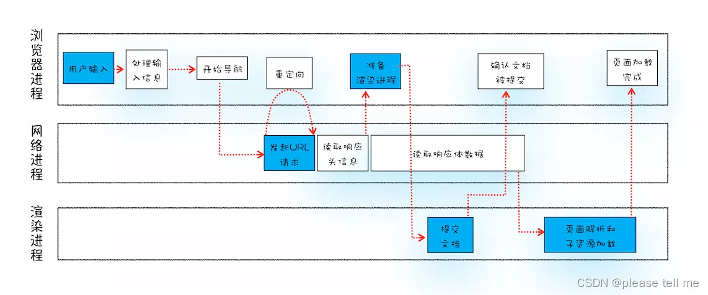
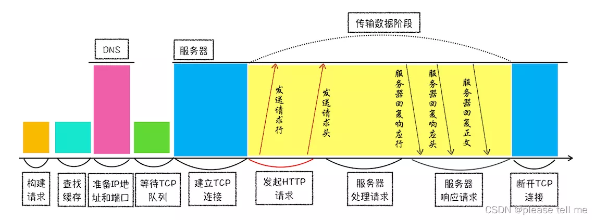
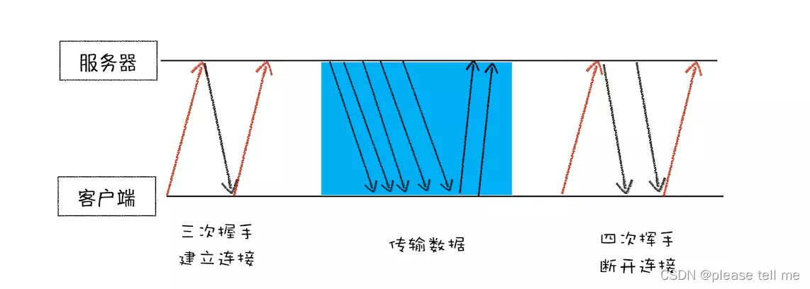
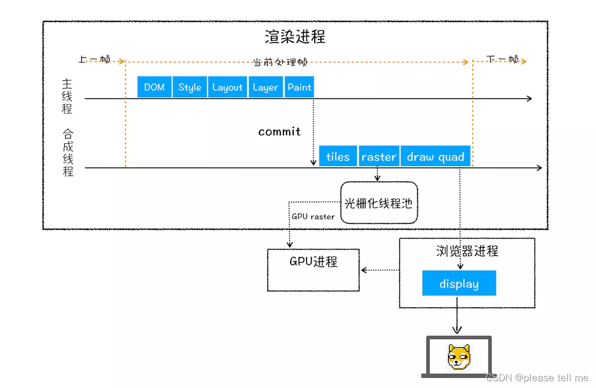
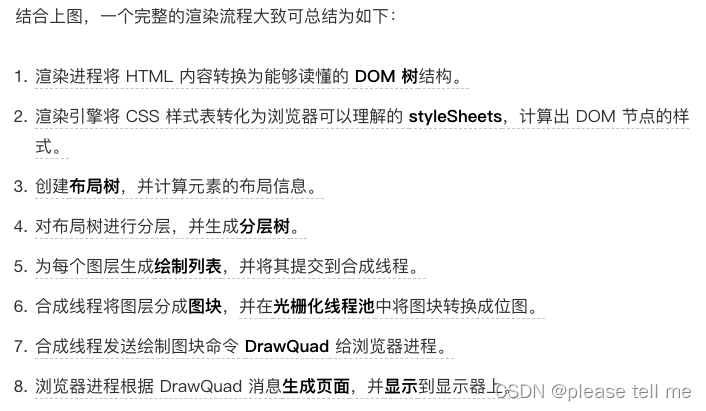
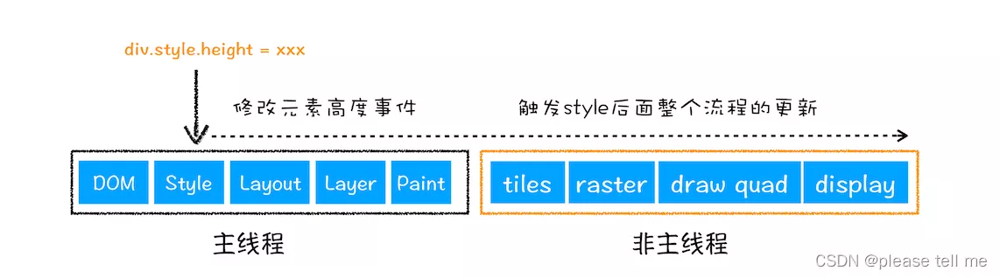
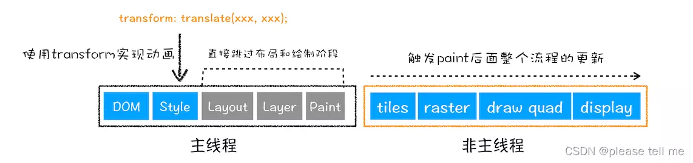

> 本来是要讲浏览器渲染原理的，但是还是打算将整个流程放在一起，有设计计算机网络知识

### 一、从输入URL到页面展示

- 首先，浏览器进程接收用户输入的URL，然后将其交给网络进程

- 在网络进程中，会首先检查URL是否合法，如果不合法，则会返回错误信息，如果合法，则发起 HTTP 请求

- 接着网络进程接收到响应头数据后，解析响应头数据，并将数据交给浏览器进程

- 浏览器进程接收到响应头数据后，发送 ‘提交导航’ 消息给渲染进程

- 渲染进程接收到提交导航信息后，便开始接收 HTML 数据，接收方式是直接与网络进程建立管道通信

- 最后渲染进程回向浏览器进程发送 ‘确认提交’ 消息，这是告诉浏览器进程，页面已经解析完成

- 浏览器进程接收到确认提交消息后，便开始更新浏览器界面，包括更新地址栏、更新前进后退按钮、更新页面标题等

### 二、网络进程发送 HTTP 请求过程

|构建请求| 构建请求行信息（`GET /index.html HTTP1.1`），构建好后，浏览器准备发起网络请求 |
|--|--|
| 查找缓存 | 当浏览器发现请求的资源已经在浏览器缓存中存有副本，它会拦截请求，返回该资源的副本，并直接结束请求；如果缓存查找失败，就会进入网络请求过程 |
| 准备 IP 地址和端口 | HTTP 的内容是通过 TCP 的传输数据阶段来实现的，而建立 TCP 连接的第一步就是需要准备 IP 地址和端口号 |
| 等待TCP队列 | Chrome 有个机制，同一个域名同时最多只能建立 6 个 TCP 连接，如果在同一个域名下同时有 10 个请求发生，那么其中 4 个请求会进入排队等待状态，直至进行中的请求完成 |
| 建立TCP连接 | 三次握手 |
| 发送HTTP请求 | 请求行、请求头、请求体 |

- TCP 链接分为三个阶段：建立连接、传输数据、断开连接

### 三、浏览器渲染原理

- 用户发出 URL 请求到页面开始解析的这个过程，就叫做**导航**。导航被提交后就进入了**渲染阶段**

- 渲染阶段主要是渲染进程将静态资源转化为可视化页面
- 大致流程如下：
  - 解析 HTML 并构建 **DOM 树**

  - 解析 CSS 并构建 **CSSOM 树**
  - 将 DOM 树和 CSSOM 树合并成一个**渲染树**
  - 页面布局
  - 页面绘制

- 稍微详细点的流程如下：

- 第一步 DOM 还是将 HTML 解析成 DOM 树
- Style 是样式就按，计算 DOM 树中每个节点的具体样式
- Layout 布局是未来计算出 DOM 树中可见元素的几何位置，然后将这些信息存储在布局树中
- Layer 分层是渲染引擎为特定的节点生成专用的图层，并生成图层树（浏览器的页面实际上被分成了很多图层，这些图层叠加后合成了最终的页面）

- Paint 绘制就是把一个图层的绘制分成很多小的绘制指令，然后按照顺序组成一个绘制列表。当绘制列表准备好后，主线程将其提交给合成线程
- 合成线程将图层分成图块，然后将这些图快生成位图，再将位图上传到 GPU 进程
- 当所有图块都上传到 GPU 进程后，合成线程会发送绘制图块命令给浏览器进程，GPU 进程开始绘制

#### 3.1 重排（回流）

- 通过 js 或者 css 修改元素的几何位置属性，例如改变元素的宽度、高度、位置等，那么浏览器会触发重新布局，解析之后的一系列子阶段，这个过程就叫做**重排**

#### 3.2 重绘

- 如果只是改变了元素的颜色、背景色等，没有改变元素的几何位置，那么就直接进入绘制阶段（下图有点错误）

- 相较于重排操作，重绘省去了布局和分层阶段，所以执行效率会比重排操作要高一些

