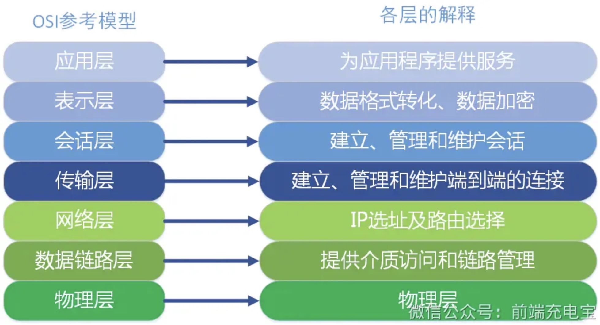
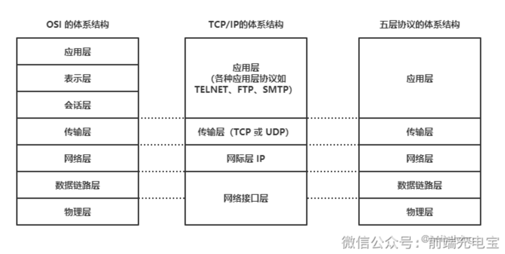
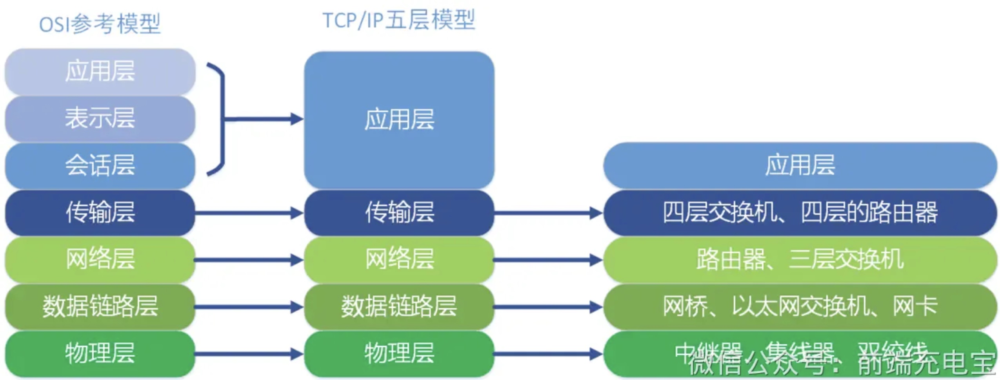
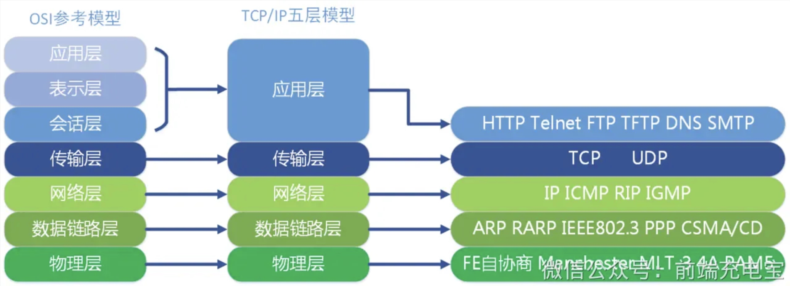
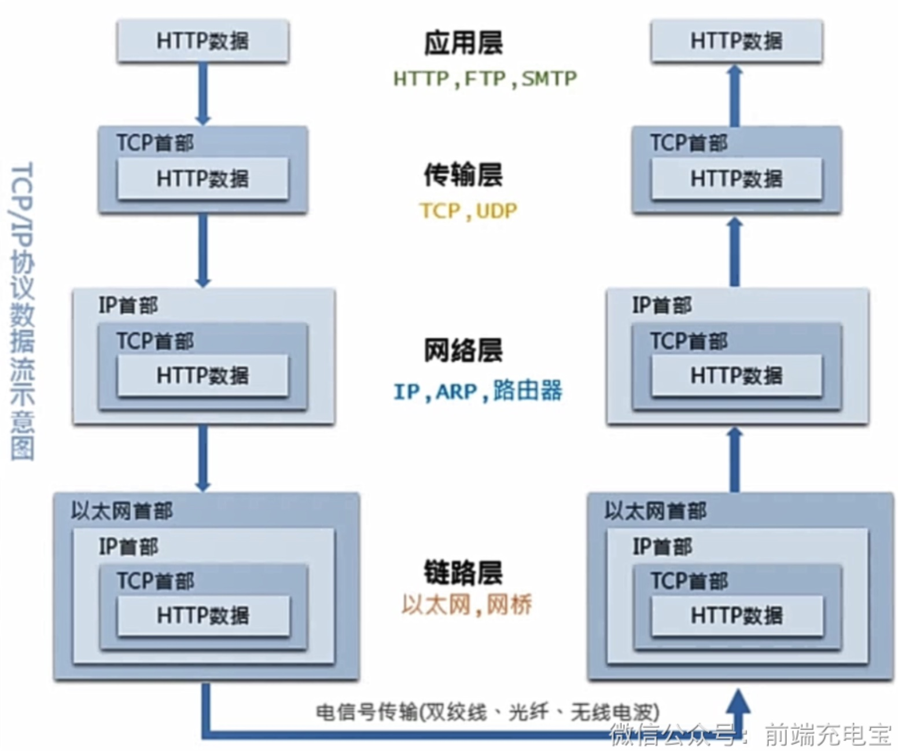

### 一、OSI七层模型

- 应用层：最靠近用户的一层，为用户提供各种网络服务，如FTP、DNS、HTTP、SMTP等

- 表示层：提供各种用于应用层数据的编码和转换功能,确保一个系统的应用层发送的数据能被另一个系统的应用层识别
    - 数据压缩和加密也是表示层可提供的转换功能之一
- 会话层：负责建立、管理和终止表示层实体之间的通信会话
- 传输层：为两台主机上的应用进程提供端到端的通信，提供可靠的或不可靠的连接服务
    - 提供面向连接的服务（TCP）

    - 提供无连接的服务（UDP）
- 网络层：负责进行逻辑地址寻址，实现不同网络之间的路径选择
- 数据链路层：负责物理地址寻址，实现相邻节点之间的数据传输
- 物理层：负责物理设备之间的比特流传输

#### 1.1 对等通信

- 为了使数据分组从源传送到目的地，源端OSI模型的每一层都必须与目的端的对等层进行通信，这种通信方式称为对等层通信

- 在每一层通信过程中，使用本层自己协议进行通信

### 二、TCP/IP五层模型

- 对比两模型，看每一层都工作者不同设备，比如常用的交换机在数据链路层，路由器在网络层

- 在看各层对应的协议

- 同样，TCP/IP五层模型也是对等通信

