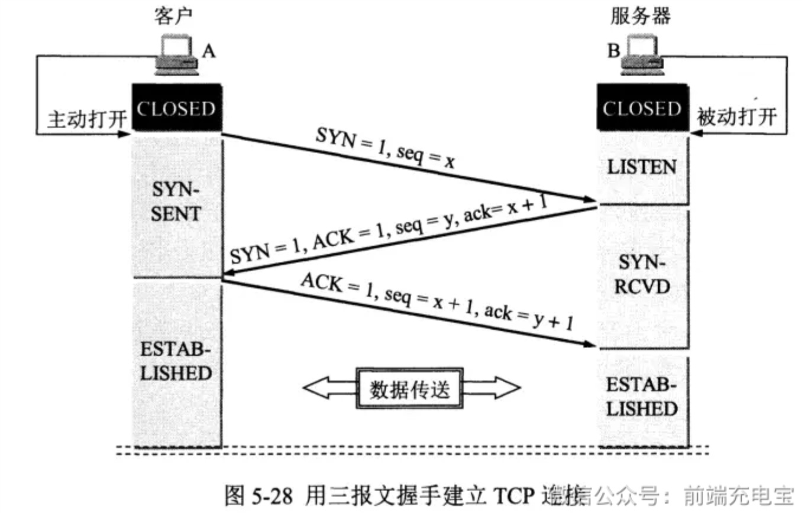
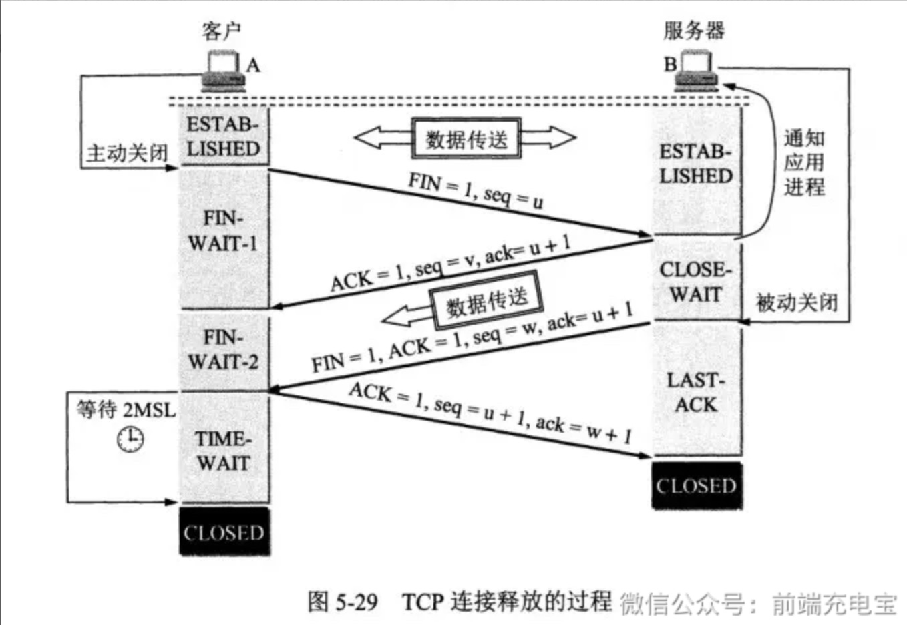

### 一、概述

- TCP和UDP是传输层的两个协议

- UDP 全称是用户数据报协议，是无连接的、不可靠的、面向数据报的协议
- TCP 全称是传输控制协议，是面向连接的、可靠的、基于字节流的协议

### 二、区别

| | UDP| TCP|
|--- |--- |--- |
| 是否连接 |无连接 | 面向连接 |
| 是否可靠 | 不可靠传输，不保证消息交付，不确认不重传 | 可靠传输（数据顺序和正确性），使用流量控制和拥塞控制 |
| 连接对象个数 | 支持一对一，一对多，多对一和多对多交互通信 | 只能是一对一通信 |
| 传输方式 | 面向报文 | 面向字节流 |
| 首部开销 | 首部开销小，仅8字节 | 首部最小20字节，最大60字节 |
| 适用场景 | 适用于实时应用（IP电话、视频会议、直播等） | 适用于要求可靠传输的应用，例如文件传输 |

### 三、TCP 的三次握手和四次握手

- 三次握手，其实是建立一个 TCP 连接时，需要客户端和服务器总共发送三个包

    - 三次握手主要作用是为了确认双方的接收能力和发送能力是否正常、指定自己的初始化序列号为后面的可靠性传送做准备

- 四次握手，其实是断开一个 TCP 连接时，需要客户端和服务器总共发送四个包

    - 断开使用四次握手是因为 TCP 的连接是全双工的，需要双方分别释放与对方的连接

