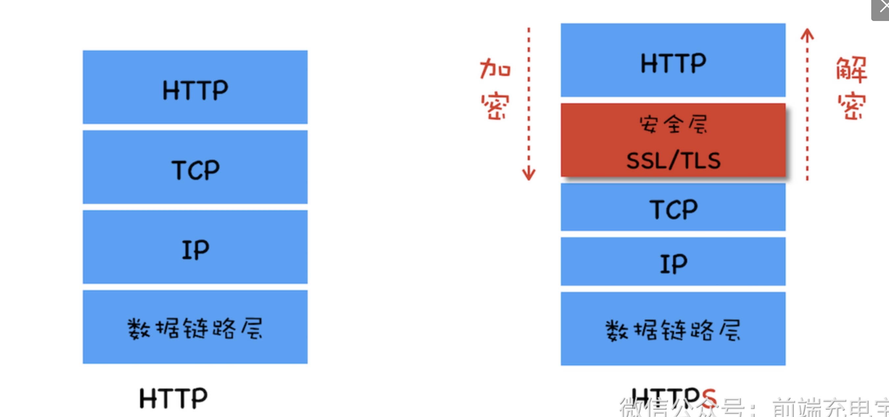
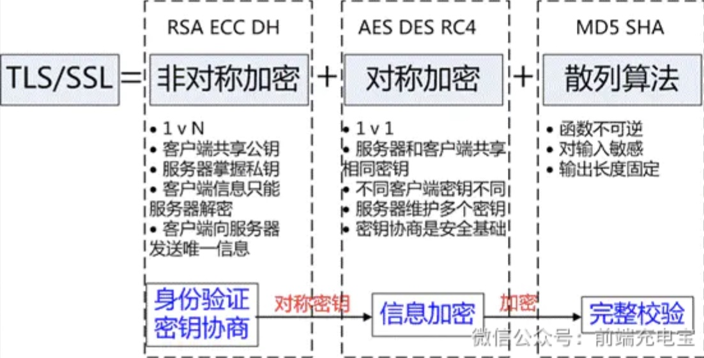

### 一、概述

- HTTPS 是超文本传输安全协议，经由 HTTP 进行通信，但利用 SSL/TLS 来加密数据包

- HTTPS 主要是提供对网站服务器的身份认证，同时保护交换数据的隐私与完整性

    - HTTP 协议采用明文传输信息，存在信息窃听、信息篡改和信息劫持的风险，而协议 SSL/TLS 具有身份验证、信息加密和完整性校验的功能

### 二、TLS/SSL 的工作原理

- TLS/SSL 全称是安全传输层协议，是介于 TCP 和 HTTP 之间的一层安全协议

- 协议功能实现主要依赖三类基本算法：

    - 非对称加密算法：实现身份认证和秘钥协商

    - 对称加密算法：采用协商好的秘钥进行数据加密

    - 散列函数 hash：验证信息的完整性

### 三、数字证书

- 上面方法也不一定是安全的，因为没办法确定得到的公钥（非对称加密算法里的）就一定是安全的，可能是第三方的

- 为了解决这个问题，引入了数字证书

    - 数字证书是由第三方权威机构颁发的，用于证明公钥的身份和公钥的所有权

### 四、HTTPS 的工作流程

- 第一步，客户端向服务器发起请求，请求中包含使用的协议版本号、生成的一个随机数、以及客户端支持的加密方法

- 第二步，服务器端接收到请求后，确认双方使用的加密方法、并给出服务器的证书、以及一个服务器生成的随机数

- 第三步，客户端确认服务器证书有效后，生成一个新的随机数，并使用数字证书中的公钥，加密这个随机数，然后发给服 务器。并且还会提供一个前面所有内容的 hash 的值，用来供服务器检验

- 第四步，服务器使用自己的私钥，来解密客户端发送过来的随机数。并提供前面所有内容的 hash 值来供客户端检验

- 第五步，客户端和服务器端根据约定的加密方法使用前面的三个随机数，生成对话秘钥，以后的对话过程都使用这个秘钥来加密信息

### 五、HTTP 和 HTTPS 的区别

- 端口不同，HTTP协议端口是80，HTTPS的协议端口是443

- HTTP协议是超文本传输协议，信息是明文传输的，HTTPS则是具有安全性的SSL加密传输协议

- HTTPS协议需要CA证书，费用较高；HTTP协议不需要