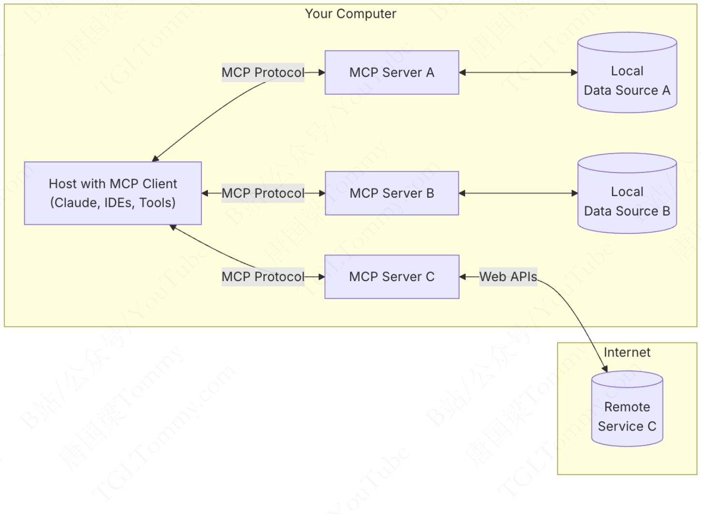
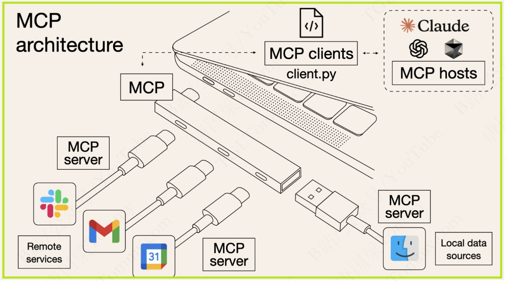
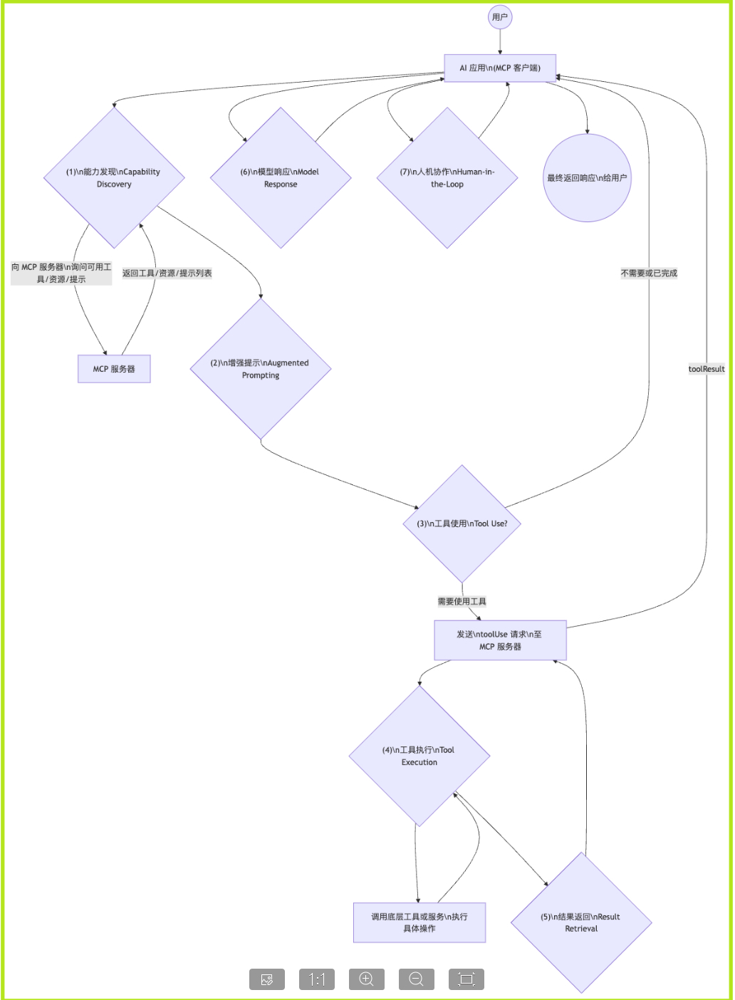
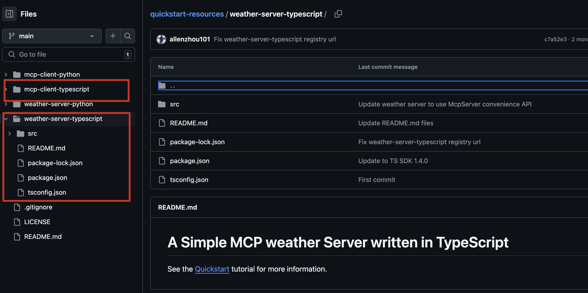
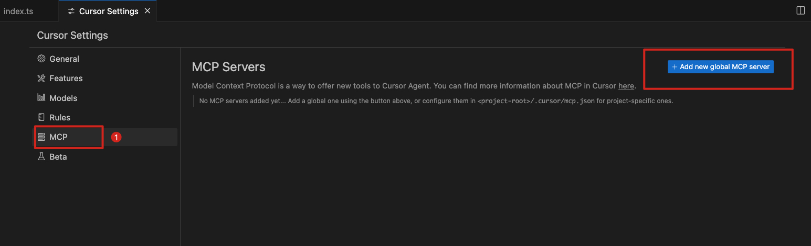
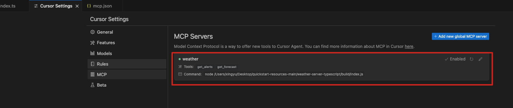
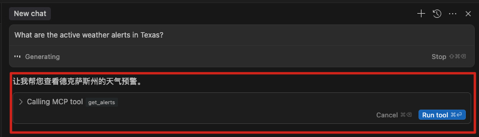
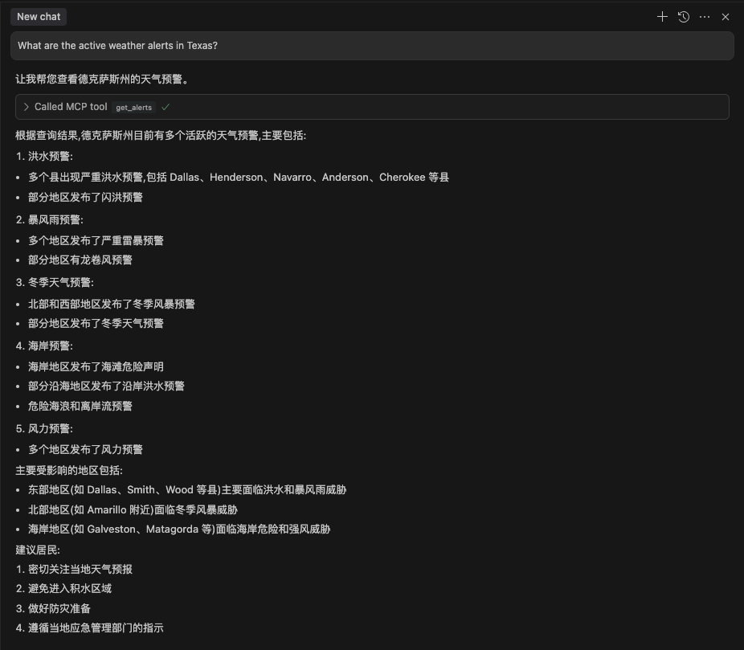
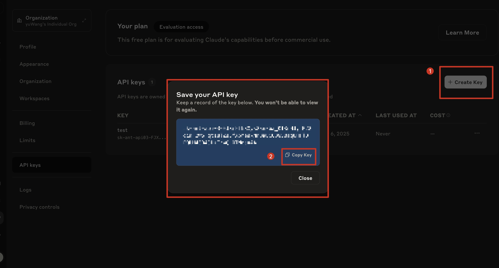
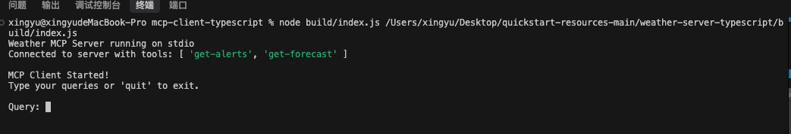

> 此篇文章不是针对纯小白的，而是针对有使用过LLM应用的人，比如使用过 gpt、deepseek 等
> 
> 内容来自官网 [MCP](https://modelcontextprotocol.io/introduction)
>
> 编写于 2025-4-5


### 一、MCP 概述与背景

- MCP 由 Anthropic 于 2024 年 11 ⽉推出，是⼀种开放协议，旨在标准化⼤语⾔模型（LLMs）应⽤程序与外部数
据源和⼯具之间的交互⽅式。
- MCP的核⼼在于建⽴⼀个标准化的 `通信层`，使得LLMs能够在处理⽤户请求或执⾏任务时，通过MCP客户端向MCP服务器发送请求。
- MCP服务器则负责与相应的外部数据源或⼯具进⾏交互，获取数据并按照MCP协议规范进⾏格式化，最后将格式化后的数据返回给LLM。这⼀机制使LLM能够获取更准确、更相关的信息，从⽽⽣成更⾼质量的回复或执⾏⽤户请求的操作。

### 二、MCP 技术架构与实现

- MCP 遵循客户端-服务器架构，由 `MCP 主机、MCP 客户端、 MCP 服务器、本地数据源、远程服务` 组成




- `MCP Host (MCP 主机)`：指希望通过 MCP 访问数据的 AI ⼯具，例如聊天客户端、集成开发环境（IDEs）、Claude Desktop、Cline等
- `MCP Clients (MCP 客户端)`：是协议客户端，与 MCP 服务器保持⼀对⼀的连接。它们负责处理通信并将服务器的响应呈现给 AI 模型。可以简单理解为主机里的客户端程序，也可以自己实现一个简单的客户端
- `MCP Server (MCP 服务器)`：通过标准化的协议，实现与MCP Clients的双向交互，提供本地或远程资源的访问能⼒，如数据库查询、API调⽤等。⼀个服务器可以提供多个功能，类似于函数调⽤或⼯具使⽤，LLM 会⾃⾏理解并调⽤所需的能⼒
- `本地数据源 (Local Data Sources)`: 计算机本地的⽂件、数据库等资源，MCP Servers可以安全地访问这些本地数据源
- `远程服务 (Remote Services)`: 通过互联⽹（如API）访问的外部系统，MCP Servers可以与这些远程服务进
⾏连接



- 通信协议采用 `JSON-RPC 2.0`，支持两种类型的通讯机制
  - `本地通讯- Stdio(标准输入输出)`：适用于本地进程间通讯
  - `远程通讯- 基于SSE的HTTP`：支持流式传输与远程服务交互，适用于与远程服务的通讯


### 三、MCP 解决的核心问题

- `打破数据孤岛`：传统⼤模型⽆法直接访问实时数据或本地资源
- `降低开发成本`：在MCP出现之前，每个⼤模型需要为每个⼯具单独开发接⼝
- `提升安全性与互操作性`：MCP内置权限控制和加密机制，⽐直接开放数据库更安全


### 四、MCP 的工作流程

- 第一步 `能力发现`：一个 MCP 客户端扩展功能时可以连接多个 MCP 服务器。客户端会像服务器询问其能提供的功能，即工具、资源和提示的列表和描述，这样客户端就知道服务器可以用来做什么
  - `工具 Tools`：可以是任何外部服务，如数据库查询、API调⽤、代码分析等可以执行的操作或函数
  - `资源 Resources`：可以访问和检索的数据对象，如⽂件、数据库等
  - `提示 Prompts`：是预定义的模板，⽤于指导 AI 的交互，确保⼀致性和效率
- 第二步 `增强提示`：当⽤户提出需要外部数据或操作的查询时，该查询以及服务器提供的⼯具/资源/提示的描述会被发送给 AI 模型（通过其宿主应⽤，即 MCP 主机）。模型现在“知道”它可以利⽤哪些服务器功能来完成任务。例如，如果⽤户询问“明天的天⽓怎么样？”，发送给模型的提示会包含⼀个描述“天⽓ API ⼯具”的信息，该⼯具由某个 MCP 服务器提供
- 第三步 `工具使用`：基于用户的查询和可用工具，AI 模型会决定是否需要使用某个工具来完成任务。如果需要，就会向相应的 MCP 服务器发送一个 `toolUse` 消息，指定要用的工具及其所需参数
- 第四步 `工具执行`：MCP 服务器接收到 `toolUse` 请求后，会将该请求分发给相应的底层⼯具或服务。例如，如果请求是使⽤“天⽓ API ⼯具”，服务器会调⽤实际的天⽓ API 并获取结果
- 第五步 `结果返回`：服务器会将结果以结构化的格式返回给客户端，包含一个 `toolResult` 消息，其中包含工具的名称、输⼊参数和返回结果
- 第六步 `模型响应`：客户端接受到结果后，会将其作为新的提示发送给 AI 模型，以完成任务
- 第七步 `人机协作`：MCP 还引入了人机协作的功能，允许用户提供额外的数据并批准某些执行步骤




### 五、MCP 服务器开发

- 引用官网的一个例子 [For Server Developers](https://modelcontextprotocol.io/quickstart/server)
- 因为 Claude 注册费劲，这里以 Cursor 作为 MCP 客户端举例
- 先下载官网的例子代码 [完整代码](https://github.com/modelcontextprotocol/quickstart-resources/tree/main/weather-server-python)，具体代码功能查看官网，很简单都有介绍



- 我是前端，所以以 TS 为例，进入 weather-server-typescript 文件夹，先 `npm i` 安装依赖，然后 `npm run build` 打包，打包后的文件在 `build` 文件夹下

- 这样一个 MCP 服务器就有了，然后就是在 Cursor 中配置这个服务器



- 点击后会有一个 `mcp.json` 文件，这个文件就是 MCP 服务器的配置文件，配置信息为：

```json
{
  "mcpServers": {
    "weather": {
          "command": "node",
          "args": [
              "/Users/xingyu/Desktop/quickstart-resources-main/weather-server-typescript/build/index.js"
          ]
      }
  }
}
```
- `weather` 服务器名称， `command` 就是运行的命令，`args` 是运行命令的参数，这里是运行 `build/index.js` 文件，这个文件就是打包后的文件

- 配置完后，关闭文件，就可以看到



- 然后在输入框中使用，因为 API 时国外的，需要询问国外地址，使用官网的询问例子
  - What are the active weather alerts in Texas?



- 这里就是找到了对应的工具 `get_alerts`，询问是否使用，点击使用




### 六、MCP 客户端开发

- 仍是上面下载的代码，进入 mcp-client-typescript 文件夹

- 进入后，需要设置Anthropic API 密钥，[注册一个](https://console.anthropic.com/settings/keys)



- 然后将复制的值放在根目录的 `.env` 文件中（删除原来的 .env.example），内容如下：

```bash
ANTHROPIC_API_KEY=sk-xxxxxxxxxxxxx
```


- 然后 `npm i` 安装依赖，然后 `npm run build` 打包，打包后的文件在 `build` 文件夹下，就可以运行了

```js
// node 后接两参数，客户端打包地址 和 服务器打包地址
node build/index.js <path_to_server_script>
```



