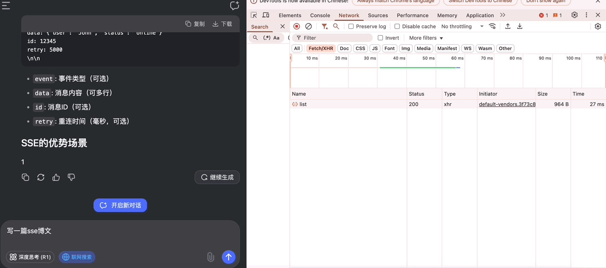

### 一、背景

*   在使用 DeepSeek 时，发现输入 prompt 后，页面是逐步给出回复的，起初以为使用了 WebSocket 实现推送，但查看网络请求，发现这个接口并非是 WebSocket，而是类似传统的 http 接口请求，但是是基于 `EventStream` 事件流



### 二、概述

*   Server-Sent Events 服务器推送事件，简称 SSE，是一种服务端`实时主动`向浏览器推送消息的技术
*   SSE 是 HTML5 中一个与通信相关的 API，主要由两部分组成
    *   服务端与浏览器端的通信协议（HTTP 协议）
    *   浏览器端可供 JavaScript 使用的 `EventSource` 对象
*   SSE 与 WebSocket 类似，又有区别

| SSE                                 | WebSocket       |
| ----------------------------------- | --------------- |
| 基于 HTTP 协议                          | 基于 TCP 协议       |
| 单工，只能服务端单向发送消息                      | 全双工，可以同时发送和接收消息 |
| 轻量级，使用简单                            | 相对复杂            |
| 内置断线重连和消息追踪的功能                      | 不在协议范围内，需手动实现   |
| 文本或使用 Base64 编码和 gzip 压缩的二进制消息      | 类型广泛            |
| 支持自定义事件类型                           | 不支持自定义事件类型      |
| 连接数 HTTP/1.1 6 个，HTTP/2 可协商（默认 100） | 连接数无限制          |

### 三、浏览器 API

*   可以使用 `EventSource` API 创建对象监听服务器发送的事件。建立连接后
    *   服务器可以使用 HTTP 响应的 `text/event-stream` 内容类型发送事件消息
    *   浏览器则可以通过监听 EventSource 对象的 `onmessage、onopen、onerror` 事件来处理这些消息

#### 3.1 建立链接，生成实例对象

*   接收两参数，第二参数是 options，可选对象，可以不用

```js
const eventSource = new EventSource('http_api_url', { withCredentials: true })
```

*   实例对象 eventSource 有一个 `readyState`属性值
    *   0: 尚未建立连接或连接关闭
    *   1: 成功建立连接，浏览器正在处理收到的数据
    *   2: 建立连接失败
*   可以使用 `eventSource.close()` 来主动关闭连接

#### 3.2 监听事件

*   有两种写法，一是 addEventListener，二是属性监听。第一种方式可以自定义监听事件

```js
eventSource.addEventListener('open', function(event) {})
eventSource.addEventListener('message', function(event) {})
eventSource.addEventListener('error', function(event) {})
// 监听自定义事件
eventSource.addEventListener('xxx', function(event) {})
```

```js
eventSource.onopen = function(event) {}
eventSource.onmessage = function(event) {}
eventSource.onerror = function(event) {})
```

### 四、封装一个类

```js
class SSEService {
    constructor() {
        this.eventSource = null;
        this.isClosing = false;
    }
    connect(url, options = {}) {
        if (this.eventSource) {
            this.disconnect();
        }
        this.eventSource = new EventSource(url);
        // 处理连接打开
        this.eventSource.onopen = () => {
            console.log('SSE连接已建立');
            this.isClosing = false;
            if (options.onOpen) {
                options.onOpen();
            }
        };
        // 处理消息
        this.eventSource.onmessage = event => {
            try {
                const data = JSON.parse(event.data);
                if (options.onMessage) {
                    options.onMessage(data);
                }
                // status，约定的最后一条消息的状态
                if (data.status === 1) {
                    this.isClosing = true;
                    this.disconnect();
                }
            } catch (error) {
                console.error('解析SSE消息失败:', error);
            }
        };
        // 处理错误
        this.eventSource.onerror = error => {
            if (this.isClosing) {
                return;
            }
            console.error('SSE连接错误:', error, new Date().toLocaleString());
            if (options.onError) {
                options.onError(error);
            }
            this.disconnect();
        };
    }
    disconnect() {
        if (this.eventSource) {
            this.eventSource.close();
            this.eventSource = null;
            console.log('SSE连接已关闭', new Date().toLocaleString());
        }
    }
}
export default SSEService;
```

*   引进 isClosing ，是因为数据接收完后也会触发 onerror 事件，这里是为了区分正常连接终止
*   使用：

```js
const url = `/xxx/xxx?query=${encodeURIComponent(query)}`;
sseService.connect(url, {
    onMessage: data => {
        // 逻辑处理
    },
    onError: () => {
        // 逻辑处理
    },
});
```
