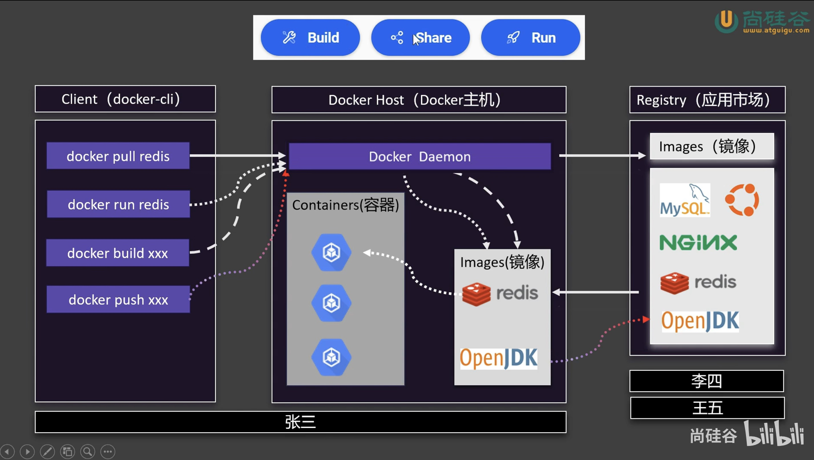
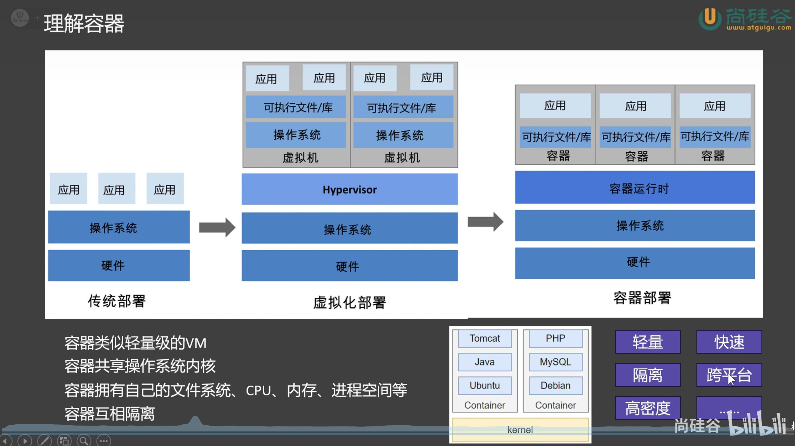

### 一、Docker 架构与容器化

#### 1.1 Docker 架构

 

- 在一台机器上安装 docker 环境，这个机器就称为 docker 主机，也叫 `docker host`

- 只要安装了 docker，docker 的后台进程 `docker daemon` 就会一直运行准备服务

- docker 还提供一个客户端，它是一个` docker CLI` 命令行程序，用来操作主机的后台进程，用它发送一些命令

- docker 有一个应用市场，将所有的应用集中在这个市场里，这些应用软件可以成为`镜像`，镜像就像一个模板，根据这个模板可以创建出容器

 

- 比如运行 redis，首先通过 `docker pull redis` 命令从应用市场拉取 redis 镜像，通过 `docker run redis` 命令创建一个 redis 容器去运行

- 也可以通过 build 、push 等命令来创建自己的软件镜像并发布到应用市场

#### 1.2 容器化

 

- 传统部署是直接在操作系统上部署一个个应用，假设这个应用炸了造成内存泄漏，会导致整个操作系统崩溃，即存在应用之间不隔离的问题

- 之后是虚拟化部署，通过虚拟机来部署应用，这样就有了隔离机制，但虚拟机很笨重

- 最后是容器化部署，通过容器来部署应用

    - 容器共享操作系统的内核

    - 每个容器都有自己的文件系统、进程空间、网络空间等

    - 容器之间相互隔离，互不干扰

    - 容器的启动、停止、删除等操作都非常快

    - 可以跨平台，如果对方机器安装了容器运行时环境，我们的容器就可以直接迁移过去

### 二、安装 Dcoker

