> 此篇文章不是针对纯小白的，而是用过Cursor一段时间的人
> 
> 内容主要来自官网 [Cursor](https://docs.cursor.com/get-started/introduction)
>
> 编写于 2025-4-4


### 一、入门

- 目前 Cursor 提供的主要 AI 功能
  - `Tab` 按下后，会自动生成代码
  - `CMD-K` 用于内联代码编辑
  - `⌘I` 打开具有询问、编辑和代理模式的统一 AI 界面

### 二、Tab

- 完成当前代码行
- 建议整个函数实现
- 模块自动导入
- Cursor预测：cursor可以预测你在编辑被接受后将转到的位置。如果可用，你将能够按 Tab 键转到下一个位置，从而允许你按 Tab-Tab-Tab 键浏览编辑
- 随着时间的推移适应你的编码的风格

*使用*

- 点击 `Tab` 键，会接受建议，点击 `ESC` 键或者继续输入，会拒绝建议
- 要逐字逐句地接受建议，请按 `Ctrl/⌘ →`，但需要在配置 `Cursor Settings> Features> Cursor Tab`


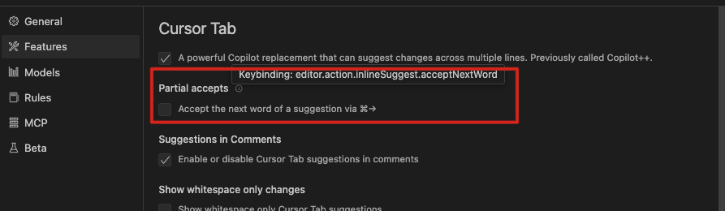

### 三、Chat

- 使用 `CMD-I` 可以打开，也可以点击右上角图标

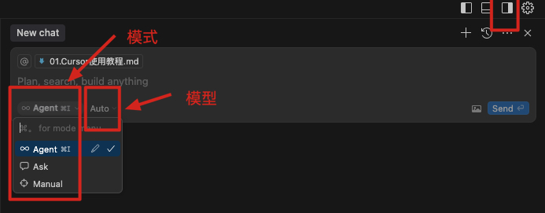

- 三种`预定义模式`：`Agent、Ask、Manual`，分别是代理模式、询问模式、手动模式
  - 也可以`自定义模式`，后面讲
- `模型`：每个模式多可以选择不同的模型，比如 gpt-4o 在问答领域很不错，claude-3.5-sonnet 在代码生成领域很好
- `Context 上下文`：可以使用 `@` 符号在提示中包含相关上下文，也可以直接拖拽文件到输入框中
  - 可以指定特定的文件，也可以指定文件夹、特定的代码函数等

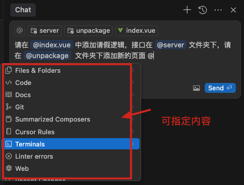

- `Checkpoints 检查点`：每次迭代都会创建一个检查点，可以点击 `Checkpoints` 按钮回滚代码到上一次迭代的位置


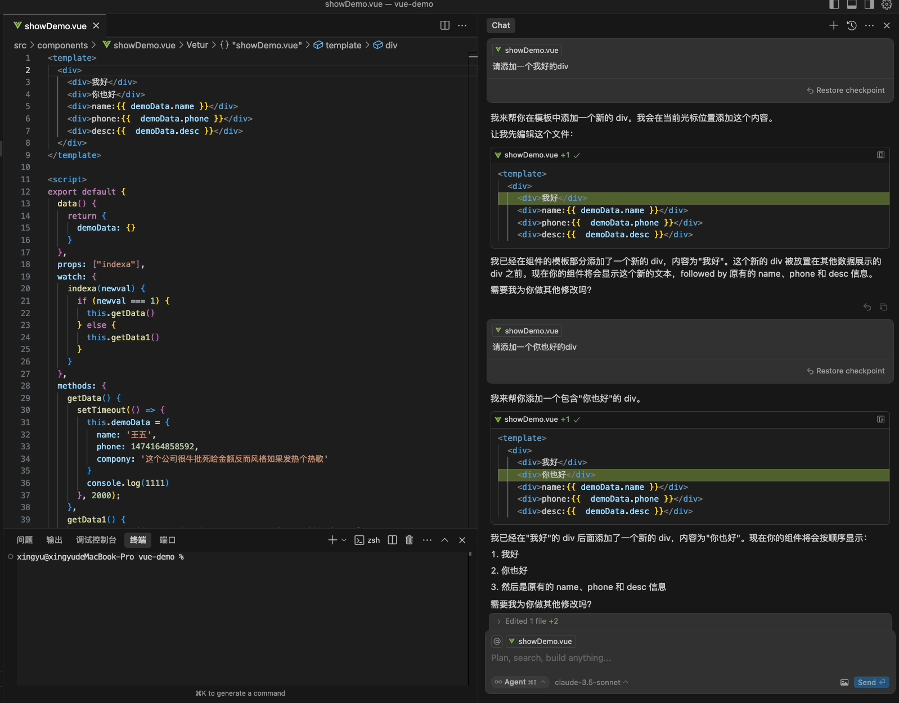

- `聊天记录`：右上角的可以看到历史聊天记录，可对记录进行编辑和删除

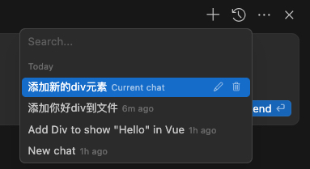

- `长时间对话`：档对话开始达到上下文窗口限制时，会显示提示，以参考当前聊天开始新的聊天
  

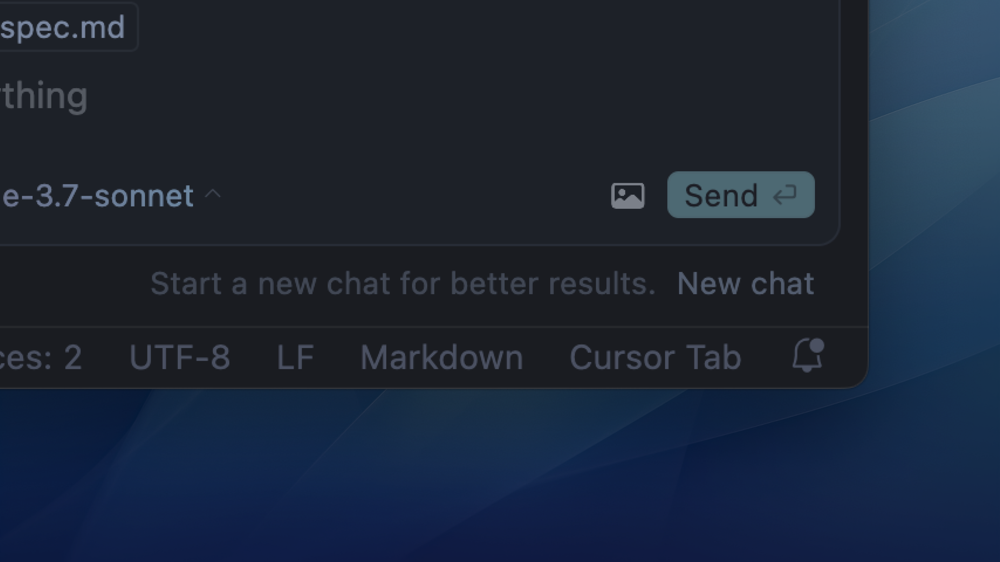

- `声音通知`：对话结束时播放声音，每次回答结束都会”叮咚“一声

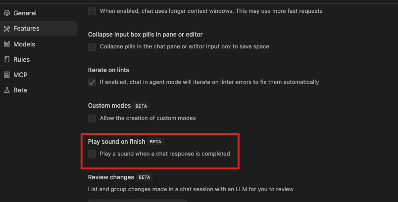

#### 3.1 预定义模式

- `Agent 代理模式`：可以自动运行终端命令、管理文件、处理项目级的复杂任务，并生成代码
  - 现在可以编辑，提前设置默认模型、代理模式的快捷键绑定、是否启用自定运行和自动修复错误

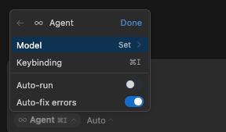

- `Ask 询问模式`：只能提供及时回答问题，不能生成代码
  - 也可以编辑，提前设置默认模型、询问模式的快捷键绑定，以及允许cursor自己搜索上下文，不需要手动将文件选为上下文

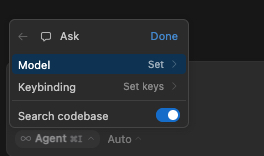

- `Manual 手动模式`：可以生成代码，但是需要手动编辑代码，ASk 模式起码还有 Apply 应用选项，是半自动的


#### 3.2 自定义模式

- 允许使用适合你自己工作流程的工具和提示来编写新模式

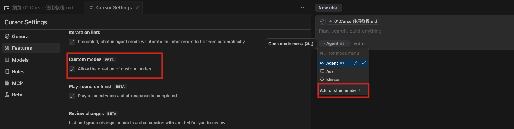
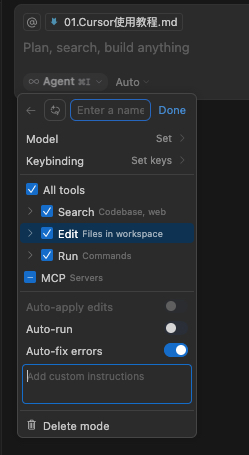

- 这是一个测试功能，后续可能会直接在根目录中提供一个文件用来配置自定义模式

#### 3.3、内联代码编辑 ⌘K

- 当代码的位置直接使用快捷键代开一个提示栏，作用类似于聊天的 AI 输入框

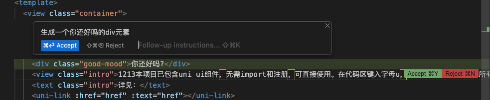

### 四、AI 提交消息

- 可以自动生成 Git 提交消息，生成的提交内容基于暂存文件中的更改和存储库的 git 历史记录

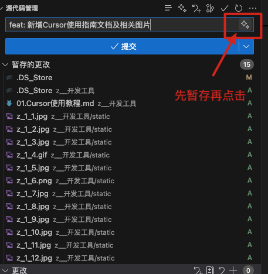


### 五、Context 上下文

#### 5.1 代码库索引

- 代码库索引是一项重要的功能，它通过为代码库中的每个文件计算嵌入向量，帮助 AI 更准确地理解和引用整个项目的上下文，从而提供更精准的代码建议和答案
- 打开项目时，每个 Cursor 实例都会初始化该工作区的索引。初始索引设置完成后，Cursor 将自动索引添加到工作区的任何新文件

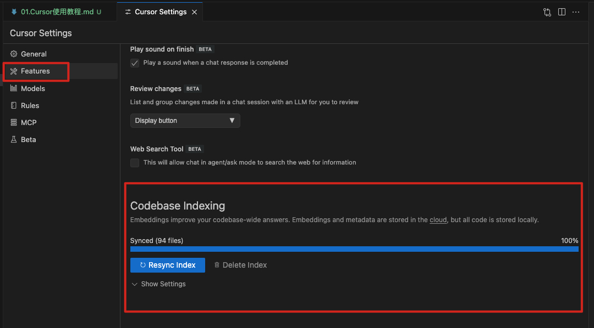

- 虽然会自动索引，但建议每次打开新项目时手动点击 `Resync Index` 按钮，以确保索引的准确性和完整性

- 默认情况下，Cursor 会自动索引所有文件，文件会被分块上传到 Cursor 服务器，然后计算嵌入向量。因为存在一定的数据安全隐患
  - 此时可以设置 `.cursorignore` 文件，来忽略不需要索引的文件，和 `.gitignore` 文件一样
  - 对于大型内容文件也可以使用 `.cursorignore` 文件来忽略，来提高索引效率，比如大文件、二进制文件等


#### 5.2 Rules for AI

- 使用项目特定规则和全局规则自定义 Cursor 中的 AI 行为
  - 规则可以根据文件扩展名、文件路径、文件内容等条件进行匹配
  - 规则可以指定 AI 模型、提示、行为等

- 目前有两种规则类型：
  - `Project-specific rules`：针对特定项目的规则，会覆盖全局规则
  - `Global rules`：全局规则，会应用于所有项目


- 项目规则一般存储在 `.cursor/rules` 目录中，可对项目不同部分的 AI 行为进行精细控制

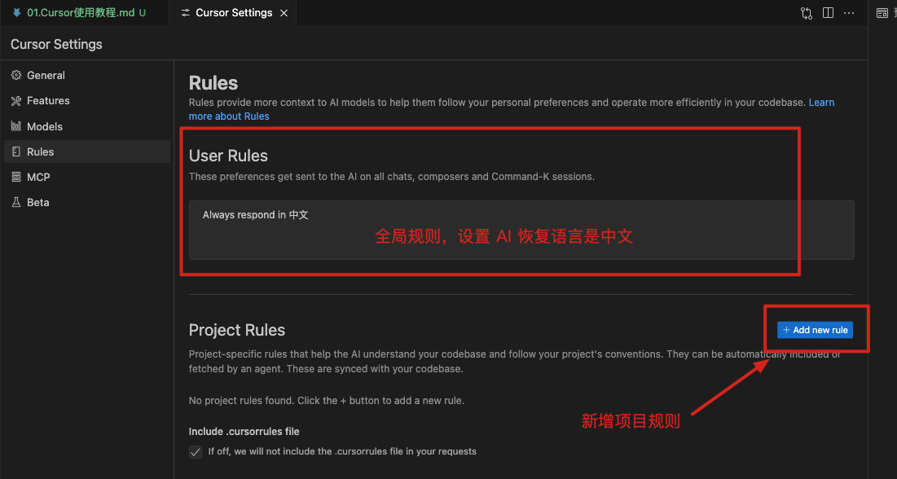

- 点击上面的添加按钮，就会在根目录生成文件

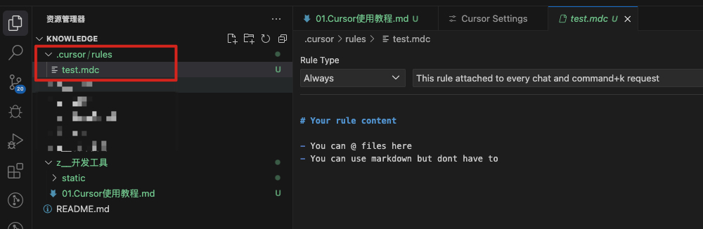

- 大概内容设置如下：

```md
# 前置
- 你是一个前端开发专家，专注于现代化网站开发，现在我们要一起开发 RssTabs

# 项目简介
- RssTabs website 是一个基于 Next.js 14 开发的多语言官方网站，用于展示 RssTabs 功能和特性。

# 技术架构
- 项目基于 Next.js 14 App Router 开发
- 使用 TypeScript 进行开发
- 使用 next-intl 实现国际化
- 使用 Tailwind CSS 构建样式
- 使用 shadcn/ui 组件库
- 使用 Framer Motion 实现动画效果
- 使用 Cloudflare Pages 部署
- Edge Runtime 运行时

# 目录结构
- app/               应用主目录
  - [locale]/        多语言路由
  - components/      页面组件
- components/        通用组件
  - ui/              UI 组件
  - layout/          布局组件
- hooks/             自定义 hooks
- i18n/              国际化配置
- lib/               工具函数
- messages/          语言文件
- styles/            全局样式
- public/            静态资源
```


#### 5.3 `@` 符号

- 在输入框中，可以使用 `@` 符号来引用上下文，可引用的上下文很多，目前最新版的相对老版以及少了很多

- `@Files`：引用项目中的文件，可以拖拽文件到输入框中，也可以使用 `@` 符号
- `@Folders`：引用项目中的文件夹，也可以拖拽
- `@Code`：引用项目中的函数
- `@Docs`：引用第三方文档作为上下文
  - 添加自定义文档

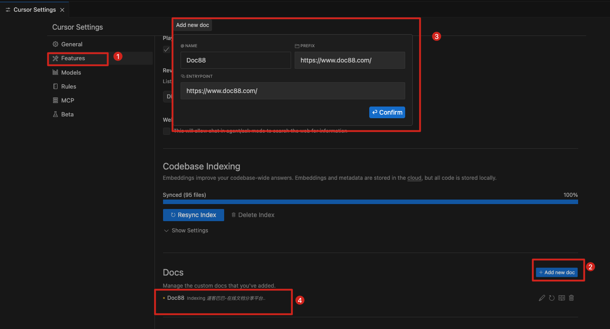

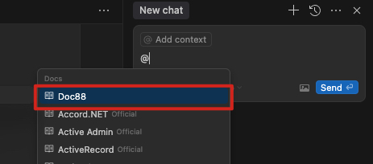

- `@link`：使用比较特殊，没有预选，除了添加Docs外，可以直接 @ + 复制链接到输入框中，将链接文档作为上下文

- `@git`：引用 git 提交历史作为上下文，可以比较两次提交的差异

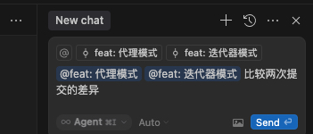

- `@web`：类似联网
- `@Past Chats`：引用之前的聊天记录作为上下文
- `@Cursor rules`：引用项目中的规则作为上下文
- `@Terminals`：引用终端命令作为上下文

#### 5.4 `#` 符号

- 使用 # 后跟文件名可聚焦特定文件。将其与 @ 符号结合可实现精确的上下文控制


### 六、MCP（Model Context Protocol，模型上下文协议）

- 模型上下文协议 (MCP)是一种开放协议，它标准化了应用程序向 LLM 提供上下文和工具的方式。可以将 MCP 视为 Cursor 的插件系统 
- 它允许您通过标准化接口将 Agent 连接到各种数据源和工具，从而扩展 Agent 的功能
  - 这意味着您可以将 Cursor 与现有工具和基础架构集成，而不必告诉 Cursor 您的项目在代码之外的结构
- MCP 服务器可以使用任何能够打印stdout或服务于 HTTP 端点的语言编写，比如 Python、Node.js、Ruby、Go、Rust 等

- 实际用途
  - 允许 Cursor 直接查询数据库，而不是手动输入模式或自己操作数据
  - 在 github 中，让 cursor 创建 PR、创建分支、查找代码

#### 6.1 MCP 服务器

- MCP 服务器是轻量级程序，通过标准化协议开发特定功能。它们充当 Cursor 与外部工具或数据源之间的中介，允许 Cursor 与这些工具进行交互
- Cursor 支持两种 MCP 服务器的传输类型

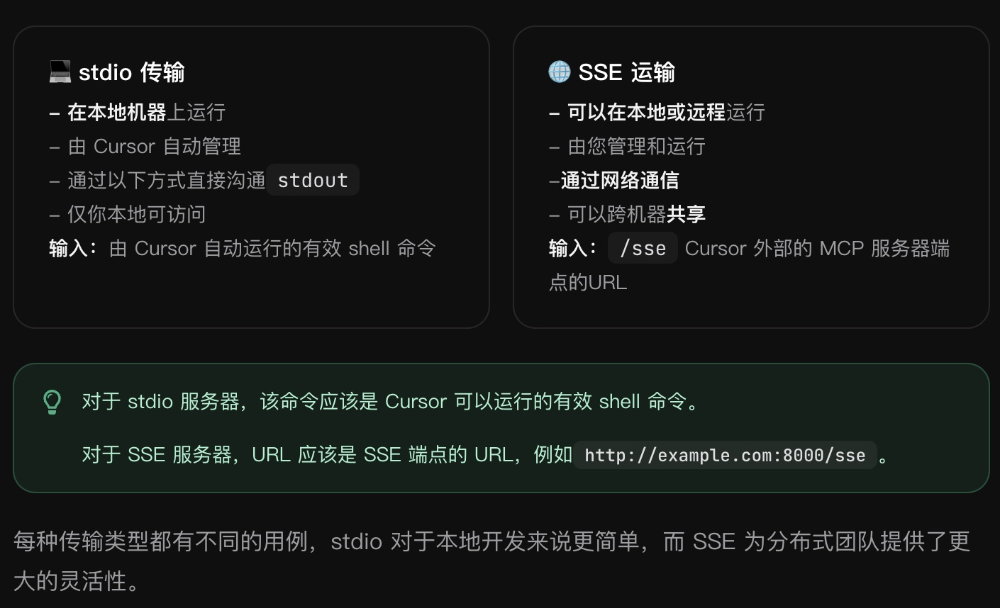

#### 6.2 配置 MCP 服务器

```js
// This example demonstrated an MCP server using the stdio format
// Cursor automatically runs this process for you
// This uses a Node.js server, ran with `npx`
{
  "mcpServers": {
    "server-name": {
      "command": "npx",
      "args": ["-y", "mcp-server"],
      "env": {
        "API_KEY": "value"
      }
    }
  }
}
```
- 该env字段允许您指定 MCP 服务器进程可用的环境变量。这对于管理 API 密钥和其他敏感配置特别有用

#### 6.3 配置位置

- 项目配置
  - 对于特定于项目的工具，在项目目录中创建一个文件 `.cursor/mcp.json`。这允许你定义仅在该特定项目中可用的 MCP 服务器
- 全局配置
  - 对于想要在所有项目中使用的工具，在主目录 `\~/.cursor/mcp.json` 中创建一个文件。这样 MCP 服务器便可在你所有的 Cursor 工作区中使用

#### 6.4 在 Agent 中使用 MCP 工具

- 在下一篇文章中讲解，针对 MCP 做详细讲解

#### 6.5 限制

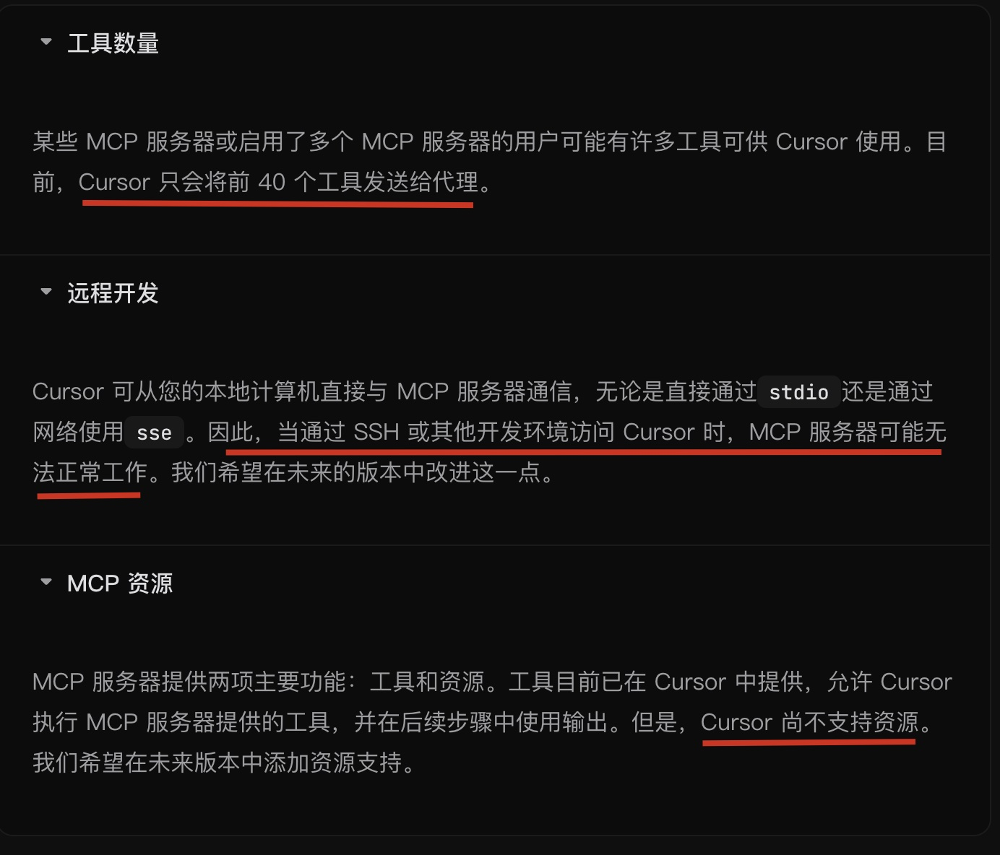